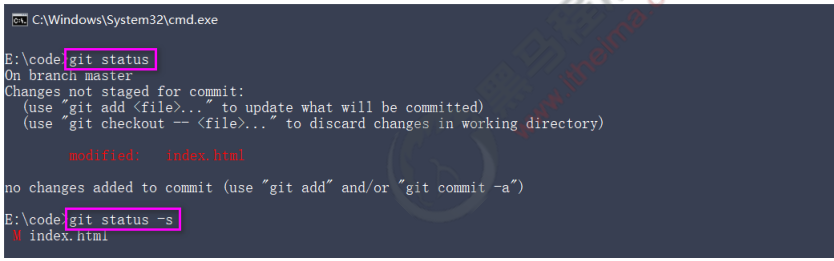
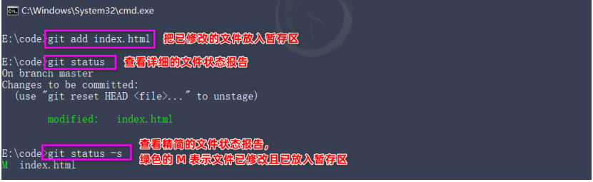

#  下载地址

[Git - Downloads (git-scm.com)](https://git-scm.com/downloads)

# 配置用户信息

```c
git config --global user.name "用户名"
git config --global user.email 邮箱    
```

全局配置文件保存在 C:/users/user/.gitconfig

```bash
# 查看所有全局配置
git config --list --global

# 查看指定信息的全局配置
git config user.name
```

# 获取Git仓库

1.将尚未进行版本控制的本地目录转换为git仓库

2.从其他服务器克隆一个已存在的git仓库

# 在现有目录中初始化仓库

如果自己有一个尚未进行版本控制的项目目录，想要用 Git 来控制它，需要执行如下两个步骤： 

① 在项目目录中，通过鼠标右键打开“Git Bash” 

② 执行 git init 命令将当前的目录转化为 Git 仓库 

git init 命令会创建一个名为 .git 的隐藏目录，这个 .git 目录就是当前项目的 Git 仓库，里面包含了初始的必要 文件，这些文件是 Git 仓库的必要组成部分

# git工作区文件的状态

未跟踪（Untracked）：不被 Git 所管理的文件

未修改（Unmodified）： 工作区中文件的内容和 Git  仓库中文件的内容保持一致 

已修改（Modified） ：工作区中文件的内容和 Git  仓库中文件的内容不一致 

已暂存（Staged）：工作区中被修改的文件已被 放到暂存区，准备将修改后 的文件保存到 Git 仓库中

Git 操作的终极结果：让工作区中的文件都处于“未修改”的状态

# 检查文件状态

可以使用 git status 命令查看文件处于什么状态

未跟踪的文件意味着 Git 在之前的快照（提交）中没有这些文件；Git 不会自动将之纳入跟踪范围，除非明确 地告诉它“我需要使用 Git 跟踪管理该文件”

使用 git status 输出的状态报告很详细，但有些繁琐。如果希望以精简的方式显示文件的状态，可以使用如下 两条完全等价的命令，其中 -s 是 --short 的简写形式：

```bash
# 以精简的方式显示文件状态
git status -s
git status --short
# 未跟踪文件前面右红色的？？标记
```

# 跟踪文件

使用命令 git add 开始跟踪一个文件。 所以，要跟踪 index.html 文件，运行如下的命令即可：

```bash
git add index.html

# 以精简的方式显示文件的状态
git status -s
# 新添加到暂存区中的文件前面有绿色的 A 标记
```

# 提交更新

现在暂存区中有一个 index.html 文件等待被提交到 Git 仓库中进行保存。可以执行 git commit 命令进行提交, 其中 -m 选项后面是本次的提交消息，用来对提交的内容做进一步的描述：

```bash
git commit -m "新建了index-html文件"
```

# 对已提交的文件进行修改

目前，index.html 文件已经被 Git 跟踪，并且工作区和 Git 仓库中的 index.html 文件内容保持一致。当我们 修改了工作区中 index.html 的内容之后，再次运行 git status 和 git status -s 命令，会看到如下的内容：



文件 index.html 出现在 Changes not staged for commit 这行下面，说明已跟踪文件的内容发生了变化， 但还没有放到暂存区。

 注意：修改过的、没有放入暂存区的文件前面有红色的 M 标记

# 暂存已修改的文件

目前，工作区中的 index.html 文件已被修改，如果要暂存这次修改，需要再次运行 git add 命令，这个命令 是个多功能的命令，主要有如下 3 个功效：

 ① 可以用它开始跟踪新文件 

② 把已跟踪的、且已修改的文件放到暂存区 

③ 把有冲突的文件标记为已解决状态



# 提交已暂存的文件

再次运行 git commit -m "提交消息" 命令，即可将暂存区中记录的 index.html 的快照，提交到 Git 仓库中进 行保存

# 还原版本

撤销对文件的修改指的是：把对工作区中对应文件的修改，还原成 Git 仓库中所保存的版本。 操作的结果：所有的修改会丢失，且无法恢复！危险性比较高，请慎重操作！

```bash
git checkout --index.html
```

撤销操作的本质：用 Git 仓库中保存的文件，覆盖工作区中指定的文件

# 向暂存区一次添加多个文件

如果需要被暂存的文件个数比较多，可以使用如下的命令，一次性将所有的新增和修改过的文件加入暂存区：

```bash
git add .
```

# 取消暂存的文件

如果需要从暂存区中移除对应的文件，可以使用如下的命令

```bash
git reset HEAD 要移除的文件名称

# 移除暂存区所有文件
git reset HEAD .
```

# 跳过使用暂存区域

Git 标准的工作流程是工作区 → 暂存区 → Git 仓库，但有时候这么做略显繁琐，此时可以跳过暂存区，直接将 工作区中的修改提交到 Git 仓库，这时候 Git 工作的流程简化为了工作区 → Git 仓库。 Git 提供了一个跳过使用暂存区域的方式， 只要在提交的时候，给 git commit 加上 -a 选项，Git 就会自动把 所有已经跟踪过的文件暂存起来一并提交，从而跳过 git add 步骤

```bash
git commit -a -m"描述信息"
```

# 移除文件 

从 Git 仓库中移除文件的方式有两种：

 ① 从 Git 仓库和工作区中同时移除对应的文件 

② 只从 Git 仓库中移除指定的文件，但保留工作区中对应的文件

```bash
# 从Git仓库和工作区同时移除index.js文件
git rm -f index.js
# 只从Git仓库中移除index.cee，但保留工作区中的index.css文件
git rm --cached index.css
```

# 忽略文件

一般我们总会有些文件无需纳入 Git 的管理，也不希望它们总出现在未跟踪文件列表。 在这种情况下，我们可 以创建一个名为 .gitignore 的配置文件，列出要忽略的文件的匹配模式。 文件 .gitignore 的格式规范如下：

 ① 以 # 开头的是注释 

② 以 / 结尾的是目录 

③ 以 / 开头防止递归 

④ 以 ! 开头表示取反 

⑤ 可以使用 glob 模式进行文件和文件夹的匹配（glob 指简化了的正则表达式）

# glob模式

所谓的 glob 模式是指简化了的正则表达式：

 ① 星号 * 匹配零个或多个任意字符 

② [abc] 匹配任何一个列在方括号中的字符 （此案例匹配一个 a 或匹配一个 b 或匹配一个 c）

 ③ 问号 ? 只匹配一个任意字符

 ④ 在方括号中使用短划线分隔两个字符， 表示所有在这两个字符范围内的都可以匹配（比如 [0-9] 表示匹配 所有 0 到 9 的数字） 

⑤ 两个星号 ** 表示匹配任意中间目录（比如 a/**/z 可以匹配 a/z 、 a/b/z 或 a/b/c/z 等）

# .gitignore文件的例子

```bash
# 忽略所有的.a文件
*.a

# 但跟踪所有的lib.a,即使在前面忽略了.a文件
!lib.a

# 只忽略当前目录下的TODO文件，而不忽略subdir/TODO
/TODO

# 忽略任何目录下名为build的文件夹
build/

# 忽略doc/notes.txt 但不忽略doc/00/ss.txt
doc/*.txt

# 忽略doc/ 目录及所有子目录下的.pdf文件
doc/**/*.pdf
```

# 查看提交历史

如果希望回顾项目的提交历史，可以使用 git log 这个简单且有效的命令

```bash
# 按时间顺序列出所有的提交历史，最近提交的在上面
git log

# 只显示最新两条提交历史,数字可以按需填写
git log -2

# 在一行上展示最新两条提交历史的信息
git log -2 --pretty=oneline

# 在一行上展示最新两条提交历史的信息,并自定义输出格式
# %h 提交的简写哈希值  %an作者名字 %ar作者修订日期,按多久以前的方式显示 %s提交说明
git log -2 --pretty=format:"%h|%an|%ar|%s"
```

# 回退到指定的版本

```bash
# 在一行上展示所有的提交历史
git log --pretty=oneline

# 根据提交的id--哈希值，回退到指定的版本
git reset --hard <CommitID>

# 回退版本后，查看所有的提交历史
git reflog --pretty=oneline
# 直接使用git log --pretty=oneline 只展示回退版本的提交记录

# 再次根据ID，跳转版本
git reset --hard <CommitID>
```

#基于HTTP将本地仓库上传到Github

1.新建仓库，协议设置为http

2.将本地仓库上传到Github

```bash
# 网址随Github仓库更改
git remote add origin https://github.com/lspdsl/test_01.git
git branch -M main
git push -u origin main
```

3.更新仓库

```bash
git push
```

# 基于SSH上传

SSH key的作用：实现本地仓库和Github之间免登录的加密数据传输

SSH key的好处：免登录身份认证、数据加密传输

SSH key由两部分组成，分别是：

1.id_rsa(私钥文件，存放于客户端的电脑中即可)

2.id_rsa.pub(公钥文件，需要配置到Github中)

生成SSH key:

```bash
ssh-keygen -t rsa -b 4096 -C"1434876181@qq.com"
```

连续敲击三次enter,即可在C:\users\user\.ssh目录下生成id_rsa和id_rsa.pub两个文件

配置Github SSH key

创建仓库

上传

# 克隆远程仓库

```bash
git clone 远程仓库地址 
```

# 本地分支

在进行多人协作开发的时候，为了防止互相干扰，提高协同开发的体验，建议每个开发者都基于分支进行项目 功能的开发

## 1.master主分支

在初始化本地 Git 仓库的时候，Git 默认已经帮我们创建了一个名字叫做 master 的分支。通常我们把这个 master 分支叫做主分支。

在实际工作中，master 主分支的作用是：用来保存和记录整个项目已完成的功能代码。 因此，不允许程序员直接在 master 分支上修改代码，因为这样做的风险太高，容易导致整个项目崩溃

## 2.功能分支

由于程序员不能直接在 master 分支上进行功能的开发，所以就有了功能分支的概念。 功能分支指的是专门用来开发新功能的分支，它是临时从 master 主分支上分叉出来的，当新功能开发且测试 完毕后，最终需要合并到 master 主分支上，如图所示

## 3.查看分支列表

使用如下的命令，可以查看当前 Git 仓库中所有的分支列表：

```bash
git branch
```

## 4.创建新分支

使用如下的命令，可以基于当前分支，创建一个新的分支，此时，新分支中的代码和当前分支完全一样：

```bash
git branch 分支名称
git branch c
```

创建新分支后，仍然处于原来的分支，不会切换分支

## 5.切换分支

使用如下的命令，可以切换到指定的分支上进行开发：

```bash
git checkout 分支名称
git checkout c
```

## 6.分支的快速创建和切换

使用如下的命令，可以创建指定名称的新分支，并立即切换到新分支上：

```bash
# -b 表示创建一个新分支
# checkout 表示切换到新分支上
git checkout -b
```

## 7.合并分支

功能分支的代码开发测试完毕之后，可以使用如下的命令，将完成后的代码合并到 master 主分支上：

```bash
# 1.切换到master分支
git checkout master
# 2.在master分支上运行git merge命令，将分支代码合并到master上
git merge 分支名称
git merge c
```

## 8.删除分支

当把功能分支的代码合并到 master 主分支上以后，就可以使用如下的命令，删除对应的功能分支：

```bash
git branch -d 分支名称

# 强制删除本地分支
git branch -D 分支名称
```

## 9.遇到冲突时的分支合并

如果在两个不同的分支中，对同一个文件进行了不同的修改，Git 就没法干净的合并它们。 此时，我们需要打开 这些包含冲突的文件然后手动解决冲突。

```bash
# 假设：在把reg分支合并到master分支期间，代码发生了冲突
git checkout master
git merge reg

# 打开包含冲突的文件，手动解决冲突后，在执行下列命令
git add .
git commit -m'解决了分支合并冲突的问题
```

# 远程分支

##1.将本地分支推送到远程仓库

```bash
# -u表示把本地分支和远程分支进行关联，只在第一次推送的时候需要带 -u 参数
git push -u 远程仓库的别名 本地分支名称：远程分支名称

# 实际案例
# 将本地分支payment推送到远程仓库origin中，并在远程仓库中重新命名为pay
git push -u origin payment:pay

# 如果希望远程分支的名称和本地分支名称保持一致，可对命令进行简化
git push -u origin patment
```

## 2.查看远程仓库中所有的分支列表

通过如下的命令，可以查看远程仓库中，所有的分支列表的信息

```bash
git remote show 远程仓库名称
```

## 3.跟踪分支

跟踪分支指的是：从远程仓库中，把远程分支下载到本地仓库中。需要运行的命令如下

```bash
# 从远程仓库中，把对应的远程分支下载到本地仓库，保持本地分支和远程分支名称相同
git checkout 远程分支的名称

# 示例
git checkout pay

# 从远程仓库中，把对应的远程分支下载到本地仓库，并把下载的本地分支进行重命名
git checkout -b 本地分支名称 远程仓库名从/远程分支名称
# 示例:
# 远程分支pay下载到本地，并重命名为payment
git checkout -b payment origin/pay
```

## 4.拉取远程分支最新代码

可以使用如下的命令，把远程分支最新的代码下载到本地对应的分支中

```bash
# 从远程仓库，拉取当前分支最新的代码，保持当前分支的代码和远程分支代码一致
git pull
```

## 5.删除远程分支

可以使用如下的命令，删除远程仓库中指定的分支：

```bash
# 删除远程仓库中，指定名称的远程分支
git push 远程仓库名称 --delete 远程分支名称
# 示例：
git push origin --delete pay
```


