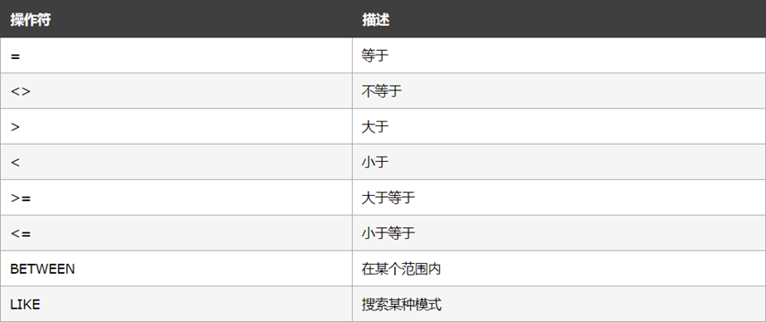

# 1.增

```sql
-- 新增数据
insert into users (uname,password,status) values('王二','1000',0)

-- 不等于号：<>  ！=
```

# 2.删

```sq
-- delete from 表名 where 列名称=值
delete from users where id=3
```

# 3.改

```sql
-- undate 表名称 set 列名称=新值 where 列名称= 某值
update uers set uname='嗡嗡嗡' where id=1

-- 同时更新多个数据
update uers set uname='嗡嗡嗡',status=1 where id=1
```

# 4.查

```sql
--	查询表中所有列
select * from user
--	查询指定列
select uname,password from user
```

+ where子句

  WHERE 子句用于限定选择的标准。在 SELECT、UPDATE、DELETE 语句中，皆可使用 WHERE 子句来限定选择的标准。

  

  ```sql
  select * from users where status=1;
  select * from users where id<>1;
  ```

+ and和or运算符

  AND 和 OR 可在 WHERE 子语句中把两个或多个条件结合起来。

  AND 表示必须同时满足多个条件，相当于 JavaScript 中的 && 运算符，例如 if (a !== 10 && a !== 20)

  OR 表示只要满足任意一个条件即可，相当于 JavaScript 中的 || 运算符，例如 if(a !== 10 || a !== 20)

  ```sql
  select * from users where status=1 and id >5;
  select * from users where status=1 or id >5;
  ```

+ orderby子句

  ORDER BY 语句用于根据指定的列对结果集进行排序。

  ORDER BY 语句**默认**按照升序对记录进行排序ASC。

  如果您希望按照**降序**对记录进行排序，可以使用 DESC 关键字。

  ```sql
  select * from users order by id asc;
  select * from users order by id desc;
  
  -- ORDER BY 子句 – 多重排序
  select * from users order by status desc,uname asc;
  ```

+ count(\*)函数

  COUNT(*) 函数用于返回查询结果的总数据条数，语法格式如下：

  ```sql
  -- select count(*) from 表名
  select count(*) from users where status=0;   -- 输出表中status=0的行数量
  select count(*) as total from users where status=0;  -- 输出表中status=0的行数量,赋值给total
  ```

# 5.node项目连接数据库

```sql
//  导入mysql模块
const mysql=require('mysql')
//  建立与mysql数据库的链接
const db=mysql.createPool({
    host:'127.0.0.1',  // 数据库的ip地址,本机地址
    user:'root',
    password:'123456',
    database:'user',  //    指定操作哪个数据库
})
//  测试连接是否成功
db.query('select 1',(err,res)=>{
    if(err){
        return console.log(err.message)
    }
    console.log(res)  //    输出[ RowDataPacket { '1': 1 } ]运行成功
})
```

+ 查询数据

  ```sql
  db.query('select *from users',(err,res)=>{
      if(err){
          return console.log(err.message)
      }
      console.log(res)  
  })
  //	查询结果输出的是数组
  ```

+ 插入数据

  ```sql
  //  待插入数据库数据
  let user={uname:'张三',password:'147852',status:0}
  //  ？sql语句中的占位符
  const sqlstr='insert into users(uname,password,status) values(?,?,?)'
  //  数组数据与占位符进行匹配
  db.query(sqlstr,[user.uname,user.password,user.status],(e,res)=>{
      if(e) return  console.log(e.message)
      if(res.affectedRows===1) console.log('插入成功')
  })
  
  //  插曲数据对象的每个属性和数据库表的字段一一对应,可直接用对象便捷插入
  let usdata={uname:'李四',password:'002258',status:0}
  let sql_str='insert into users set ?'
  db.query(sql_str,usdata,(e,res)=>{
      if(e) return  console.log(e.message)
      if(res.affectedRows===1) console.log('插入成功')
  })
  ```

+ 更新数据

  ```sql
  //  要更新的数据对象
  let newsuer={id:8,uname:'鲨bee',password:'qwweee',status:1}
  let up_sql='update users set uname=?,password=?,status=? where id=?'
  db.query(up_sql,[newsuer.uname,newsuer.password,newsuer.status,newsuer.id],(e,res)=>{
      if(e) return  console.log(e.message)
      if(res.affectedRows===1) console.log('更新成功')
  })
  
  //  便携方式
  let newsuer1={id:11,uname:'sharkbee',password:'qwweee',status:1}
  let upstr='update users set ? where id=?'
  db.query(upstr,[newsuer1,newsuer1.id],(e,res)=>{
      if(e) return  console.log(e.message)
      if(res.affectedRows===1) console.log('更新成功')
  })
  ```

+ 删除数据

  ```sql
  const delsql='delete from users where id=?'
  db.query(delsql,10,(e,res)=>{
      if(e){
          return  console.log(e.message)
      }
      if(res.affectedRows){
          console.log('删除成功')
      }
  })
  ```

+ 标记数据

  ```js
  //	不使用delete,设置标志字段模拟删除，当用户执行删除操作时，更改标志字段，以免误删
  ```

  