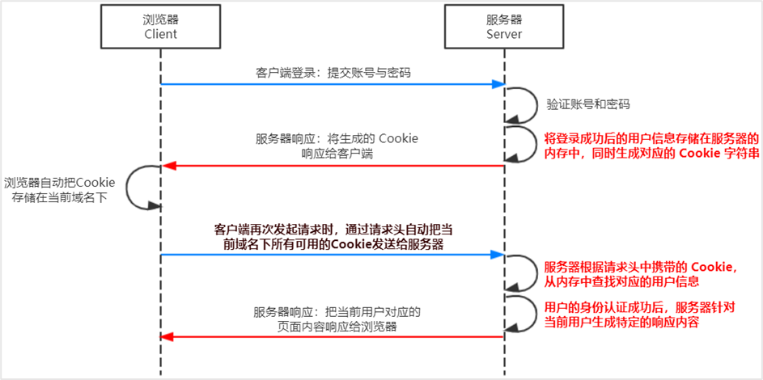
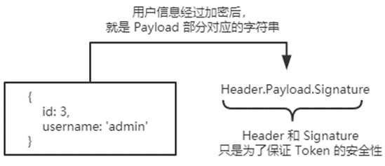

# 1.fs文件系统模块

fs 模块是 Node.js 官方提供的、用来操作文件的模块。它提供了一系列的方法和属性，用来满足用户对文件的操作需求。

例如：

 fs.readFile() 方法，用来读取指定文件中的内容

 fs.writeFile() 方法，用来向指定的文件中写入内容

如果要在 JavaScript 代码中，使用 fs 模块来操作文件，则需要使用如下的方式先导入它：

```js
const fs=require('fs')
```

+ 读取指定文件中的内容

  ```js
  fs.readFile(path,[options],callback)
  //	参数1：必选参数，字符串，表示文件的路径。
  //	参数2：可选参数，表示以什么编码格式来读取文件。
  //	参数3：必选参数，文件读取完成后，通过回调函数拿到读取的结果。
  
  const fs=require('fs')
  fs.readFile('./files/11.txt','utf8',function(){
      // 读取成功err的值为null
      // 读取失败err的值为错误对象，dataStr的值为undefined
      console.log(err)
      console.log('-------')
      console.log(dataStr)
  })
  ```

+ 向指定文件中写内容

  ```js
  fs.write(file,data,[option],callback)
  //	参数1：必选参数，需要指定一个文件路径的字符串，表示文件的存放路径。
  //	参数2：必选参数，表示要写入的内容。
  //	参数3：可选参数，表示以什么格式写入文件内容，默认值是 utf8。
  //	参数4：必选参数，文件写入完成后的回调函数。
  
  fs.write('./files/101.txt','string',function(err){
      // 写入成功，err=null
      // 写入失败，err=错误对象
  })
  ```

+ 路径动态拼接

  在使用 fs 模块操作文件时，如果提供的操作路径是以 ./ 或 ../ 开头的相对路径时，很容易出现路径动态拼接错误的问题。

  原因：代码在运行的时候，会以执行 node 命令时所处的目录，动态拼接出被操作文件的完整路径。

  解决方案：在使用 fs 模块操作文件时，直接提供完整的路径，不要提供 ./ 或 ../ 开头的相对路径，从而防止路径动态拼接的问题。

  ```js
  const fs=require('fs')
  
  // 出现路径拼接错误的问题，是因为提供了 ./ 或 ../ 开头的相对路径
  // 如果要解决这个问题，可以直接提供一个完整的文件存放路径就行
  /* fs.readFile('./files/1.txt', 'utf8', function(err, dataStr) {
    if (err) {
      return console.log('读取文件失败！' + err.message)
    }
    console.log('读取文件成功！' + dataStr)
  }) */
  
  // 移植性非常差、不利于维护
  /* fs.readFile('C:\\Users\\escook\\Desktop\\Node.js基础\\day1\\code\\files\\1.txt', 'utf8', function(err, dataStr) {
    if (err) {
      return console.log('读取文件失败！' + err.message)
    }
    console.log('读取文件成功！' + dataStr)
  }) */
  
  // __dirname 表示当前文件所处的目录
  // console.log(__dirname)
  
  fs.readFile(__dirname + '/files/1.txt', 'utf8', function(err, dataStr) {
    if (err) {
      return console.log('读取文件失败！' + err.message)
    }
    console.log('读取文件成功！' + dataStr)
  })
  ```

# 2.path路径模块

path 模块是 Node.js 官方提供的、用来处理路径的模块。它提供了一系列的方法和属性，用来满足用户对路径的处理需求。

例如：

path.join() 方法，用来将多个路径片段拼接成一个完整的路径字符串

path.basename() 方法，用来从路径字符串中，将文件名解析出来

如果要在 JavaScript 代码中，使用 path 模块来处理路径，则需要使用如下的方式先导入它：

```js
const path=require('path')
```

+ 路径拼接

  ```js
  path.join([...paths])
  //	...paths(string)路径片段序列
  //	返回值string
  
  path.join('/a','/b/c','../','./d','e')		//	../  前一个路径抵消--取消
  //	输出\a\b\d\e
  
  const pathstr=path.join(__dirpath,'./file/1.txt')

+ 获取路径中的文件名

  ```js
  path.baseneme(path,[ext])
  //	path <string> 必选参数，表示一个路径的字符串
  //	ext <string> 可选参数，表示文件扩展名  不保留拓展名
  //	返回: <string> 表示路径中的最后一部分
  
  const path = require('path')
  
  // 定义文件的存放路径
  const fpath = '/a/b/c/index.html'
  const fullName = path.basename(fpath)
  //	输出index.html
  console.log(fullName)   
  const nameWithoutExt = path.basename(fpath, '.html')
  //	输出index
  console.log(nameWithoutExt)
  ```

+ 获取文件拓展名

  ```js
  path.extname(path)
  //	path <string>必选参数，表示一个路径的字符串
  //	返回: <string> 返回得到的扩展名字符串
  const path = require('path')
  
  // 这是文件的存放路径
  const fpath = '/a/b/c/index.html'
  
  const fext = path.extname(fpath)
  //	输出.html
  console.log(fext)
  ```

#3.http模块

http 模块是 Node.js 官方提供的、用来创建 web 服务器的模块。通过 http 模块提供的 http.createServer() 方法，就能方便的把一台普通的电脑，变成一台 Web 服务器，从而对外提供 Web 资源服务。

如果要希望使用 http 模块创建 Web 服务器，则需要先导入它：

```js
const http=require('http')
```

+ 创建web服务器

  ```js
  //	1.导入 http 模块
  const http=require('http')
  //	2.创建 web 服务器实例
   const sever=http.createServer() 
  // 3. 为服务器实例绑定 request 事件，监听客户端的请求
  server.on('request', function (req, res) {
    console.log('Someone visit our web server.')
  })
  //	4.启动服务器
  server.listen(8080, function () {  
    console.log('server running at http://127.0.0.1:8080')
  })
  
  
  //	获取请求的 url 地址
  //	设置默认的响应内容为 404 Not found
  //	判断用户请求的是否为 / 或 /index.html 首页
  //	判断用户请求的是否为 /about.html 关于页面
  //	设置 Content-Type 响应头，防止中文乱码
  //	使用 res.end() 把内容响应给客户端
  ```

  req请求对象
  只要服务器接收到了客户端的请求，就会调用通过 server.on() 为服务器绑定的 request 事件处理函数。
  如果想在事件处理函数中，访问与客户端相关的数据或属性，可以使用如下的方式：

  ```JS
  const http = require('http')
  const server = http.createServer()
  // req 是请求对象，包含了与客户端相关的数据和属性
  server.on('request', (req, res) => {
    // req.url 是客户端请求的 URL 地址
    const url = req.url
    // req.method 是客户端请求的 method 类型
    const method = req.method
    const str = `Your request url is ${url}, and request method is ${method}`
    console.log(str)
    // 调用 res.end() 方法，向客户端响应一些内容
    res.end(str)
  })
  server.listen(80, () => {
    console.log('server running at http://127.0.0.1')
  })
  ```

  res响应对象

  在服务器的 request 事件处理函数中，如果想访问与服务器相关的**数据**或**属性**，可以使用如下的方式

  ```JS
  //	res.end()
  const http = require('http')
  const server = http.createServer()
  // req 是请求对象，包含了与客户端相关的数据和属性
  server.on('request', (req, res) => {
    // req.url 是客户端请求的 URL 地址
    const url = req.url
    // req.method 是客户端请求的 method 类型
    const method = req.method
    const str = `Your request url is ${url}, and request method is ${method}`
    console.log(str)
    // 调用 res.end() 方法，向客户端响应一些内容
    res.end(str)
  })
  server.listen(80, () => {
    console.log('server running at http://127.0.0.1')
  })
  ```

  解决中文乱码

  当调用 res.end() 方法，向客户端发送中文内容的时候，会出现乱码问题，此时，需要手动设置内容的编码格式：

  ```js
  sever.on('request',(req,res)=>{
      // 发送的内容包含中文
      const str=`您请求的url地址是${req.url},请求的method类型是${req.method}`
      //	为防止中文乱码，设置响应头Content-Type的值为：text/html;charset=utf-8
      res.setHeader('Content-Type','text/html;charset=utf-8')
      //	把包含中文的内容响应给客户端
      res.end(str)
  })
  ```

  根据不同的url响应不同的html内容

  核心步骤：

  ①获取请求的 url 地址

  ②设置默认的响应内容为 404 Not found

  ③判断用户请求的是否为 / 或 /index.html 首页

  ④判断用户请求的是否为 /about.html 关于页面

  ⑤设置 Content-Type 响应头，防止中文乱码

  ⑥使用 res.end() 把内容响应给客户端

  ```js
  const http = require('http')
  const server = http.createServer()
  
  server.on('request', (req, res) => {
    // 1. 获取请求的 url 地址
    const url = req.url
    // 2. 设置默认的响应内容为 404 Not found
    let content = '<h1>404 Not found!</h1>'
    // 3. 判断用户请求的是否为 / 或 /index.html 首页
    // 4. 判断用户请求的是否为 /about.html 关于页面
    if (url === '/' || url === '/index.html') {
      content = '<h1>首页</h1>'
    } else if (url === '/about.html') {
      content = '<h1>关于页面</h1>'
    }
    // 5. 设置 Content-Type 响应头，防止中文乱码
    res.setHeader('Content-Type', 'text/html; charset=utf-8')
    // 6. 使用 res.end() 把内容响应给客户端
    res.end(content)
  })
  
  server.listen(80, () => {
    console.log('server running at http://127.0.0.1')
  })
  ```

# 4.模块化

1. 内置模块

   内置模块是由 Node.js 官方提供的，例如 fs、path、http 等

2. 自定义模块

   用户创建的每个 .js 文件，都是自定义模块

3. 第三方模块

   由第三方开发出来的模块，并非官方提供的内置模块，也不是用户创建的自定义模块，使用前需要先下载

**模块作用域:**和函数作用域类似，在自定义模块中定义的变量、方法等成员，只能在当前模块内被访问，这种模块级别的访问限制，叫做模块作用域。

**module对象:**在每个 .js 自定义模块中都有一个 module 对象，它里面存储了和当前模块有关的信息，

**module.exports对象:**在自定义模块中，可以使用 module.exports 对象，将模块内的成员共享出去，供外界使用。外界用 require() 方法导入自定义模块时，得到的就是 module.exports 所指向的对象。

**共享成员时的注意点:**使用 require() 方法导入模块时，导入的结果，永远以module.exports指向的对象为准。

**exports** **对象:**由于 module.exports 单词写起来比较复杂，为了简化向外共享成员的代码，Node 提供了 exports 对象。默认情况下，exports 和 module.exports 指向同一个对象。最终共享的结果，还是以 module.exports 指向的对象为准。 

**exports** **和** **module.exports** **的使用误区:**为了防止混乱，建议大家不要在同一个模块中同时使用 exports 和 module.exports

```js
// 在一个自定义模块中，默认情况下， module.exports = {}

const age = 20

// 向 module.exports 对象上挂载 username 属性
module.exports.username = 'zs'
// 向 module.exports 对象上挂载 sayHello 方法
module.exports.sayHello = function() {
  console.log('Hello!')
}
module.exports.age = age

// 让 module.exports 指向一个全新的对象
module.exports = {
  nickname: '小黑',
  sayHi() {
    console.log('Hi!')
  }
}
```

# 5.Express

+ 基本用法

  ```js
  //	1.创建基本web服务器
  //	导入express
  const express=require('express')
  //	创建web服务器
  const app=express()
  //	调用app.listen(端口号,回调函数),启动服务器
  app.listen(80,()=>{
      console.log('express sever run at http://127.0.0.1')
  })
  
  //	2.监听get请求
  app.get(url,function(req,res){})
  
  //	3.监听post请求
  app.post(url,function(req,res){})
  
  //	4. 把内容响应给客户端
  app.get(url,function(req,res){
      //	向客户端响应JSON数据
      res.send({name:'张三',age:20,gender:'男'})
  })
  app.post(url,function(req,res){
      //	响应文本内容
      res.send('请求成功')
  })
  
  //	5.获取url中携带的查询参数
  app.get('./',(req,res)=>{
      console.log(req.query)
  })
  //	res.query默认是一个空对象
  //	客户端使用?name=张三&age=20，这种查询字符串形式发送到服务器的参数，可以通过res.query访问到
  //	res.query.name   res.query.age
  
  //	6.获取url中的动态参数  :id是一个动态参数
  app.get('/user/:id',(req,res)=>{
      console.log(res.params)
  })
  //	url地址中可以通过：参数名的形式，动态匹配参数值
  //	req.params默认是一个空对象
  //	里面存放着通过 ： 动态匹配到的参数值
  ```

+ 托管静态资源

  express 提供了一个非常好用的函数，叫做 express.static()，通过它，我们可以非常方便地创建一个静态资源服务器，例如，通过如下代码就可以将 public 目录下的图片、CSS 文件、JavaScript 文件对外开放访问了：

  ```js
  app.use(express.static('public'))
  //	现在，你就可以访问 public 目录中的所有文件了：
  //	http://localhost:3000/images/bg.jpg
  //	http://localhost:3000/css/style.css
  //	http://localhost:3000/js/login.js
  //	Express 在指定的静态目录中查找文件，并对外提供资源的访问路径。因此，存放静态文件的目录名不会出现在 URL 中。
  
  //	托管多个静态资源--多次调用express.static()
  app.use(express.static('public'))
  app.use(express.static('public1'))
  app.use(express.static('public2'))
  //	访问静态资源文件时，express.static() 函数会根据目录的添加顺序查找所需的文件。
  
  //	挂载路径前缀
  //	在托管的静态资源访问路径前，挂载路径前缀
  app.use('/public',express.static('public'))
  //	现在，你就可以通过带有 /public 前缀地址来访问 public 目录中的文件了：
  //	http://localhost:3000/public/images/kitten.jpg
  //	http://localhost:3000/public/css/style.css
  //	http://localhost:3000/public/js/app.js
  
  ```

# 6.Express路由

在 Express 中，路由指的是客户端的请求与服务器处理函数之间的映射关系。

Express 中的路由分 3 部分组成，分别是请求的类型、请求的 URL 地址、处理函数，格式如下：

```js
app.method(path,function(){})
app.get(url,function(){})

//	基本用法
const express=require('express')
const app=express()
//	挂载路由
app.get('/',(req,res)=>{
    res.send('get require')
})
app.post('/',(req,res)=>{
    res.send('post qeruire')
})
//	启动web服务器
app.sever(80,()=>{
    console.log('sever run ')
})
```

**模块化路由**

为了方便对路由进行模块化的管理，Express **不建议**将路由直接挂载到 app 上，而是推荐将路由抽离为单独的模块。

将路由抽离为单独模块的步骤如下：

①创建路由模块对应的 .js 文件

②调用 express.Router() 函数创建路由对象

③向路由对象上挂载具体的路由

④使用 module.exports 向外共享路由对象

⑤使用 app.use() 函数注册路由模块

```js
//	创建路由模块
//	1.导入express模块
let express=require('express')
//	2.创建路由对象
let router=express.Router()
//	3.挂载具体路由
//	挂在获取用户列表路由
router.get('/user/list',function(req,res){
    res.send('get user list')
})
//	挂载添加用户路由
router.post('/user/add',function(req,res){
    res.send('add new user')
})
//	4.向外导出路由对象
module.export=router

//	注册路由模块
//	新js文件
const express=require('express')
const app=express()
//	1.导入路由模块
const userRouter=require('./router/user.js')
//	2.使用app.user注册路由模块
app.use(userRouter)

//	为路由模块添加前缀
app.use('/api',userRouter)	//	访问时加上/api才能访问成功
```

# 7.Express中间件

当一个请求到达 Express 的服务器之后，可以连续调用多个中间件，从而对这次请求进行预处理

Express 的中间件，本质上就是一个 **function** **处理函数**，Express 中间件的格式如下：


注意：中间件函数的形参列表中，必须包含 next 参数。而路由处理函数中只包含 req 和 res。

**next** **函数**是实现多个中间件连续调用的关键，它表示把流转关系转交给下一个中间件或路由:


**中间件注意事项：**

①一定要在路由之前注册中间件

②客户端发送过来的请求，可以连续调用多个中间件进行处理

③执行完中间件的业务代码之后，不要忘记调用 next() 函数

④为了防止代码逻辑混乱，调用 next() 函数后不要再写额外的代码

⑤连续调用多个中间件时，多个中间件之间，共享 req 和 res 对象

+ 定义中间件函数

  ```js
  const middlef=function(req,res,next){
      console.log('中间件函数')
      //	next()函数表示把流转关系转交给下一个中间件或路由
      next()
  }
  ```

+ 全局生效的中间件

  客户端发起的任何请求，到达服务器之后，都会触发的中间件，叫做全局生效的中间件。

  通过调用 app.use(中间件函数)，即可定义一个全局生效的中间件，示例代码如下：

  ```js
  const middlef=function(req,res,next){
      console.log('中间件函数')
      //	next()函数表示把流转关系转交给下一个中间件或路由
      next()
  }
  //	注册为全局生效的中间件
  app.use(middlef)
  
  //	简化形式
  app.use(function(req,res,next){
      console.log('中间件函数')
      //	next()函数表示把流转关系转交给下一个中间件或路由
      next()
  })
  ```

+ 中间件的作用

  多个中间件之间，**共享同一份** **req** **和** **res**。基于这样的特性，我们可以在上游的中间件中，**统一**为 req 或 res 对象添加自定义的属性或方法，供下游的中间件或路由进行使用。

  

+ 定义多个全局中间件

  可以使用 app.use() 连续定义多个全局中间件。客户端请求到达服务器之后，会按照中间件定义的先后顺序依次进行调用，示例代码如下：

  ```js
  app.use((req,res,next)=>{
      console.log('第一个中间件')
  })
  app.use((req,res,next)=>{
      console.log('第二个中间件')
  })
  //	请求这个路由，依次调用上面两个中间件
  app.get('/',(req,res)=>{
      res.send('index')
  })
  ```

+ 局部生效的中间件

  不使用app.use()定义的中间件，叫做局部生效的中间件

  ```js
  //	定义中间件函数
  const mhw=function(req,res,next){
      console.log('中间件函数')
      next()
  }
  //	不使用app.use(),中间件只在当前路由中生效
  app.get('/',mhw,(req,res)=>{
      res.send('index')
  })
  //	mhw不影响这个路由
  app.get('/user',(req,res)=>{
      res.send('index')
  })
  ```

+ 定义多个局部中间件

  ```js
  //	以下两种方式等价
  app.get('/',m1,m2,m3,(req,res)=>{
      res.send('index')
  })
  app.get('/',[m1,m2,m3],(req,res)=>{
      res.send('index')
  })
  ```

+ 中间件的分类

  ```js
  //	1.应用级别的中间件
  //	通过 app.use() 或 app.get() 或 app.post() ，绑定到 app 实例上的中间件，叫做应用级别的中间件
  app.use((req,res,next)=>{	//	全局
      console.log('第一个中间件')
  })
  app.get('/',mhw,(req,res)=>{	//	局部
      res.send('index')
  })
  
  //	2.路由级别的中间件
  //	绑定到 express.Router() 实例上的中间件，叫做路由级别的中间件。它的用法和应用级别中间件没有任何区别。只不过，应用级
  //	级别中间件是绑定到 app 实例上，路由级别中间件绑定到 router 实例上
  const app=express()
  const router=express.Router()
  //	路由级别中间件
  router.use((req,res,next)=>{
      console.log('路由级别中间件')
  })
  app.use('/',router)
  
  //	3.错误率级别的中间件
  //	错误级别中间件的作用：专门用来捕获整个项目中发生的异常错误，从而防止项目异常崩溃的问题。
  //	格式：错误级别中间件的 function 处理函数中，必须有 4 个形参，形参顺序从前到后，分别是 (err, req, res, next)
  //	错误级别的中间件，必须注册在所有路由之后！
  app.get('/',function(req,res){
      throw new Error('抛出错误')	//throw :抛出自定义错误
      res.send('home page')
  })
  app.use(function(err,req,res,next){	//	错误级别中间件
      console.log('发生错误'+err.message)  	//	服务器打印错误信仰
      res.send('Error'+err.message)		//	客户端响应错误信息
  })
  
  //	4.Express内置的中间件
  //	express.static 快速托管静态资源的内置中间件，例如： HTML 文件、图片、CSS 样式等（无兼容性）
  //	express.json 解析 JSON 格式的请求体数据（有兼容性，仅在 4.16.0+ 版本中可用）
  //	express.urlencoded 解析 URL-encoded 格式的请求体数据（有兼容性，仅在 4.16.0+ 版本中可用）
  //	配置解析application/json格式数据的内置中间件
  app.use(express.json())
  //	配置解析application/x-www-form-urlencode格式数据的内置中间件
  app.use(express.urlencode({extended:false}))
  
  //	5.第三方中间件
  //	非 Express 官方内置的，而是由第三方开发出来的中间件，叫做第三方中间件。在项目中，大家可以按需下载并配置第三方中间件
  //	从而提高项目的开发效率。
  ```

  自定义中间件

  ①定义中间件

  ②监听 req 的 data 事件

  ③监听 req 的 end 事件

  ④使用 querystring 模块解析请求体数据

  ⑤将解析出来的数据对象挂载为 req.body

  ⑥将自定义中间件封装为模块

# 8.Express写接口

1. 创建基本的服务器

   ```js
   //	导入express
   const express=require('express')
   //	创建express的服务器实例
   const app=express()
   
   //	启动服务器
   app.listen(80,()=>{
       console.og('sever run on http://127.0.0.1')
   })
   ```

2. 创建API路由模块

   ```js
   //	apiRouter.js   路由模块
   const express=require('express')
   const router=express.Router()
   
   module.export=router
   
   //	app.js 导入并注册路由模块
   const router=require('./apiRouter.js')
   app.use('/api',router)
   ```

3. 编写get接口

   ```js
   router.get('/get',(req,res)=>{
       //	获取客户端通过查询字符串发送到服务器的数据
       const query=req.query
       //	通过res.send()把数据响应给客户端
       res.send({
           status:0,		//	0成功，1失败
           msg:'get请求',
           data:query
       })
   })
   ```

4. 编写post接口

   ```js
   app.use(express.urlencoded({ extended: false }))
   
   router.post('/api',(req,res)=>{
       //	获取客户端通过请求体发送到服务器的URL-encode数据
       const body=req.body
       res.send({
           status:0,
           msg:'post请求',
           data:body,
       })
   })
   
   //	注意：如果要获取 URL-encoded 格式的请求体数据，必须配置中间件 app.use(express.urlencoded({ extended: false }))
   ```

5. JSONP接口

   注意事项：

   如果项目中已经配置了 CORS 跨域资源共享，为了**防止冲突**，必须在配置 CORS 中间件之前声明 JSONP 的接口。否则 JSONP 接口会被处理成开启了 CORS 的接口。示例代码如下：

   ```js
   //	优先创建jsonp接口，这个接口不会被处理成cors接口
   app.get('/api/jsonp',(req,res)=>{})
   //	配置cors中间件,后续的接口都会被处理成cors接口
   app.use(cors())
   //	这个接口使用cors
   app.get('/api/get',(req,res)=>{})
   ```

   实现步骤：

   ```js
   app.get('api/jsonp',(req,res)=>{
       //	1.获取客户端发送过来的回调函数的名字
       const fname=req.query.callback
       //	2.得到要通过JSONP形式发送给客户端的数据
       const data={name:'asss',age:2000}
       //	3.根据前两部得到的数据，拼接出一个函数调用的字符串
       const scriptsrc=`${fname}(${JSON.stringify(data)})`
       //	4.把上一步得到的拼接字符串响应给客户端的<script>标签进行解析
       res.send(scriptsrc)
   })
   //	网页中使用jquery发起jsonp请求
   $('#btnJSONP').on('click',function(){
       $.ajax({
           method:'GET',
           url:'http://127.0.0.1/api/jsonp',
           dataType:'jsonp',
           success:function(res){
               console.log(res)
           }
       })
   })
   ```


#9.Session认证机制

1. http协议的无状态性

   HTTP 协议的无状态性，指的是客户端**的每次** **HTTP** **请求都是独立的**，连续多个请求之间没有直接的关系，**服务器不会主动保留每次** **HTTP** **请求的状态**。

2. 如何图片破http无状态的限制

   现实生活中的**会员卡身份认证方式**，在 Web 开发中的专业术语叫做 **Cookie**

3. cookie

   Cookie 是**存储在用户浏览器中的一段不超过** **4 KB** **的字符串**。它由一个名称（Name）、一个值（Value）和其它几个用于控制 Cookie 有效期、安全性、使用范围的可选属性组成。

   不同域名下的 Cookie 各自独立，每当客户端发起请求时，会**自动**把**当前域名下**所有**未过期的** **Cookie** 一同发送到服务器

   **Cookie的几大特性:**

   ①自动发送

   ②域名独立

   ③过期时限

   ④4KB 限制

4. **Cookie** **在身份认证中的作用**

   客户端第一次请求服务器的时候，服务器**通过响应头的形式**，向客户端发送一个身份认证的 Cookie，客户端会自动将 Cookie 保存在浏览器中。

   随后，当客户端浏览器每次请求服务器的时候，浏览器会**自动**将身份认证相关的 Cookie，**通过请求头的形式**发送给服务器，服务器即可验明客户端的身份。

   

5. **Cookie** **不具有安全性**

   由于 Cookie 是存储在浏览器中的，而且**浏览器也提供了读写** **Cookie** **的** **API**，因此 **Cookie** **很容易被伪造**，不具有安全性。因此不建议服务器将重要的隐私数据，通过 Cookie 的形式发送给浏览器。

   **注意：千万不要使用Cookie存储重要且隐私的数据!**比如用户的身份信息、密码等。

6. **Session的工作原理**

   

   

#10.在Express中使用Session

1. 安装express-session中间件

2. 配置express-session中间件

   express-session 中间件安装成功后，需要通过 app.use() 来注册 session 中间件，示例代码如下：

   ```js
   const express=require('express')
   const app=express()
   const session=require('express-session')
   //	配置Session中间件
   app.use(session({
       secret:'keyboard cat', 		//	secret属性的值可以是任意字符串
       resave:false,				//	固定写法
       saveUninitialized:true,		//	固定写法
   }))
   ```

3. 向session中存数据

   当 express-session 中间件配置成功后，即可通过 **req.session** 来访问和使用 session 对象，从而存储用户的关键信息：

   ```js
   app..post('/api/login',(req,res)=>{
       //	判断用户提交的登录信息是否正确
       if(req.body.username!=='admin'||req.body.password!=='0000'){
           return res.send({status:1,msg:'登陆失败'})
       }
       req.session.user=req.body	//	将用户的信息存到session中
       req.session.islogin=true	//	将用户的登陆状态存到session中
       res.send({status:0,msg:'登陆成功'})
   })
   ```

4. 从session获取数据

   ```js
   //  从session获取数据
   app.get('/api/username',(req,res)=>{
       //  判断用户是否登录
       if(!req.session.islogin){
           return res.send({status:1,msg:'登陆失败'})
       }
       res.send({
           status:0,
           msg:'扽flu成功',
           username:req.session.user.username
       })
   })
   ```

5. 清空session

   ```js
   //  退出登录清空session
   app.post('/api/logout',(req,res)=>{
       req.session.destroyed
       res.send({
           status:0,
           msg:'退出登录成功'
       })
   })
   ```

6. session认证的局限

   Session 认证机制需要配合 Cookie 才能实现。由于 Cookie 默认不支持跨域访问，所以，当涉及到前端跨域请求后端接口的时候，**需要做很多额外的配置**，才能实现跨域 Session 认证。

   当前端请求后端接口**不存在跨域问题**的时候，**推荐使用** **Session** 身份认证机制。

   当前端需要跨域请求后端接口的时候，不推荐使用 Session 身份认证机制，推荐使用 JWT 认证机制。

# 11.JWT认证

1. jwt认证工作原理

   

   用户的信息通过 Token 字符串的形式，保存在客户端浏览器中。服务器通过还原 Token 字符串的形式来认证用户的身份。

2. jwt的组成部分

   JWT 通常由三部分组成，分别是 Header（头部）、Payload（有效荷载）、Signature（签名）。

   ```js
   Header.Payload.Signature
   ```

   Header 和 Signature 是**安全性相关**的部分，只是为了保证 Token 的安全性。

   **Payload** 部分**才是真正的用户信息**，它是用户信息经过加密之后生成的字符串。

   

3. jwt的使用方式

   客户端收到服务器返回的 JWT 之后，通常会将它储存在 localStorage 或 sessionStorage 中。

   此后，客户端每次与服务器通信，都要带上这个 JWT 的字符串，从而进行身份认证。推荐的做法是**把** **JWT** **放在** **HTTP** **请求头的** **Authorization** **字段中**，格式如下：

   ```js
   Authorization: Bearer <token>
   ```

#12.Express中使用JWT

1. 下载安装**jsonwebtoken** 用于**生成** **JWT** **字符串**,**express-jwt 用于**将JWT字符串解析还原成 **JSON** **对象**

2. 导入jwt相关包

   ```js
   // TODO_01：安装并导入 JWT 相关的两个包，分别是 jsonwebtoken 和 express-jwt
   const jwt=require('jsonwebtoken')
   const {expressjwt:exjwt} = require('express-jwt')
   ```

3. 定义secret密钥

   为了保证 JWT 字符串的安全性，防止 JWT 字符串在网络传输过程中被别人破解，我们需要专门定义一个用于**加密**和**解密**的 secret 密钥：

   ①当生成 JWT 字符串的时候，需要使用 secret 密钥对用户的信息进行加密，最终得到加密好的 JWT 字符串

   ②当把 JWT 字符串解析还原成 JSON 对象的时候，需要使用 secret 密钥进行解密

   ```js
   // TODO_02：定义 secret 密钥，建议将密钥命名为 secretKey  字符串内容自定义
   const secretKey='mhtsmwy'
   ```

4. 在登陆成功后生成jwt字符串

   调用 **jsonwebtoken** 包提供的 **sign()** 方法，将用户的信息加密成 JWT 字符串，响应给客户端：

   ```js
       // TODO_03：在登录成功之后，调用 jwt.sign() 方法生成 JWT 字符串。并通过 token 属性发送给客户端
       //  参数1：用户信息对象
       //  参数2：加密密钥
       //  参数3：配置对象，可以配置token的有效期
       const tokenStr=jwt.sign({username:userinfo.username},secretKey,{ algorithm: 'HS256'},{ foo: 'bar', iat: Math.floor(Date.now() / 1000) - 30 })
       res.send({
           status: 200,
           message: '登录成功！',
           token: tokenStr // 要发送给客户端的 token 字符串
       })
   ```

5. 将jwt字符串还原成json对象

   客户端每次在访问那些有权限接口的时候，都需要主动通过**请求头中的** **Authorization** **字段**，将 Token 字符串发送到服务器进行身份认证。

   此时，服务器可以通过 **express-****jwt** 这个中间件，自动将客户端发送过来的 Token 解析还原成 JSON 对象：

   ```js
   // TODO_04：注册将 JWT 字符串解析还原成 JSON 对象的中间件
   //  使用app.use（）注册中间件
   //  expressJWT({secret:secretKey})解析Token的中间件
   //  .unless({path:[/^\/api\///]})用来指定哪些接口不需要访问权限
   app.use(exjwt({secret:secretKey,algorithms:["HS256"]}).unless({path:[/^\/api\//]}))
   ```

6. 使用req.auth获取用户信息

   当 express-jwt 这个中间件配置成功之后，即可在那些有权限的接口中，使用 **req.auth** 对象，来访问从 JWT 字符串中解析出来的用户信息了，示例代码如下：

   ```js
   // 这是一个有权限的 API 接口
   app.get('/admin/getinfo', function (req, res) {
       // TODO_05：使用 req.user 获取用户信息，并使用 data 属性将用户信息发送给客户端
       console.log(req.auth)
       res.send({
           status: 200,
           message: '获取用户信息成功！',
           data: req.auth // 要发送给客户端的用户信息
       })
   })
   ```

7. 捕获解析jwt失败后产生的错误

   当使用 express-jwt 解析 Token 字符串时，如果客户端发送过来的 Token 字符串**过期**或**不合法**，会产生一个**解析失败**的错误，影响项目的正常运行。我们可以通过 **Express** **的错误中间件**，捕获这个错误并进行相关的处理，示例代码如下

   ```js
   // TODO_06：使用全局错误处理中间件，捕获解析 JWT 失败后产生的错误
   app.use((err,req,res,next)=>{
       if(err.name==='UnauthorizedError'){
           return res.send({
               status:401,
               message:'无效的token'
           })
       }
       res.send({
           status:500,
           msg:'weizhi'
       })
   })
   ```

#------------------