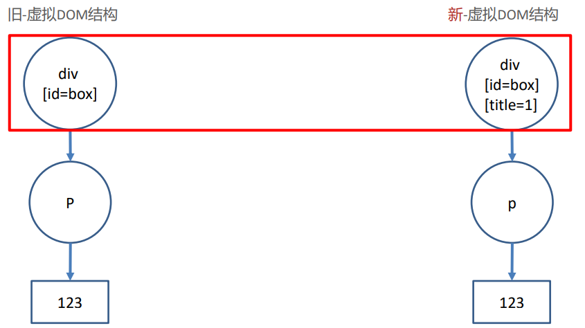

# Vue-基础

1. 安装包----yarn global add vue@cli
2. 创建项目文件夹---vue create vuecli-demo
3. 启动服务器---yarn serve

## 1.插值表达式

作用：在dom标签中直接插入vue数据变量

语法：{{表达式}}----不能填写语句

```vue
<template>
	<div>
        <!--把值赋予到标签中-->
        <h1>{{msg}}</h1>
        <h2>{{obj.name}}</h2>
        <h3>{{obj.age>=18?'成年':'未成年'}}</h3>
    </div>
</template>

<script>
	export default{
        data(){	//	固定格式，定义vue数据的地方
            return{  //	key 相当于变量名
                msg:'hello,world',
                obj:{
                    name:"vue",
                    age:5
                }
            }
        }
    }
</script>
```

msg和obj是vue数据变量，要在js中data函数里声明

## 2.MVVM设计模式

M:Model

V:View

VM:ViewModel

用数据驱动视图改变，操作dom的事，vue源码内执行了 

设计模式: 设计模式是对代码的分层，引入一种架构的概念

不需要再取操作DOM,减少DOM操作，提高开发效率


##3.Vue指令-v-bind

作用：给属性标签设置Vue变量的值

语法：v-bind：属性名=‘vue变量’-------属性名=‘vue变量’

```vue
<!--vue指令-v-bind动态赋值-->
<a v-bind:href='url'>a标签</a>

```

```vue
<template>
	<div>
        <!--把值赋予到标签中-->
        <a v-bind:href='url'>百度网址链接</a>
        
</template>

<script>
	export default{
        data(){	//	固定格式，定义vue数据的地方
            return{  //	key 相当于变量名
              url:'www.baidu.com',
                imgsrc:'src'
                }
            }
        }
    }
</script>
```

## 4.Vue指令-v-on

作用：给标签绑定事件

语法:v-on:事件名=‘要执行的代码’

​		 v-on：事件名=‘methods中的函数名’

​		 v-on：事件名=‘methods中的函数名（实参）’

v-on可简写成@

​		 @事件名=‘要执行的代码’

​		 @事件名=‘methods中的函数名’

​		 @事件名=‘methods中的函数名（实参）’

```vue
<template>
  <div>
    <p>需要购买的商品数量:{{count}}</p>
    <button v-on:click="count=count+1">+1</button>
    <button v-on:click="addfn">+1</button>
    <button v-on:click="addfn_1(5)">+5</button>
      <button @click="count=count+1">+1</button>
  </div>
</template>

<script>
export default{
  data(){
    return{
      count:1,
    }
  },
  //  定义函数
  methods:{
    addfn(){ // this指向的export default{}
      //  data函数，会把对象挂到当前组件对象上
      this.count++
    },
    addfn_1(n){
      this.count=this.count+n
    }
  }
}
</script>

<style>

</style>
```

-------------------------------------------------------------------------------------------------------------------------------------------------------------------------------------------

vue事件处理函数中拿到事件对象--阻止默认行为

语法:无传参，通过形参直接接收

​		 传参，通过$event指代事件传给事件处理函数

```vue
<template>
  <div>
    <a href="http://www.baidu.com" @click='one'>百度</a><hr/>
    <a href="www.taobao.com" @click="two(10)">淘宝</a>
  </div>
</template>

<script>
export default{
  methods:{
    one(e){
      e.preventDefault()
    },
    two(num,e){
      e.preventDefault()
    }
  }
}
</script>

<style>

</style>
```

## 5.Vue指令-v-on修饰符

作用：在事件后面.修饰符名-给事件带来更强大的功能

语法：@事件名.修饰符='methods里函数'

修饰符列表:

​	.stop		-阻止事件冒泡

​	.prevent -阻止默认行为

​	.once	  -程序运行期间，只触发一次事件处理函数,事件还在执行

```vue
<template>
  <div>
    <div @click="fatherFn">
      <p @click.stop="oneFn">.stop组织事件冒泡</p>
      <a href="www.baidu.com" @click.prevent.stop>百度</a>
      <p @click.once="twofn">p触发次数</p>
    </div>
  </div>
</template>

<script>
export default{
  methods:{
    fatherFn(){
      console.log('father触发事件');
    },
    oneFn(){
      console.log('p触发事件');
    },
    twofn(){
      console.log('p点击了');
    }
  }
}
</script>

<style>

</style>
```

## 6.Vue指令-v-on按键修饰符

作用：给键盘事件添加修饰符

语法：

​		@keyup.enter	-检测回车按键

​		@key.esc			-检测返回按键

```vue
<template>
  <div>
      <input type="text" @keydown.enter="enterFn">
      <hr/>
       <input type="text" @keydown.esc="escFn">
  </div>
</template>

<script>
export default{
  methods:{
    enterFn(){
      console.log('回车按下');
    },
    escFn(){
      console.log('esc触发事件');
    },
  }
}
</script>

<style>

</style>
```

## 7.Vue指令-v-model

作用：value属性和Vue数据变量，双向绑定到一起

语法：v-model='Vue数据变量'

双向数据绑定：变量变换<===>视图变化，双向驱动

暂用在表单中

```vue
<template>
  <div>
    <div>
      <span>用户名：</span>
      <!--双向绑定，username和input.value-->
      <input v-model="username" type="text">
    </div>
    <div>
      <span>密码:</span>
      <input v-model="password" type="password">
    </div>
  </div>
</template>

<script>
export default{
  data(){
    return{
      username:'',
      password:'',
    }
  }
}
</script>

<style>

</style>
```

```vue
<template>
 <div>
    <div>
      <span>来自于：</span>
      <!--下拉菜单要绑定在select上-->
      <!--value的值与form绑定-->
      <select v-model="form">
        <option value="22">22</option>
        <option value="11">11</option>
        <option value="33">33</option>
      </select>
    </div>
   <div>
     <span>爱好：</span>
     <!--复选框
     非数组：v-model关联的是复选框checked属性--布尔值
     数组：v-model关联的是复选框的value属性
     -->
     <input v-model="hobby" type="checkbox" value="a">a
      <input v-model="hobby" type="checkbox" value="b">b
      <input v-model="hobby" type="checkbox" value="c">c
   </div>
   <div>
     <span>性别：</span>
     <input v-model="sex" type="radio" value="nan">男
     <input v-model="sex" type="radio" value="nv">女
   </div>
   <div>
     <textarea v-model="intro"></textarea>
   </div>
 </div>
</template>

<script>
 export default {
    data(){
      return{
        form:'',
        hobby:[],
        sex:'',
        intro:'',
      }
    }
 }
</script>

<style scoped>

</style>
```

vue变量初始值会影响表单的默认状态

## 8.v-model修饰符

语法:v-model.修饰符=“Vue数据变量”

​		.number		以parseFloat转换成数字类型

​		.trim			  去除首尾空白字符串

​		 .lazy			  在change时触发，而非input时

```vue
<template>
 <div>
   <div>
     <span>年龄</span>
     <!--.number修饰符，把value parseFloat后再赋值给v-model对应的变量-->
     <input v-model.number="age" type="number">
   </div>
   <div>
     <span>格言</span>
     <!--.trim修饰符，去除首尾空格后赋值给v-model对应的变量-->
     <input v-model.trim="moto" type="text">
   </div>
   <div>
     <span>个人简介</span>
     <!--.lazy修饰符，失去焦点时才将value赋值给v-model对应的变量-->
     <textarea v-model.lazy="intro"></textarea>
   </div>
 </div>
</template>

<script>
 export default {
   data () {
     return {
       age: 20,
       moto:'',
       intro:'',
     }
   },
 }
</script>

<style scoped>

</style>
```

## 9.Vue指令-v-text和v-html

作用：更新DOM对象的innertext/innerHTML

语法：v-text="Vue数据变量"		v-html="Vue数据变量"

会覆盖插值表达式

```vue
<template>
 <div>
   <!--v-text内容覆盖p标签内表达式赋值，显示str的内容-->
   <p v-text="str">{{msg}}</p>
   <!--v-html解析html标签-->
   <p v-html="str_html"></p>
   <!--v-text不解析html标签-->
   <p v-text="str_html"></p>
 </div>
</template>

<script>
 export default {
   data () {
     return {
       msg: '表达式赋值',
       str:'v-text赋值',
       str_html:"<span>span标签内</span>",
     }
   },
 }
</script>

<style scoped>

</style>
```

## 10.Vue指令v-show和v-if

作用：控制标签的隐藏或出现

语法: v-show='Vue变量'      v-if=‘vue变量’

true：显示标签

false:不显示标签

v-show:display:none隐藏，

v-if:从DOM树上移除

v-if和v-else一块使用，可进行判断，选择显示标签

```vue
<template>
 <div>
   <h1>默认的h1</h1>
   <h1 v-show="isShow">display方式隐藏的H1</h1>
   <h1 v-if="isHidden">DOM树上移除的H1</h1>
   <!--进行判断，age>18显示成年，否则显示未成年-->
   <h2 v-if="age >=18">成年</h2>
   <h2 v-else>未成年</h2>
 </div>
</template>

<script>
 export default {
   data () {
     return {
       isShow:false,
       isHidden:true,
       age:20
     }
   },
 }
</script>

<style scoped>

</style>
```

## 11.Vue指令 v-for

作用：列表渲染，所在标签结构，按照数据数量循环生成

语法：v-for"（值变量，索隐变量）in 目标结构"

​			v-for="值变量 in 目标结构"

目标结构可以是数组、对象、数字

值变量和索引变量不能用到v-for范围以外

让谁循环生成, v-for就写谁身上

```vue
<template>
  <div id="app">
    <div id="app">
      <!-- v-for 把一组数据, 渲染成一组DOM -->
      <!-- 口诀: 让谁循环生成, v-for就写谁身上 -->
      <p>学生姓名</p>
      <ul>
        <li v-for="(item, index) in arr" :key="item">
          {{ index }} - {{ item }}
        </li>
      </ul>

      <p>学生详细信息</p>
      <ul>
        <li v-for="obj in stuArr" :key="obj.id">
          <span>{{ obj.name }}</span>
          <span>{{ obj.sex }}</span>
          <span>{{ obj.hobby }}</span>
        </li>
      </ul>

      <!-- v-for遍历对象(了解) -->
      <p>老师信息</p>
      <div v-for="(value, key) in tObj" :key="value">
        {{ key }} -- {{ value }}
      </div>

      <!-- v-for遍历整数(了解) - 从1开始 -->
      <p>序号</p>
      <div v-for="i in count" :key="i">{{ i }}</div>
    </div>
  </div>
</template>

<script>
export default {
  data() {
    return {
      arr: ["小明", "小欢欢", "大黄"],
      stuArr: [
        {
          id: 1001,
          name: "孙悟空",
          sex: "男",
          hobby: "吃桃子",
        },
        {
          id: 1002,
          name: "猪八戒",
          sex: "男",
          hobby: "背媳妇",
        },
      ],
      tObj: {
        name: "小黑",
        age: 18,
        class: "1期",
      },
      count: 10,
    };
  },
};
</script>
```

## 12.更新监测和key

### 1.v-for更新监测

目标:目标结构发生变化，触发v-for的更新

1. 数组反转
2. 数组截取
3. 更新值

数组数据变更，导致v-for更新，页面更新

push()  pop()  shift()  unshift()  splice()  sort()  reverse()

数组非变更，返回新数组，原数组数据不变，不会导致v-for更新，可采用覆盖数组或this.$set()

folter()  concat()  slice()

<p style="color:red;font-weight:700">this.$set(this.arr,0,1000)<br>第一个参数：更新的数组<br>第二个参数：数组更新的元素位置下标<br>第三个参数：待更新数据</p>

v-for更新时循环出新的虚拟DOM结构, 和旧的虚拟DOM 结构对比, 尝试复用标签就地更新内容

### 2.虚拟DOM

本质是保存节点信息，属性和内容的一个js对象，当数据发生变化时，在内存中创建一个新的虚拟DOM结构，在内存中比较新旧虚拟DOM，然后更新真实DOM


<p style="color:red;font-weight:700">好处：</p>

提高DOM更新的性能, 不频繁操作真实DOM,  在内存中找到变化部分, 再更新真实DOM(打补丁)

### 3.diff算法

作用：同级比较，根元素变化==>整个dom树删除重建，根元素不变===>属性改变更新属性

根元素改变：


根元素不变，属性改变：



### 4.key

子元素或者内容改变会分diff哪2种情况比较? 无key, 就地更新 有key, 按照key比较 

key值要求是? 唯一不重复的字符串或者数值 

key应该怎么用? 有id用id, 无id用索引

 key的好处? 可以配合虚拟DOM提高更新的性能

v-for什么时候会更新页面呢? 数组采用更新方法, 才导致v-for更新页面 

vue是如何提高更新性能的? 采用虚拟DOM+diff算法提高更新性能 

虚拟DOM是什么? 本质是保存dom关键信息的JS对象 

diff算法如何比较新旧虚拟DOM? 

根元素改变 – 删除当前DOM树重新建 根元素未变, 属性改变 – 更新属性 根元素未变, 子元素/内容改变 无key – 就地更新 

有key – 按key比较

+ 无key

  

  从第二个往后更新内容---性能不高

  最大限度尝试就地修改/复用相同类型元素

  

  

+ 有key，值为索引

  

  有key属性, 基于key的来比较新旧虚拟DOM, 移除key不存在元素

  先产生新旧虚拟DOM, 根据key比较, 还是就地更新

  

  相当于无key

+ 有key，值唯一，且不重复的字符串或数字

  id作为key

  

  先产生新旧虚拟DOM, 根据key比较

  key相同，数据不变就dom就不变

  


## 13.动态class

+ 用v-bind给标签class设置动态的值

  语法:class="{类名：布尔值}"

   true使用, false不用

  ```vue
  <template>
   <div>
     <!--:class="{类名:布尔值}"
     使用场景:vue变量控制标签是否应该有类名-->
    <p :class="{red_str:bool}">动态class</p>
   </div>
  </template>
  
  <script>
   export default {
     data () {
       return {
         bool: true,
       }
     },
   }
  </script>
  
  <style scoped>
  .red_str{
    color: red;
  }
  </style>
  ```


## 14.动态style

语法 :style="{css属性名: 值}"

给style赋值和class区别是? :class="{类名: 布尔值}”, true使用, false不用 :style="{css属性名: 值}"

```vue
<p:style="{backgroundColor:colorStr}">动态style</p>


data(){
	return{
		colorStr:'red'
}
		
}
```

## 15.过滤器_filter

 转换格式, 过滤器就是一个函数, 传入值返回处理后的值

过滤器只能用在, 插值表达式和v-bind动态属性里

使用场景：

1. 字符串翻转, "输入hello, world", 输出"dlrow ,olleh”
2. 字母转大写, 输入"hello", 输出"HELLO”

语法：

全局过滤器--在main.js中定义：Vue.filter("过滤器名", (值) => {return "返回处理后的值"})

局部过滤器--在当前vue文件定义:filters: {过滤器名字: (值) => {return "返回处理后的值"}

使用方法：{{值|过滤器名字}}

```vue
<template xmlns:p="http://www.w3.org/1999/xlink">
 <div>
  <p>原来的样子:{{msg}}</p>
   <!--过滤器使用语法{{值|过滤器名字}}-->
   <p>使用全局翻转过滤器:{{msg|reverse_1}}</p>
   <p>使用局部翻转过滤器:{{msg|reverse_2}}</p>
   <p :title='msg|toUp'>鼠标长汀</p>
 </div>
</template>

<script>
 export default {
   data () {
     return {
       msg: 'Hello,World',
     }
   },
   // 方式二：局部过滤器
   // 只能在当前vue文件内使用
   /*语法
    filters:{
      过滤器名字(val){
      return 处理后的值}
    }

   */
   filters:{
     reverse_2(val){
       return val.split('').reverse().join('')
     },
     toUp(val){
       return val.toUpperCase()
     }
   }
 }
</script>

<style scoped>

</style>

<!--main.js中定义,在new vue前定义-->
//  方式一：定义全局过滤器
//  任意的vue文件内直接使用
//  语法：Vue.filter("过滤器名", (值) => {return "返回处理后的值"})
Vue.filter('reverse_1',val => val.split('').reverse().join(''))
```

------

过滤器传参：语法：vue变量|过滤器（实参）

```js
//	全局过滤 main.js中定义
Vue.filter('reverse_1',(val,s)=>{
  return val.split('').reverse().join(s)
})
```

```vue
 <!--过滤器使用语法{{值|过滤器名字}}-->
   <p>使用全局翻转过滤器:{{msg|reverse_1("--")}}</p>
```

多个过滤器：语法：vue变量|过滤器1|过滤器2

```vue
<p :title='msg|toUp|reverse_2'>鼠标长汀</p>
```

## 16.计算属性_computed

一个变量的值, 依赖另外一些数据计算而来的结

使用场景：当变量的值, 需要通过别人计算而得来

特点：函数内使用的变量改变, 重新计算结果返回

注意事项：计算属性也是vue数据变量, 所以不要和data里重名, 用法和data相同

语法：


```vue
<template>
 <div>
  <p>{{add}}</p>
 </div>
</template>

<script>
 export default {
   data(){
     return{
       a:10,
       b:20,
     }
   },
   computed:{
     add(){
       return this.a+this.b
     }
   }
 }
</script>

<style scoped>

</style>
```


------

<p style="font-size:28px;font-weight:700">计算属性----缓存</p>

计算属性, 基于依赖项的值进行缓存，依赖的变量不变, 都直接从缓存取结果，函数则需要重新执行


计算属性只在第一次执行，后续从缓存取结果，函数每次都从新执行

------

<p style="font-size:28px;font-weight:700">计算属性---完整写法</p>

给计算属性变量赋值时，需要使用计算属性完整写法发


```vue
<template>
 <div>
  <span>姓名：</span>
   <input v-model="full" type="text">
 </div>
</template>

<script>
 export default {
   data(){
     return{
       a:10,
       b:20,
     }
   },
   computed:{
     full:{
       // 给full赋值触发set
       set(val){
         console.log(val);
       },
       // 使用full的值触发get
       get(){
         return '名字'
       }
     }
   }
 }
</script>

<style scoped>

</style>
```

## 17.侦听器—watch

作用：可用侦听到data、computed属性值的改变 


侦听到某个变量值改变 ：使用watch配置项, key是要侦听的data/计算属性名

------

<p style="font-size:28px;font-weight:700">侦听器-深度侦听和立即执行</p>

目标: 侦听复杂类型, 或者立即执行侦听函数


侦听数组/对象：把侦听器写成对象形式, 给handler方法和deep:true

immediate: true     立即侦听，网页打开，handler执行一次

# Vue组件

##1.vue组件创建和使用

组件是可复用的 Vue 实例, 封装标签, 样式和JS代码 

组件化 ：封装的思想，把页面上 `可重用的部分` 封装为 `组件`，从而方便项目的 开发 和 维护 

一个页面， 可以拆分成一个个组件，一个组件就是一个整体, 每个组件可以有自己独立的 结构 样式 和 行为(html,  css和js)

1. 创建组件, 封装要复用的标签, 样式, JS代码

2. 注册组件

   全局注册– --main.js中 

   ```js
   import vue from 'vue'
   import 组件对象 from 'vue文件路径'
   vue.component('组件名'，组件对象)
   ```

   局部注册 – 某.vue文件内

   ```js
   import 组件对象 from 'vue文件路径'
   export default{
       component:{
           "组件名":组件对象
       }
   }
   ```

3. 使用组件--组件名当标签使用

   ```vue
   <template>
    <div id="app">
      <h3>案例：折叠面板</h3>
        <组件名></组件名>
        <组件名></组件名>
        <组件名></组件名>
    </div>
   </template>
   ```

## 2.组件-scoped作用

准备: 当前组件内标签都被添加 data-v-hash值 的属性 

获取: css选择器都被添加 [data-v-hash值] 的属性选择器

会自动给标签添加data-v-hash值属性, 所有选择都 带属性选择


## 3.Vue组件通信

### 1.父传子-props

目标：父组件--->子组件 传值

首先明确父和子是谁，在父组件引入子组件，被引入的是子组件

1. 子组件内, 定义变量, 准备接收, 然后使用变量

   ```vue
   <template>
     <div class="my-product">
       <h3>标题: {{ title }}</h3>
       <p>价格: {{ price }}元</p>
       <p>{{ intro }}</p>
     </div>
   </template>
   
   <script>
   export default {
     props: ['title', 'price', 'intro']
   }
   </script>
   
   <style>
   .my-product {
     width: 400px;
     padding: 20px;
     border: 2px solid #000;
     border-radius: 5px;
     margin: 10px;
   }
   </style>
   ```

   props内定义变量，准备接收父组件传来的数据

   props:[]	-	只能声明变量，不能进行类型的校验

   props:{}	-	声明变量和校验类型规则，不对则报错

   父组件调用子组件时，每次都是独立的

   父组件内, 使用子组件, 属性方式给props变量传值

2. 父组件(App.vue)内, 要展示封装的子组件(MyProduct.vue) 引入组件, 注册组件, 使用组件, 传值进去

   ```vue
   <template>
    <div>
      <!--父向子传值
         1.子组件内定义变量准备接受，然后使用变量
      -->
      <sun intro="开业大酬宾, 全场8折" price="50" title="好吃的口水鸡"></sun>
      <sun intro="开业大酬宾, 全场8折" price="50" title="好吃的口水鸡"></sun>
      <sun intro="开业大酬宾, 全场8折" price="50" title="好吃的口水鸡"></sun>
    </div>
   </template>
   
   <script>
   //	创建子组件
   //  引入子组件
   import sun from './01_父子通信_sun'
    export default {
     //  注册组件   key和value同名，可以简写
     components :{
       sun
     }
    }
   </script>
   
   <style scoped>
   
   </style>
   ```

### 2.父向子传值-配合循环

目标：父组件 -> 子组件 循环使用-传值

```vue
<template>
 <div>
  <sun v-for="items in list" :key="items.id"
       :intro="items.intro" :price="items.price" :title="items.title"></sun>
 </div>
</template>

<script>
//  引入子组件
import sun from './01_父子通信_sun'
 export default {
   data () {
     return {
       list: [
         { id: 1, title: "超级好吃的棒棒糖", price: 18.8, intro: '开业大酬宾, 全场8折' },
         { id: 2, title: "超级好吃的大鸡腿", price: 34.2, intro: '好吃不腻, 快来买啊' },
         { id: 3, title: "超级无敌的冰激凌", price: 14.2, intro: '炎热的夏天, 来个冰激凌了' },
       ],
     }
   },
   components:{
     sun
   }
 }
</script>

<style scoped>

</style>
```

每次循环, 变量和组件, 都是独立的

### 3.单向数据流

从父到子的数据流向, 叫单向数据流


原因: 子组件修改, 不通知父级, 造成数据不一致性

Vue规定props里的变量, 本身是只读的

不建议子组件修改父组件传过来的值 ，会造成父子数据不一致, 而且子组件是依赖父传入的值 

单向数据流：从父到子的数据流向, 叫单向数据流 

props里定义的变量不能修改, props里的变量本身是只读的

### 4.子向父传值—自定义事件

目标：子组件触发父自定义事件方法

前置补充, 父 -> 索引 -> 子组件 (用于区分哪个子组件)

```vue
<!--子组件-->
<script>
export default {
  props: [,'index','title', 'price', 'intro'],
  methods:{
    btn(){
      this.price=this.price-1
    }
  }
}
</script>
```

```vue
<!--父组件-->
<template>
 <div>
  <sun v-for="(items,index) in list" :key="items.id" :index="index"
       :intro="items.intro" :price="items.price" :title="items.title"></sun>
 </div>
</template>
```

1. 父组件内, 绑定自定义事件和事件处理函数 

   父组件内, 给组件@自定义事件="父methods函数"

   语法: @自定义事件名="父methods里函数名"

   ```vue
   <template>
    <div>
      <!--父组件自定义事件  @自定义事件名='父methods函数'-->
     <sun v-for="(items,index) in list" :key="items.id" :index="index"
          :intro="items.intro" :price="items.price" :title="items.title"
          @subprice="fn"
     ></sun>
    </div>
   </template>
   
   <script>
   //  引入子组件
   import sun from './02_子向父_sun'
   export default {
     data () {
       return {
         list: [
           { id: 1, title: "超级好吃的棒棒糖", price: 18.8, intro: '开业大酬宾, 全场8折' },
           { id: 2, title: "超级好吃的大鸡腿", price: 34.2, intro: '好吃不腻, 快来买啊' },
           { id: 3, title: "超级无敌的冰激凌", price: 14.2, intro: '炎热的夏天, 来个冰激凌了' },
         ],
       }
     },
     methods:{
       fn(index,price){
         //  修改list中 price的值
         this.list[index].price=this.list[index].price-price
       }
     },
     components:{
       sun
     }
   }
   </script>
   ```

2. 子组件内, 恰当的时机, 触发父给我绑的自定义事件, 导致父methods里事件处理函数执行

   子组件内, 恰当时机this.$emit('自定义事件名', 值)

   ```vue
   <template>
    <div>
      <!--父组件自定义事件  @自定义事件名='父methods函数'-->
     <sun v-for="(items,index) in list" :key="items.id" :index="index"
          :intro="items.intro" :price="items.price" :title="items.title"
          @subprice="fn"
     ></sun>
    </div>
   </template>
   
   <script>
   //  引入子组件
   import sun from './02_子向父_sun'
   export default {
     data () {
       return {
         list: [
           { id: 1, title: "超级好吃的棒棒糖", price: 18.8, intro: '开业大酬宾, 全场8折' },
           { id: 2, title: "超级好吃的大鸡腿", price: 34.2, intro: '好吃不腻, 快来买啊' },
           { id: 3, title: "超级无敌的冰激凌", price: 14.2, intro: '炎热的夏天, 来个冰激凌了' },
         ],
       }
     },
     methods:{
       fn(index,price){
         //  修改list中 price的值
         this.list[index].price>1 && (this.list[index].price=(this.list[index].price-price).toFixed(2))
       }
     },
     components:{
       sun
     }
   }
   </script>
   
   <style scoped>
   
   </style>
   ```

## 4.组件通信-Eventbus

目标：常用于跨组件通信时使用


语法：

src/EventBus/index.js – 创建空白Vue对象并导出

在要接收值的组件(List.vue) eventBus.$on('事件名', 函数体)-----注册事件并监听

在要传递值的组件(MyProduct.vue) eventBus.$emit('事件名', 值)

```vue
<!--myp   sun_1-->
<template>
  <div class="my-product">
    <h3>标题: {{ title }}</h3>
    <p>价格: {{ price }}元</p>
    <p>{{ intro }}</p>
    <button @click="btn">砍1元</button>
  </div>
</template>

<script>
import eventBus from "./EventBus/index";
export default {
  props: ['index','title', 'price', 'intro'],
  methods:{
    btn(){
      //  this.$emit触发父组件定义的事件
      eventBus.$emit('send',this.index,1)
    }
  }
}
</script>

<style>
.my-product {
  width: 400px;
  padding: 20px;
  border: 2px solid #000;
  border-radius: 5px;
  margin: 10px;
}
</style>
```

```vue
<!--List   sun_2-->
<template>
  <ul class="my-product">
    <li v-for="(items,index) in arr" :key="index">
      <span>{{items.title}}</span>
      <span>{{items.price}}</span>
    </li>
    </ul>
</template>

<script>
//  跨组件传值
//  默认从文件夹内找index.js
import eventBus from "./EventBus/index";
 export default {
   props:['arr'],
   // 组件创建完毕，监听send事件
  created () {
     eventBus.$on('send',(index,price)=>{
       this.arr[index].price>1&&(this.arr[index].price=(this.arr[index].price-price).toFixed(2))
     })
  }
 }
</script>

<style scoped>
.my-product{
  width: 400px;
  padding: 20px;
  border: 2px solid #000;
  margin: 10px;
}
</style>
```

```vue
<!--app.vue-->
<template>
  <div style="overflow: hidden;">
    <div style="float: left;">
      <sun
          v-for="(items, index) in list"
          :key="items.id"
          :index="index"
          :intro="items.intro"
          :price="items.price"
          :title="items.name">
          <!--@subprice="fn"-->
      </sun>
    </div>
    <div style="float: left;">
      <sun-list :arr="list"></sun-list>
    </div>
  </div>
</template>

<script>
//  引入子组件
import sunList from './03_EventBus_sun2list'
import sun from './03_EventBus_sun1'
export default {
  data () {
    return {
      list: [
        { id: 1, title: "超级好吃的棒棒糖", price: 18.8, intro: '开业大酬宾, 全场8折' },
        { id: 2, title: "超级好吃的大鸡腿", price: 34.2, intro: '好吃不腻, 快来买啊' },
        { id: 3, title: "超级无敌的冰激凌", price: 14.2, intro: '炎热的夏天, 来个冰激凌了' },
      ],
    }
  },
  // methods:{
  //   fn(index,price){
  //     //  修改list中 price的值
  //     this.list[index].price>1 && (this.list[index].price=(this.list[index].price-price).toFixed(2))
  //   }
  // },
  components:{
    sun,
    sunList,
  }
}
</script>

<style scoped>

</style>
```

## 5.生命周期

从创建 到 销毁 的整个过程就是 – Vue实例的 - 生命周期

### 1.钩子函数

Vue 框架内置函数，随着组件的生命周期阶段，自动执行-----获取Vue生命周期到达了什么阶段

作用: 特定的时间点，执行特定的操作

场景: 组件创建完毕后，可以在created 生命周期函数中发起Ajax 请求，从而初始化 data 数据

分类: 4大阶段8个方法


### 2.初始化阶段

1. new Vue() – Vue实例化(组件也是一个小的Vue实例)

2. Init Events & Lifecycle – 初始化事件和生命周期函数

3. beforeCreate – 生命周期钩子函数被执行

4. Init injections&reactivity – Vue内部添加data和methods等

5. created – 生命周期钩子函数被执行, 实例创建，能获取data, 不能获取真实DOM--网络请求，注册全局事件......

6. 接下来是编译模板阶段 –开始分析

7. Has el option? – 是否有el选项 – 检查要挂到哪里

   没有. 调用$mount()方法

   有, 继续检查template选项


### 3.挂载阶段

1. template选项检查

   有 - 编译template返回render渲染函数

   无 – 编译el选项对应标签作为template(要渲染的模板)

2. 虚拟DOM挂载成真实DOM之前

3. beforeMount – 生命周期钩子函数被执行----预处理data，不会触发updated钩子函数

4. Create … – 把虚拟DOM和渲染的数据一并挂到真实DOM上

5. 真实DOM挂载完毕

6. mounted – 生命周期钩子函数被执行--挂载后真实DOM


### 4.更新阶段

1. 当data里数据改变, 更新DOM之前

2. beforeUpdate – 生命周期钩子函数被执行

3. Virtual DOM…… – 虚拟DOM重新渲染, 打补丁到真实DOM

4. updated – 生命周期钩子函数被执行

5. 当有data数据改变 – 重复这个循环


###5.销毁阶段

1. 当$destroy()被调用 – 比如组件DOM被移除(例v-if)

2. beforeDestroy – 生命周期钩子函数被执行

3. 拆卸数据监视器、子组件和事件侦听器

4. 实例销毁后, 最后触发一个钩子函数

5. destroyed – 生命周期钩子函数被执行


## 6.axios

axios 是一个专门用于发送ajax请求的库，一种前端异步请求后端的技术

特点：

+ 支持客户端发送Ajax请求
+ 支持服务端Node.js发送请求
+ 支持Promise相关用法
+ 支持请求和响应的拦截器功能
+ 自动转换JSON数据

axios 底层还是原生js实现, 内部通过Promise封装的

```js
axios({
    method:'请求方式',//	get post
    url:'请求地址',
    data:{   //	拼接到请求体的参数，post请求的参数
        key:value
    },
    params:{  //	拼接到请求体的参数，get请求的参数
        ksy:value
    }
}).then(res=>{  //	后台返回的结果
    console.log(res.data)
}).catch(err=>){   //	后台报错返回
	console.log(err)         
}
```

ajax原理：浏览器window接口的XMLHttpRequest

axios：基于原生ajax+Promise技术封装通用于前后端的请求库

配置全局地址：axios.defaults.baseUrl=''

## 7.\$refs和$nextTick

### 1.获取DOM

通过id或ref属性获取原生DOM

在mounted生命周期 – 2种方式获取原生DOM标签

1. 目标标签 – 添加id / ref

   ```vue
   <h1 ref='myh1' id='h'>获取余原生dom</h1>
   ```

2. 恰当时机, 通过id / 通过ref属性 获取目标标签

   ```vue
    mounted () {
        console.log(document.getElementById('h'))
        console.log(this.$refs.myh1);
      }
   ```

### 2.获取组件

通过ref属性获取组件对象

1.  创建Demo组件, 写一个方法

2. App.vue使用Demo组件, 给ref属性-名字随意

   ```vue
   <Demo ref='de'></Demo>
   ```

3. 恰当时机, 通过ref属性 获取组件对象, 可调用组件对象里方法等

   ```vue	
   mounted(){
   this.$refs.de.fn()
   }
   ```

### 3.异步更新DOM

点击改data, 获取原生DOM内容

1. 创建标签显示数据

   ```vue
    <div>
        <h2>data更新，获取DOM</h2>
        <p ref="num">数字：{{count}}</p>
        <button @click="btn">点击加一</button>
      </div>
   ```

2. 点击+1, 马上获取原生DOM内容

   ```vue
   methods:{
   	 btn(){
          this.count++ // vue监测数据更新
          console.log(this.$refs.num.innerHTML);//	输出更新前的值，Vue更新DOM是异步的
   
        }
   }
   ```

------

<h3>$nextTick</h3>

等DOM更新后, 触发此方法里函数体执行

语法: this.$nextTick(函数体)

```vue
<p ref="num">数字：{{number}}</p>
<button @click="nextBtn" >点击加一$nextTick</button>

nextBtn(){
       this.number++
       this.$nextTick(()=>{
         console.log('nextTick:');
         console.log(this.$refs.num.innerHTML);
       })
     }
```

输出更新后的数据

$nextTick函数原地返回Promise对象

### 4.组件name属性

组件name可用作注册组件名字

1. 组件定义name属性和值

   ```vue
   <!--components.vue-->
   <script>
   export default{
       name:'comname'
   }
   </script>
   ```

2. 注册组件可用上面name的值

   ```vue
   <comname></comname>
   <script>
   import comN from './components.vue'
    export default{
      componets:{
          [comN.name]:comN  //	key是变量，需要用[]包起来
      }
   }   
    
   </script>
   ```

## 8.动态组件

多个组件使用同一个挂载点，并动态切换

1.  准备被切换的 - UserName.vue / UserInfo.vue 2个组件

2. 引入到UseDynamic.vue注册

   ```vue
   <script>
   import userName from './04_动态组件_userName'
   import userInfo from './04_动态组件_userInfo'
    export default {
     components:{
       userName,
       userInfo
   },
      methods:{
       btnName(){
         this.comName='userName'
       },
        btnInfo(){
          this.comName='userInfo'
        }
      }
    }
   </script>
   ```

3. 准备变量来承载要显示的"组件名"

   ```vue
      data () {
        return {
          comName: 'userName'
        }
      },
   ```

4. 设置挂载点, 使用is属性来设置要显示哪个组件

   ```vue
   <template>
    <div>
       <div>
         <h2>1.动态组件使用</h2>
         <button @click="btnName">账号密码填写</button>
         <button @click="btnInfo">个人信息填写</button>
         <h2>下面显示注册组件--动态切换:</h2>
       </div>
      <hr/>
       <div>
         <!--vue内置组件component，可以动态显示组件-->
         <component :is="comName"></component>
       </div>
    </div>
   </template>
   ```

5. . 点击按钮 – 修改comName变量里的"组件名"

   ```vue
      methods:{
       btnName(){
         this.comName='userName'
       },
        btnInfo(){
          this.comName='userInfo'
        }
      }
   ```

   动态组件：在同一个挂载点, 可以切换显示不同组件，vue内置的component组件, 配合is属性，改变is属性的值, 为要显示的组件名即可

   切换会导致组件频繁创建和销毁

   ------

   ## 组件缓存

   Vue内置的keep-alive组件 包起来要频繁切换的组件

   ```vue
   <keep-alive>
   	<!--vue内置组件component，可以动态显示组件-->
       <component :is="comName"></component>
   </keep-alive>
   ```

   vue内置的keep-alive组件把要缓存的组件包起来，不会频繁的创建和销毁组件, 页面更快呈现

   ------

   ## 组件激活和非激活

   扩展2个新的生命周期方法：

   1. activated – 激活时触发
   2. deactivated – 失去激活状态触发

   ```vue
   <script>
   	export default{
           actived(){
               console.log('激活了')
           }，
           deactived(){
               console.log('失去激活')
           }
           
       }
   </script>
   ```

## 9.组件插槽

通过 slot 标签, 让组件内可以接收不同的标签结构显示

给组件插入什么标签, 组件就显示什么标签

语法口诀:

1. 组件内用占位

   ```vue
   <div>
       <slot></slot>
   </div>
   ```

2. 使用组件时夹着的地方, 传入标签替换slot 

   ```vue
   <Panel>
   	<div>
           <p>替换slot</p>
       </div>
   </Panel>
   ```

   传入的标签会替换掉slot显示

   ------

   ## 默认插槽内容

   slot内放置内容, 作为默认显示内容，不给组件传标签. slot内容原地显示，给组件内传标签, 则slot整体被换掉

   ------

   ##具名插槽

   一个组件内有2处以上需要外部传入标签的地方:

   1. slot使用name属性区分名字
   2. template配合v-slot:名字来分发对应标签-----v-slot:可以简化成#

```vue
<template>
 <div>
  <div class="title">
    <slot name="title"></slot>
    <span class="btn" @click="isShow=!isShow">{{isShow?'收起':'展开'}}</span>
  </div>
   <div v-show="isShow" class="body">
     <slot name="body"></slot>
   </div>
 </div>
</template>

<script>
 export default {
   data () {
     return {
       isShow: true
     }
   },
 }
</script>
```

```vue
<template>
 <div>
  <Panel>
    <template v-slot:title>
      <h4>标题</h4>
    </template>
  </Panel>
   <Panel v-slot:body>
     <h4>文本内容</h4>
   </Panel>
 </div>
</template>

<script>
import Panel from './05_插槽_slot'
 export default {
    components:{
      Panel
    }
 }
</script>

<style scoped>

</style>
```

------

## 10.作用域插槽

使用插槽时, 想使用子组件内变量：

1. 子组件, 在slot上绑定属性和子组件内的值

2.  使用组件, 传入自定义标签, 用template和v-slot="自定义变量名"

3. scope变量名自动绑定slot上所有属性和值

   scope = {row: defaultObj}  

   scope.defaultObj=row.defaultObj


使用组件插槽技术时, 需要用到子组件内变量，子组件在slot身上添加属性和子组件的值 ，使用组件处template配合v-slot=“变量名” ，收集slot身上的所有属性和值

可以让组件更加灵活的适用于不同的场景和项目

同时使用name和作用域插槽   v-slot:name="自定义变量"

## 11.自定义指令

目标：获取标签, 扩展额外的功能

在Vue内置指令满足不了需求时, 可以自己定义使用

1. 全局注册

   ```main.js
   Vue.directive('指令名',{
   	"inserted"(el){
   	//	可以对el标签，拓展额外功能
   	}
   })
   ```

2. 局部注册

   ```vue
   <script>
   	directives:{
           inserted(el){
               //	对el标签进行操作
           }
       }
   </script>
   ```

   v-指令名   使用自定义指令

   ------

   ## 指令传值

   定义color指令-传入一个颜色, 给标签设置文字颜色

   ```js
   Vue.dirctive('color',{
       inserted(el,binding){ // 当被绑定的袁术擦汗儒道府掾属中时调用
           el.style.color=binding.value;
       },
       update(el,biding){ // 值或模板更新时，触发此函数
           el.style.color=bing.value
       }
   })
   ```

   在标签上使用 v-color="'red'"

   inserted方法：指令所在标签，插入到网页上触发一次

   update方法：指令对应数据/标签更新时执行

# Vue路由

## 1. vue路由简介和基础使用

路由是一种映射关系

vue路由：路径和组件的映射关系

nodejs路由：接口和服务的映射关系

前端路由：路径和组件的映射关系

前端路由作用: 实现业务场景切换

1. 优点
   + 整体不刷新页面，用户体验更好
   + 数据传递容易, 开发效率高
2. 缺点
   + 开发成本高(需要学习专门知识)
   + 首次加载会比较慢一点。不利于seo

<h2>Vue_router模块</h2>

1. 下载vue-router模块到当前工程

2. 在main.js中引入VueRouter函数

3. 添加到Vue.use()身上 – 注册全局RouterLink和RouterView组件

4. 创建路由规则数组 – 路径和组件名对应关系

5. 用规则生成路由对象

6. 把路由对象注入到new Vue实例中

7. 用router-view作为挂载点, 切换不同的路由页

   <p style="color:red;font-weight:700">注意: 一切都要以url上hash值为准</p>

下包/引入/注册/规则/路由对象/注入/挂载点

切换url上hash值, 开始匹配规则, 对应组件展示到 router-view位置

```js
<!--main.js-->
import Vue from 'vue'
import App from './App.vue'
import Find from "@/views/Find";  // @=src的绝对路径
import My  from "@/views/My";
import Part from "@/views/Part";
//  目标:vue-router使用
//  1.下载包，
//  2.引入
import VueRouter from 'vue-router'
//  3.注册全局组件
Vue.use(VueRouter)
//  4.规则数组
const routes=[
  {
    path:'/find',
    component:Find
  },
  {
    path:'/my',
    component:My
  },
  {
    path:'/part',
    component:Part
  },
]
//  5.生成路由对象
const router=new VueRouter({
  routes  //  routes是固定的key,参数是规则数组，同名，可省略简写
})
Vue.config.productionTip = false
//  6.路由对象注入到vue实例中，this可以访问$route和$router
new Vue({
  router,
  render: h => h(App),
}).$mount('#app')
```

```vue
<!--App.vue-->
<template>
  <div>
    <div class="footer_wrap">
      <a href="#/find">发现音乐</a>
      <a href="#/my">我的音乐</a>
      <a href="#/part">朋友</a>
    </div>
    <div class="top">
      <!--7.设置挂载点，当url的hash值路径切换，显示规则里对应的组件到这里-->
      <router-view></router-view>
    </div>
  </div>
</template>

<script>
export default {};
</script>

<style scoped>
.footer_wrap {
  position: fixed;
  left: 0;
  top: 0;
  display: flex;
  width: 100%;
  text-align: center;
  background-color: #333;
  color: #ccc;
}
.footer_wrap a {
  flex: 1;
  text-decoration: none;
  padding: 20px 0;
  line-height: 20px;
  background-color: #333;
  color: #ccc;
  border: 1px solid black;
}
.footer_wrap a:hover {
  background-color: #555;
}
.top {
  padding-top: 62px;
}
.footer_wrap .router-link-active{
  color: #fff;
  background-color: black;
}
</style>
```


## 2.声明式导航

可用组件router-link来替代a标签

1.  vue-router提供了一个全局组件 router-link
2. . router-link实质上最终会渲染成a链接 to属性等价于提供 href属性(to无需#)
3.  router-link提供了声明式导航高亮的功能(自带类名)
4. 对激活的样式进行编写

router-link，本质就是a标签，当标签使用, 必须传入to属性, 指定路由路径值，自带激活时的类名, 可以做高亮

```vue
<template>
  <div>
    <div class="footer_wrap">
      <router-link to="/find">发现音乐</router-link>
      <router-link to="/my">我的音乐</router-link>
      <router-link to="/part">朋友</router-link>
    </div>
    <div class="top">
      <!--7.设置挂载点，当url的hash值路径切换，显示规则里对应的组件到这里-->
      <router-view></router-view>
    </div>
  </div>
</template>

<script>
export default {};
</script>

<style scoped>
.footer_wrap {
  position: fixed;
  left: 0;
  top: 0;
  display: flex;
  width: 100%;
  text-align: center;
  background-color: #333;
  color: #ccc;
}
.footer_wrap a {
  flex: 1;
  text-decoration: none;
  padding: 20px 0;
  line-height: 20px;
  background-color: #333;
  color: #ccc;
  border: 1px solid black;
}
.footer_wrap a:hover {
  background-color: #555;
}
.top {
  padding-top: 62px;
}
.footer_wrap .router-link-active{
  color: #fff;
  background-color: black;
}
</style>
```

<h2>声明导航--跳转传参</h2>

在跳转路由时, 可以给路由对应的组件内传值

+ 在router-link上的to属性传值, 语法格式如下

  /path?参数名=值

  ```app.vue
  <router-link to="/part?name=错错错">朋友</router-link>
  ```

  ```part.vue
  <p>{{$route.query.name}}</p>
  ```

  /path/值 – 需要路由对象提前配置 path: “/path/参数名”

  ```main.js
    {
      path:'/part/:uname/:id',
      component:Part,
    }
  ```

  ```vue
  <router-link to="/part/uNameeee">朋友</router-link>
  ```

  ```part.vue
  <p>{{$route.params.name}}</p>
  ```

+ 对应页面组件接收传递过来的值

  $route.query.参数名

  $route.params.参数名

## 3.重定向

匹配path后, 强制跳转path路径

+ 网页打开url默认hash值是/路径
+ redirect是设置要重定向到哪个路由路径

```main.js
const routes=[
  {
    path: '/', // 默认hash值路径
    redirect:'/find' // 重新定向到/find
    // 浏览器url中#后面的路径被该百年城/find-重新匹配规则
  },
  {
    path:'/find',
    component:Find
  },
  {
    path:'/my',
    component:My
  },
  {
    path:'/part',
    component:Part
  },
  {
    path:'/part/:uname/:id'
  }
  
]
```

------

<h2>路由404</h2>

找不到路径给个提示页面

路由最后, path匹配*(任意路径) – 前面不匹配就命中最后这个

```main.js
const routes=[
  {
    path: '/', // 默认hash值路径
    redirect:'/find' // 重新定向到/find
    // 浏览器url中#后面的路径被该百年城/find-重新匹配规则
  },
  {
    path:'/find',
    component:Find
  },
  {
    path:'/my',
    component:My
  },
  {
    path:'/part',
    component:Part
  },
  {
    path:'/part/:uname/:id'
  },
    //  path比较是从前往后逐个比较，404一定要写在最后
  {
    path: '*',
    component: NotFound
  }
  
]
```

## 4.路由-模式设置

修改路由在地址栏的模式

hash路由例如: http://localhost:8080/#/home

history路由例如: http://localhost:8080/home (以后上线需要服务器端支持, 否则找的是文件夹)

```main.js
const router =new VueRouter({
	routes,
	mode:'history'
})
```

## 5.编程式导航

用JS代码来进行跳转

语法： path

```VUE
<template>
  <div>
    <div class="footer_wrap">
      <span @click="btn('/find')">发现音乐</span>
      <span @click="btn('/my')">我的音乐</span>
      <span @click="btn('Part')">朋友</span>
    </div>
    <div class="top">
      <!--7.设置挂载点，当url的hash值路径切换，显示规则里对应的组件到这里-->
      <router-view></router-view>
    </div>
  </div>
</template>

<script>
//  目标：编程式导航--使用js跳转
//  1. this.$router.push(path:'路由路径')
//  2.this.router.push(name:'路由名')
export default {
  methods:{
    btn(path){
      this.$router.push({
        path
      })
    },
  }
};
</script>

<style scoped>
.footer_wrap {
  position: fixed;
  left: 0;
  top: 0;
  display: flex;
  width: 100%;
  text-align: center;
  background-color: #333;
  color: #ccc;
}
.footer_wrap span {
  flex: 1;
  text-decoration: none;
  padding: 20px 0;
  line-height: 20px;
  background-color: #333;
  color: #ccc;
  border: 1px solid black;
}
.footer_wrap span:hover {
  background-color: #555;
}
.top {
  padding-top: 62px;
}
.footer_wrap .router-link-active{
  color: #fff;
  background-color: black;
}
</style>
```

name

路由规则中，给每个路由添加name属性，值自定义

```main.js
const routes=[
  {
    path: '/', // 默认hash值路径
    redirect:'/find' // 重新定向到/find
    // 浏览器url中#后面的路径被该百年城/find-重新匹配规则
  },
  {
    path:'/find',
    component:Find,
    name:'FIND'
  },
  {
    path:'/my',
    component:My,
    name:'MY'
  },
  {
    path:'/part',
    component:Part,
    name:'PART'
  },
  {
    path:'/part/:uname/:id'
  },
    //  path比较是从前往后逐个比较，404一定要写在最后
  {
    path: '*',
    component: NotFound
  }
  
]
```

```main.js
<template>
  <div>
    <div class="footer_wrap">
      <span @click="btn('FIND')">发现音乐</span>
      <span @click="btn('MY')">我的音乐</span>
      <span @click="btn('PART')">朋友</span>
    </div>
    <div class="top">
      <!--7.设置挂载点，当url的hash值路径切换，显示规则里对应的组件到这里-->
      <router-view></router-view>
    </div>
  </div>
</template>

<script>
//  目标：编程式导航--使用js跳转
//  1. this.$router.push(path:'路由路径')
//  2.this.router.push(name:'路由名')
export default {
  methods:{
    // btn(path){
    //   this.$router.push({
    //     path
    //   })
    // },
    btn(name){
      this.$router.push({
        name:name
      })
    }
  }
};
</script>

<style scoped>
.footer_wrap {
  position: fixed;
  left: 0;
  top: 0;
  display: flex;
  width: 100%;
  text-align: center;
  background-color: #333;
  color: #ccc;
}
.footer_wrap span {
  flex: 1;
  text-decoration: none;
  padding: 20px 0;
  line-height: 20px;
  background-color: #333;
  color: #ccc;
  border: 1px solid black;
}
.footer_wrap span:hover {
  background-color: #555;
}
.top {
  padding-top: 62px;
}
.footer_wrap .router-link-active{
  color: #fff;
  background-color: black;
}
</style>
```

使用name,页面跳转时，url的hash值还是切换path路径值

------

<h2>编程式导航-跳转传参
JS跳转路由, 传参

path传参会自动忽略params

使用name+query方式传参

语法: query或者params任选一个

+ params传, $route.params接

```vue
export default{
	methods:{
		btnchuancan(){
			this.$router.push({
				name:'PART',
				params:{
					uname:'零充'
				}
			})
		}
	}
}

<!--part.view-->
<p>
    {{$.route.params.uname}}
</p>
```

+ query传, $route.query接

```vue
export default{
	methods:{
		btnchuancan(){
			this.$router.push({
				name:'PART',
				query:{
					uname:'零充--query传'
				}
			})
		}
	}
}

<!--part.view-->
<p>
    {{$.route.query.uname}}
</p>
```

## 6.路由嵌套

在现有的一级路由下, 再嵌套二级路由

1. 创建需要用的所有组件

   + src/views/Find.vue -- 发现音乐页
   + src/views/My.vue -- 我的音乐页
   + src/views/Second/Recommend.vue -- 发现音乐页 / 推荐页面
   + src/views/Second/Ranking.vue -- 发现音乐页 / 排行榜页面
   + src/views/Second/SongList.vue -- 发现音乐页 / 歌单页面

2. main.js– 继续配置2级路由

   + 一级路由path从/开始定义

   + 二级路由往后path直接写名字, 无需/开头

   +  嵌套路由在上级路由的children数组里编写路由信息对象

     ```main.js
     const routes=[
       {
         path: '/', // 默认hash值路径
         redirect:'/find' // 重新定向到/find
         // 浏览器url中#后面的路径被该百年城/find-重新匹配规则
       },
       {
         path:'/find',
         component:Find,
         name:'FIND',
         children:[
           {
             path:'ranking',
             component:Ranking,
           },
           {
             path:'recommend',
             component:Recommend,
           },
           {
             path:'songlist',
             component:SonList,
           },
         ]
       },
       {
         path:'/my',
         component:My,
         name:'MY'
       },
       {
         path:'/part',
         component:Part,
         name:'PART'
       },
       {
         path:'/part/:uname/:id'
       },
         //  path比较是从前往后逐个比较，404一定要写在最后
       {
         path: '*',
         component: NotFound
       }
     
     ]
     ```

3. 说明：

   + App.vue的router-view负责发现音乐和我的音乐页面, 切换
   + Find.vue的的router-view负责发现音乐下的, 三个页面, 切换

## 7.类名区别

router-link-exact-active (精确匹配) url中hash值路径, 与href属性值完全相同, 设置此类名

router-link-active (模糊匹配) url中hash值, 包含href属性值这个路径

自动添加的2个类名的区别：

router-link-exact-active – url的hash值和href完全匹配

router-link-active – url的hash值包含href路径值匹配

## 8.全局前置守卫

路由跳转之前, 会触发一个函数

例如: 登陆状态去<我的音乐>页面, 未登录弹窗提示

语法: router.beforeEach((to, from, next) =>｛｝   一定调next(), 才会跳转下一页

```main.js
//	目标：路由守卫
//	场景：对路由权限进行判断
//	语法： router.beforeEach((to, from, next) =>｛｝
//	跳转前先执行函数，判断是否跳转
//	to:要跳转路由的信息
//	from:从哪里跳转的路由
//	next函数:next()正常切换跳转  next(false) 原地停留 next('强制修改到另一个路由路径上')
//	如果不调用next，页面留在原地

const isLogin=false // 登陆状态，未登录
router.beforeEach((to,from,naxt)=>{
	if(to.path==='/my'&&isLogin===false){
	alert('登陆后尝试')
	next(false) // 阻止路由跳转
	}else{
	next()
	}
})
```

# vant组件库

## 1.Vant组件库

 Vant是一个轻量、可靠的移动端 Vue 组件库, 开箱即用，封装了很多的组件, 支持移动项目中大多数使用场景

Vant组件库: https://vant-contrib.gitee.io/vant/#/zh-CN/

特点：

+ 提供 60 多个高质量组件，覆盖移动端各类场景
+ 性能极佳，组件平均体积不到 1kb
+ 完善的中英文文档和示例
+ 支持 Vue 2 & Vue 3
+ 支持按需引入和主题定制

## 2.全部引入

下载, 引入Vant组件库

1. 全部引入, 快速开始: https://vant-contrib.gitee.io/vant/#/zh-CN/quickstart
2. 下载Vant组件库到当前项目中
3. 在main.js中全局导入所有组件,
4. 使用按钮组件 – 作为示范的例子

```vue
import { createApp } from 'vue';
import Vant from 'vant';
import 'vant/lib/index.css';

const app = createApp();
app.use(Vant);
```

## 3.按需引入

手动单独引入, 快速开始: https://vant-contrib.gitee.io/vant/#/zh-CN/quickstart

# Vuex

Vuex是采用集中式管理组件依赖的共享数据的一个工具， 可以解决不同组件数据共享的问题


## 1.使用步骤

- 第一步：`npm i vuex --save`  => 安装到**`运行时依赖`**   => 项目上线之后依然使用的依赖 ,开发时依赖  => 开发调试时使用  

> 开发时依赖 就是开开发的时候，需要的依赖，运行时依赖，项目上线运行时依然需要的

- 第二步： **在main.js中** `import Vuex from 'vuex'`
- 第三步：**在main.js中**  `Vue.use(Vuex)`  => 调用了 vuex中的 一个install方法
- 第四步：`const store = new Vuex.Store({...配置项})`
- 第五步：在根实例配置 store 选项指向 store 实例对象

```js
import Vue from 'vue'
import Vuex from 'vuex'
Vue.use(vuex)
const store = new Vuex.Store({})
new Vue({
  el: '#app',
  store
})
```

## 2.state

state是放置所有公共状态的属性，如果你有一个公共状态数据 ， 你只需要定义在 state对象中

### 定义state

```js
// 初始化vuex对象
const store = new Vuex.Store({
  state: {
    // 管理数据
    count: 0
  }
})
```

<h3>获取state中的数据</h3>

### 1.原始形式---插值表达式

组件中可以使用  **this.$store** 获取到vuex中的store对象实例，可通过**state**属性属性获取**count**， 如下

```vue
<p>state的数据:{{this.$store.state.count}}</p>
```

### 2.通过计算属性获取

将state属性定义在计算属性中

```vue
// 把state中数据，定义在组件内的计算属性中
  computed: {
    count () {
      return this.$store.state.count
    }
  }
```

```vue
<div> state的数据：{{ count }}</div>
```

### 3.辅助函数---mapState

mapState是辅助函数，帮助我们把store中的数据映射到 组件的计算属性中, 它属于一种方便用法

第一步：导入mapState

```js
import { mapState } from 'vuex'
```

第二步：采用数组形式引入state属性

组件script标签export default中

```js
mapState(['count']) 
```

第三步：利用**延展运算符**将导出的状态映射给计算属性

```js
  computed: {
    ...mapState(['count'])
  }
```

```js
 <div> state的数据：{{ count }}</div>
```

## 3.mutations

state数据的修改只能通过mutations，并且mutations必须是同步更新，目的是形成**`数据快照`**

数据快照：一次mutation的执行，**立刻**得到一种视图状态，因为是立刻，所以必须是同步

### 定义mutaitions

```js
const store  = new Vuex.Store({
  state: {
    count: 0
  },
  // 定义mutations
  mutations: {
     
  }
})
```

mutations是一个对象，对象中存放修改state的方法

```js
mutations: {
    // 方法里参数 第一个参数是当前store的state属性
    // payload 载荷 运输参数 调用mutaiions的时候 可以传递参数 传递载荷
    addCount (state) {
      state.count += 1
    }
  },
```

### 1.原始形式调用mutaitions

新建组件child-a.vue，内容为一个button按钮，点击按钮调用mutations

```vue
<template>
  <button @click="addCount">+1</button>
</template>

<script>
export default {
    methods: {
    //   调用方法
      addCount () {
         // 调用store中的mutations 提交给muations
        // commit('muations名称', 2)
        this.$store.commit('addCount', 10)  // 直接调用mutations
    }
  }
}
</script>
```

带参数的传递

```js
//	mutaitions中定义   
addCount (state, payload) {
        state.count += payload
    }

//	组件调用
this.$store.commit('addCount', 10)
```

### 2.**辅助函数** - mapMutations

mapMutations和mapState很像，它把位于mutations中的方法提取了出来，我们可以将它导入

```js
import  { mapMutations } from 'vuex'
methods: {
    ...mapMutations(['addCount']) // 此时组件中就会有一个addCount方法
}
```

上面代码的含义是将mutations的方法导入了methods中，等同于

```js
methods: {
      // commit(方法名, 载荷参数)
      addCount () {
          this.$store.commit('addCount')
      }
 }
```

此时，就可以直接通过this.addCount调用了

```vue
<!--vue中方法的默认第一个参数是事件参数对象-->
<!--事件参数对象 $event-->
<!--100就是mutaitions中的载荷-->
<button @click="addCount(100)">+100</button>
```

但是请注意： Vuex中mutations中要求不能写异步代码，如果有异步的ajax请求，应该放置在actions中

## 4.actions

state是存放数据的，mutations是同步更新数据，actions则负责进行异步操作

### 定义actions

```js
 actions: {
  //  获取异步的数据 context表示当前的store的实例 可以通过 context.state 获取状态 也可以通过context.commit 来提交mutations， 也可以 context.diapatch调用其他的action
    getAsyncCount (context) {
      setTimeout(function(){
        // 一秒钟之后 要给一个数 去修改state
        context.commit('addCount', 123)
      }, 1000)
    }
 } 
```

### 1.原始调用

```js
 addAsyncCount () {
     this.$store.dispatch('getAsyncCount')
 }
```

### 2.传参调用

```js
 addAsyncCount () {
     this.$store.dispatch('getAsyncCount', 123)
 }
```

### 3.辅助函数

actions也有辅助函数，mapActions，可以将action导入到组件中

```js
import { mapActions } from 'vuex'
methods: {
    ...mapActions(['getAsyncCount'])
}
```

直接通过 this.方法就可以调用

```vue
<button @click="getAsyncCount(111)">+异步</button>
```

## 5.getters

除了state之外，有时我们还需要从state中派生出一些状态，这些状态是依赖state的，此时会用到getters

例如，state中定义了list，为1-10的数组，

```js
state: {
    list: [1,2,3,4,5,6,7,8,9,10]
}
```

组件中，需要显示所有大于5的数据，正常的方式，是需要list在组件中进行再一步的处理，但是getters可以帮助我们实现它

### 1.定义getters

```js
  getters: {
    // getters函数的第一个参数是 state-当前store中的state
    // 必须要有返回值
     filterList:  state =>  state.list.filter(item => item > 5)
  }
```

<h3>使用getters</h3>

### 1.原始方式

```vue
<div>{{ $store.getters.filterList }}</div>
```

###2.辅助函数--mapGetters

```js
computed: {
    ...mapGetters(['filterList'])
}
```

```vue
 <div>{{ filterList }}</div>
```

# vue进阶


