# 1.组件

## 1.视图容器组件

```html
<view></view>
普通视图区域
类似于 HTML 中的 div，是一个块级元素
常用来实现页面的布局效果
```

```html
<scroll-view></scroll-view>
可滚动的视图区域
常用来实现滚动列表效果
```

```html
<swiper>
    <scroll-item></scroll-item>
</swiper>
轮播图容器组件 和 轮播图 item 组件
```

swiper常用属性：

+ indicator-dots:		boolean		指示器
+ indicator-color：     color            指示器颜色
+ indicator-active-color：     color    指示器选中时颜色
+ autoplay:    boolean        自动播放
+ interval：        number        自动切换间隔时间
+ circular:        boolean         衔接滑动

## 2.基础内容组件

```html
<text></text>
文本组件
类似于 HTML 中的 span 标签，是一个行内元素
```

```html
<rich-text></rich-text>
富文本组件
支持把 HTML 字符串渲染为 WXML 结构
```

## 3.其他常用组件

```html
<button></button>
按钮组件
功能比 HTML 中的 button 按钮丰富
通过 open-type 属性可以调用微信提供的各种功能（客服、转发、获取用户授权、获取用户信息等）
```

```html
<image></image>
图片组件
image 组件默认宽度约 300px、高度约 240px
```

image 组件的 mode 属性用来指定图片的裁剪和缩放模式，常用的 mode 属性值如下：

+ scaleToFill:（默认值）缩放模式，不保持纵横比缩放图片，使图片的宽高完全拉伸至填满 image 元素
+ aspectFit:缩放模式，保持纵横比缩放图片，使图片的长边能完全显示出来。也就是说，可以完整地将图片显示出来。
+ aspectFill:缩放模式，保持纵横比缩放图片，只保证图片的短边能完全显示出来。也就是说，图片通常只在水平或垂直方 向是完整的，另一个方向将会发生截取。
+ widthFix:缩放模式，宽度不变，高度自动变化，保持原图宽高比不变
+ heightFix:缩放模式，高度不变，宽度自动变化，保持原图宽高比不变

```html
<navigator></navigator>
页面导航组件
类似于 HTML 中的 a 链接
```

# 2.API

## 1.事件监听API

特点：以 on 开头，用来监听某些事件的触发

举例：wx.onWindowResize(function callback) 监听窗口尺寸变化的事件

## 2.同步API

特点1：以 Sync 结尾的 API 都是同步 API

特点2：同步 API 的执行结果，可以通过函数返回值直接获取，如果执行出错会抛出异常

举例：wx.setStorageSync('key', 'value') 向本地存储中写入内容

##3.异步API

特点：类似于 jQuery 中的 $.ajax(options) 函数，需要通过 success、fail、complete 接收调用的结果

举例：wx.request() 发起网络数据请求，通过 success 回调函数接收数据

# 3.模板语法

## 1.数据绑定

+ 在 data 中定义数据

  在页面对应的 .js 文件中，把数据定义到 data 对象中即可

  ```js
  Page({
      data:{
          n:'111',
          url:'a/b/c'
      }
  })
  ```

  把data中的数据绑定到页面中渲染，使用 Mustache 语法（双大括号）将变量包起来即可

  ```html
  <view>{{n}}</view>
  <image src="{{url}}"></image>
  ```

+ 在 WXML 中使用数据

## 2.事件绑定

事件是渲染层到逻辑层的通讯方式。通过事件可以将用户在渲染层产生的行为，反馈到逻辑层进行业务的处理

+ 常用事件

  tap：  bindtap或bind:tap    手指触摸后马上离开，类似于 HTML 中的 click 事件

  input:    bindinput 或 bind:input    文本框的输入事件

  change:    bindchange 或 bind:change     状态改变时触发

+ 事件对象的属性

  type:    String     事件类型

  timeStamp:    Integer        页面打开到触发事件所经过的毫秒数

  target:    Object    触发事件的组件的一些属性值集合

  currentTarget:    Object    当前组件的一些属性值集

  detail:    Object    额外的信息

  touches:    Array    触摸事件，当前停留在屏幕中的触摸点信息的数组

  changedTouches :    Array    触摸事件，当前变化的触摸点信息的数组

+ . target 和 currentTarget 的区别

  target 是触发该事件的源头组件，而 currentTarget 则是当前事件所绑定的组件。举例如下:

  ```html
  <view bindtap="outerHander">
  	<button type="primary">
          按钮
      </button>
  </view>
  ```

  点击内部的按钮时，点击事件以冒泡的方式向外扩散，也会触发外层 view 的 tap 事件处理函数。 此时，对于外层的 view 来说：

  e.target 指向的是触发事件的源头组件，因此，e.target 是内部的按钮组件

  e.currentTarget 指向的是当前正在触发事件的那个组件，因此，e.currentTarget 是当前的 view 组件

+ bindtap 的语法格式

  在小程序中，不存在 HTML 中的 onclick 鼠标点击事件，而是通过 tap 事件来响应用户的触摸行为

  通过 bindtap，可以为组件绑定 tap 触摸事件

  ```html
  <button type="primary" bindtap="btn">
      按钮
  </button>
  ```

  在页面的 .js 文件中定义对应的事件处理函数，事件参数通过形参 event（一般简写成 e） 来接收

  ```js
  Page({
      btn(e){
          console.log(e)
      }
  })
  ```

+ 在事件处理函数中为 data 中的数据赋值

  通过调用 this.setData(dataObject) 方法，可以给页面 data 中的数据重新赋值

  ```js
  Page({
      data:{
         num:2 
      },
      btn(){
          this.setData({
              num:this.data.num+5
          })
      }
  })
  ```

+ 事件传参

  小程序中的事件传参比较特殊，不能在绑定事件的同时为事件处理函数传递参数，因为小程序会把 bindtap 的属性值，统一当作事件名称来处理，相当于要调用一个名称为 btnHandler(123)  的事件处理函数

  可以为组件提供 data-* 自定义属性传参，其中 * 代表的是参数的名字

  ```html
  <button bindtap="btn" data-info="{{2}}">
      事件传参
  </button>
  ```

  +  info 会被解析为参数的名字

  + 数值 2 会被解析为参数的值

  在事件处理函数中，通过 event.target.dataset.参数名 即可获取到具体参数的值

  ```js
  Page({
      btn(e){
          // dataset是一个对象，包含了所有通过data-*传递过来的参数项
          console.log(e.target.dataset)
          // 通过dataset可访问到具体参数的值
           console.log(e.target.dataset.info)
      }
  })
  ```

+ 文本框和data之间数据同步

  定义数据

  ```js
  Page({
      data:{
          msg:'sssss'
      }
  })
  ```

  渲染结构

  ```html
  <input value="{{msg}}" bindinput="inputHandler"/>
  ```

  美化样式

  ```css
  input{
      border:1px solid #eee;
      padding:5px;
      margin:5px;
      border-radius:3px;
  }
  ```

  绑定input事件处理函数

  ```js
  Pages({
      inputHandler(e){
          this.setData({
              // 通过e.detail.value获取到文本框最新的值
              msg:e.detail.value
          })
      }
  })
  ```

## 3.条件渲染

+ wx:if

  在小程序中，使用 wx:if="{{condition}}" 来判断是否需要渲染该代码块：

  ```html
  <view wx:if="{{count}}">True</view>
  ```

  也恶意用 wx:elif  和wx:else  来添加else判断

  ```html
  <view wx:if="{{type===1}}">2</view>
  <view wx:elif="{{type===2}}">3</view>
  <view wx:else>渲染else</view>
  ```

   

+ 结合\<block>使用wx:if

  如果要一次性控制多个组件的展示与隐藏，可以使用一个\<block>\</block>标签将多个组件包装起来，并在 标签上使用 wx:if 控制属性，示例如下

  ```html
  <block wx:if="{{true}}">
  	<view>view1</view>
      <view>view2</view>
  </block>
  ```

    \<block>并不是一个组件，它只是一个包裹性质的容器，不会在页面中做任何渲染。

+ hidden

  在小程序中，直接使用 hidden="{{ condition }}" 也能控制元素的显示与隐藏

  ```html
  <view hidden="{{condition}}">条件为true隐藏，条件false显示</view>
  ```

  wx:if 与 hidden 的对比:

  1. 运行方式不同

     wx:if 以动态创建和移除元素的方式，控制元素的展示与隐藏

     hidden 以切换样式的方式（display: none/block;），控制元素的显示与隐藏

  2. 使用建议

     频繁切换时，建议使用 hidden

     控制条件复杂时，建议使用 wx:if 搭配 wx:elif、wx:else 进行展示与隐藏的切换

## 4.列表渲染

+ wx:for

  通过 wx:for 可以根据指定的数组，循环渲染重复的组件结构，语法示例如下：

  ```html
  <view wx:for="{{array}}">
  	索引是：{{index}} 当前元素是{{item}}
  </view>
  ```

  默认情况下，当前循环项的索引用 index 表示；当前循环项用 item 表示

+ 手动指定索引和当前项的变量名

  使用 wx:for-index 可以指定当前循环项的索引的变量名

  使用 wx:for-item 可以指定当前项的变量名

  ```html
  <view wx:for="{{array}}" wx:for-index="indx" wx:for-item="element">
  	索引是:{{indx}}当前元素是:{{element}}
  </view>
  ```

+ wx:key的使用

  类似于 Vue 列表渲染中的 :key，小程序在实现列表渲染时，也建议为渲染出来的列表项指定唯一的 key 值， 从而提高渲染的效率，示例代码如下：

  ```js
  // 数据
  data:{
      userList:[
          {id:1,name:'aa'},
          {id:2,name:'bb'},
          {id:3,name:'cc'},
      ]
  }
  ```

  ```html
  <view wx:for="{{userList}}" wx:key="id">{{item.name}}</view>
  ```

# 4.全局配置

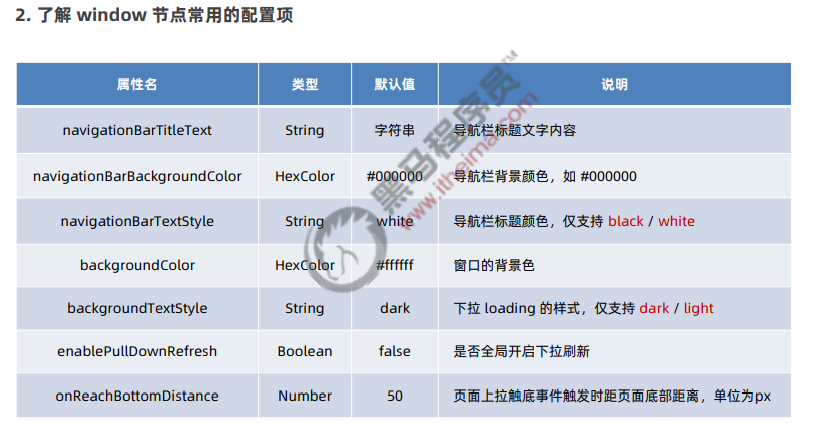

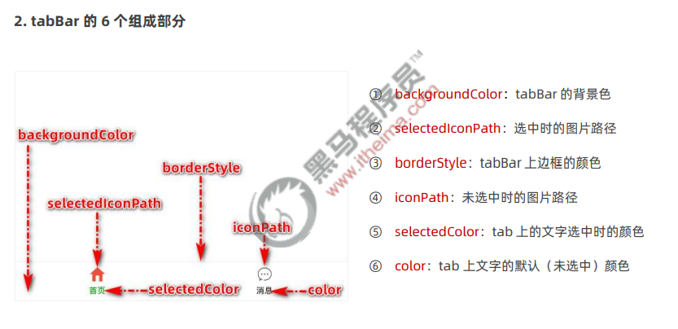

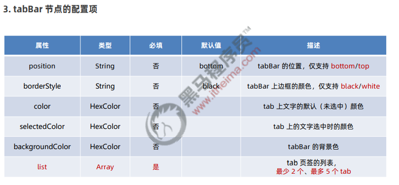

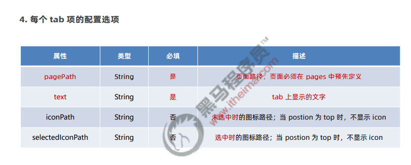

# 5.页面配置

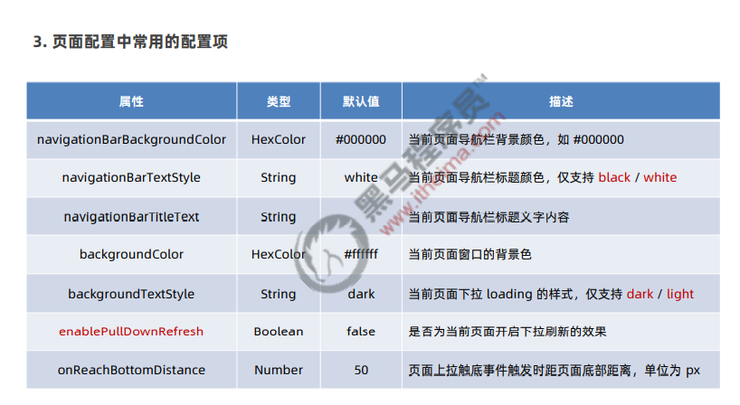

# 6.网络数据请求

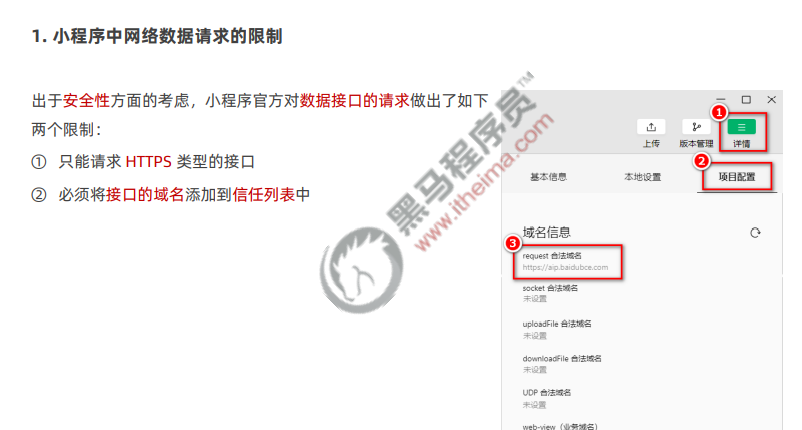

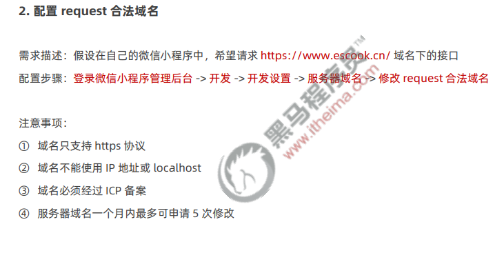

+ 发起get请求

  调用微信小程序提供的 wx.request() 方法，可以发起 GET 数据请求

  ```js
  wx.request({
      // 请求接口的地址，必须是hyyps协议，且添加到信任列表中
      url:'url',
      method:"get",
      data:{
          name:'ls',
          age:222
      },
      // 请求成功之后的回调函数
      success:(res)=>{
          console.log(res)
      }
  })
  ```

+ 发起post请求

  调用微信小程序提供的 wx.request() 方法，可以发起 POST 数据请求

  ```js
  wx.request({
      // 请求接口的地址，必须是hyyps协议，且添加到信任列表中
      url:'url',
      method:"post",
      data:{
          name:'zs',
          age:222
      },
      // 请求成功之后的回调函数
      success:(res)=>{
          console.log(res)
      }
  })
  ```

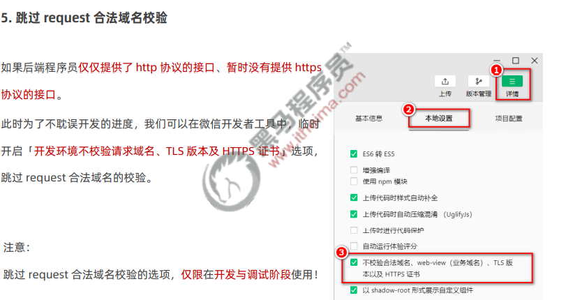

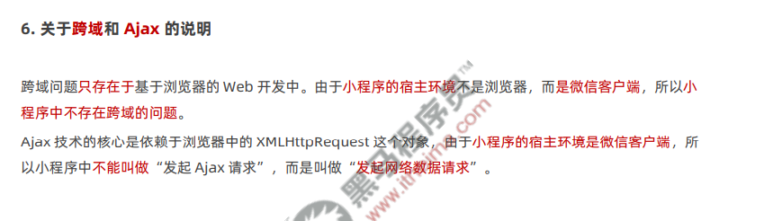

# 7.页面导航

## 1.声明式导航

在页面上声明一个\<navigator>导航组件

通过点击\<navigator>组件实现页面跳转

+ 导航到tabBar页面

  tabBar 页面指的是被配置为 tabBar 的页面。 在使用  组件跳转到指定的 tabBar 页面时，需要指定 url 属性和 open-type 属性

  + url 表示要跳转的页面的地址，必须以 / 开头

  + open-type 表示跳转的方式，必须为 switchTab

  ```html
  <navigator url="/pages/msg/msg" open-type="switchTab">导航</navigator>
  ```

+ 导航到非tabBar页面

  非 tabBar 页面指的是没有被配置为 tabBar 的页面。 在使用  组件跳转到普通的非 tabBar 页面时，则需要指定 url 属性和 open-type 属性

  + url 表示要跳转的页面的地址，必须以 / 开头

  + open-type 表示跳转的方式，必须为 navigate

  ```html
  <navigator url="/pages/info/info" open-type="navigate">导航</navigator>
  ```

  为了简便，在导航到非 tabBar 页面时，open-type="navigate" 属性可以省略

+ 后退导航

  如果要后退到上一页面或多级页面，则需要指定 open-type 属性和 delta 属性，其中

  open-type 的值必须是 navigateBack，表示要进行后退导航

  delta 的值必须是数字，表示要后退的层级

  ```html
  <navigator open-type="navigateBack" delta="1">返回上一页</navigator>
  ```

  为了简便，如果只是后退到上一页面，则可以省略 delta 属性，因为其默认值就是 1

##2.编程式导航

调用小程序的导航 API，实现页面的跳转

+ 导航到 tabBar 页面

  调用 wx.switchTab(Object object) 方法，可以跳转到 tabBar 页面。其中 Object 参数对象的属性列表如下

  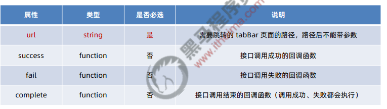

  ```html
  <button bindtap="gotomsg">跳转到消息页面</button>
  ```

  ```js
  gotomsg(){
      wx.switchTab({
          url:'/pages/msg/msg'
      })
  }
  ```

+ 跳转到非tabBar页面

  调用 wx.navigateTo(Object object) 方法，可以跳转到非 tabBar 的页面。其中 Object 参数对象的属性列表

  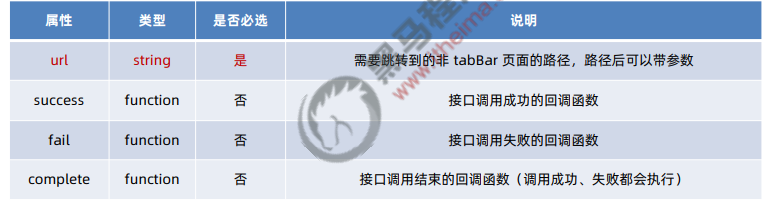

  ```html
  <button bindtap="gotoinfo">跳转到info页面</button>
  ```

  ```js
  gotoinfo(){
      wx.navigateTo({
          url:"/pages/info/info"
      })
  }
  ```

+ 后退导航

  调用 wx.navigateBack(Object object) 方法，可以返回上一页面或多级页面。其中 Object 参数对象可选的 属性列表如下：

  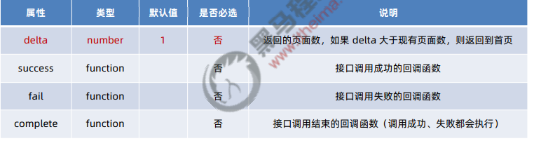

  ```html
  <button bindtap="gotoback">后退导航</button>
  ```

  ```js
  gotoBack(){
      // 返回上一页
      wx.navigateback()
  }
  ```

##3.传参导航

+ 声明式导航传参

  navigator 组件的 url 属性用来指定将要跳转到的页面的路径。同时，路径的后面还可以携带参数：

  + 参数与路径之间使用 ? 分隔

  + 参数键与参数值用 = 相连

  + 不同参数用 & 分隔

  ```html
  <navigator url="/pages/info/info?name=zs&age=20" open-type="navigate">导航</navigator>
  ```

+ 编程式导航传参

  调用 wx.navigateTo(Object object) 方法跳转页面时，也可以携带参数，代码示例如下

  ```html
  <button bindtap="gotoinfo">gotoinfo</button>
  ```

  ```js
  gotoinfo(){
      wx.navigateTo({
          url:"/pages/info/info?name=ls&age=20"
      })
  }
  ```

+ 在onLoad中接收导航参数

  通过声明式导航传参或编程式导航传参所携带的参数，可以直接在 onLoad 事件中直接获取到，示例代码如下

  ```js
  onLoad:function(options){
      // options就是导航传递过来的参数
      console.log(options)
  }
  ```

# 8.页面事件

## 1.下拉帅新事件

下拉刷新是移动端的专有名词，指的是通过手指在屏幕上的下拉滑动操作，从而重新加载页面数据的行为

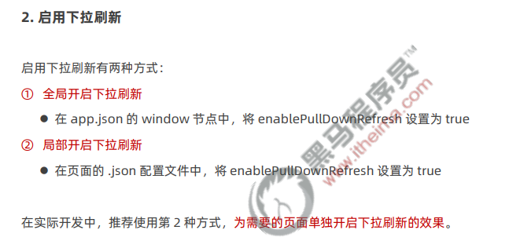

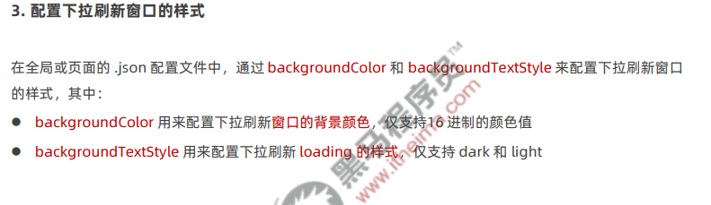

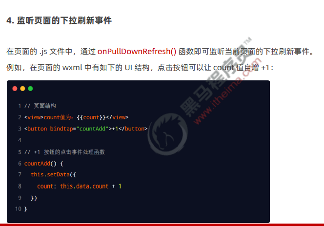

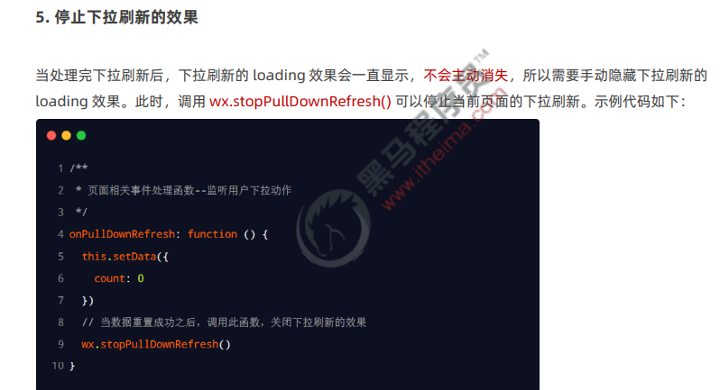

## 2.上拉触底事件

上拉触底是移动端的专有名词，通过手指在屏幕上的上拉滑动操作，从而加载更多数据的行为

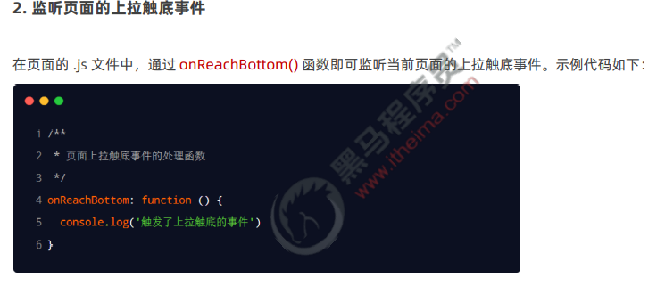

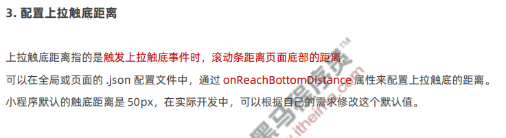

# 9.生命周期

## 1.应用的生命周期函数

小程序的应用生命周期函数需要在 app.js 中进行声明，示例代码如下

```js
// app.js文件
App({
    // 小程序初始化完成时，执行此函数，全局只触发一次，可以做一些初始化的工作
    onLaunch:function(options){}
    // 小程序启动时，或从后台进入前台时触发
    onShow:function(options){}
    // 小程序从前台进入后台时触发
	onHide:function(){}
})
```

## 2.页面的生命周期函数

小程序的页面生命周期函数需要在页面的 .js 文件中进行声明，示例代码如下

```js
// 页面的.js文件
Page({
    // 监听页面加载，一个页面只调用一次
    onLoad:function(options){}
    // 监听页面显示
    onShow:function(options){}
	// 监听页面初次渲染完成，一个页面只调用一次
	onready:function(options){}
	// 监听页面隐藏
	onHide:function(options){}
	// 监听页面卸载，也个页面只调用一次
	onUnload:function(options){}
})
```

# 10.WXS脚本

WXS（WeiXin Script）是小程序独有的一套脚本语言，结合 WXML，可以构建出页面的结构

wxml 中无法调用在页面的 .js 中定义的函数，但是，wxml 中可以调用 wxs 中定义的函数。因此，小程序中 wxs 的典型应用场景就是“过滤器”

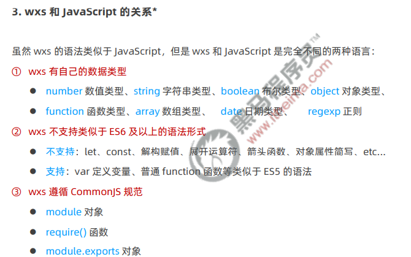

## 1.内嵌wxs脚本

wxs代码可以编写在wxml文件中的\<wxs>标签内，就像js代码可以编写在html文件中的\<script>标签内一样

wxml 文件中的每个\<wxs>\</wxs>标签，必须提供 module 属性，用来指定当前 wxs 的模块名称，方便在wxml中网文模块中的成员

```html
<view>{{m1.toUpper(username)}}</view>

<wxs module="m1">
    module.exports.toUpper=function(str){
    return str.toUpperCase()
    }
</wxs>
```

## 2.外联的wxs脚本

wxs 代码还可以编写在以 .wxs 为后缀名的文件内，就像 javascript 代码可以编写在以 .js 为后缀名的文件中 一样。示例代码如下：

```js
// tools.wxs文件
function toLower(str){
    return str.toLowerCase()
}

module.exports={
    toLower:toLower
}
```

在 wxml 中引入外联的 wxs 脚本时，必须为\<wxs>标签添加 module 和 src 属性，其中

module 用来指定模块的名称

src 用来指定要引入的脚本的路径，且必须是相对路径

```html
<!--调用m2模块中的方法-->
<view>{{m2.toLower(country)}}</view>

<!--引用外联的tools.wxs脚本,并命名为m2-->
<wxs src="../../utils/tools.wxs" module="m2"></wxs>
```

## 3.wxs特点

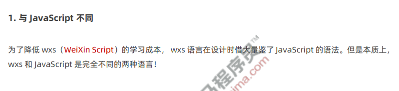

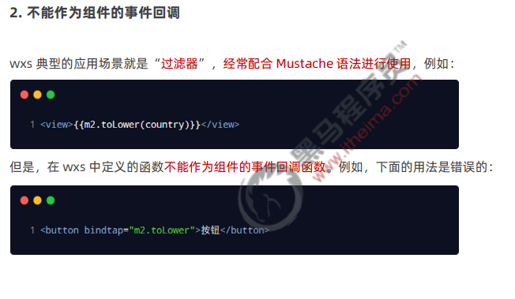

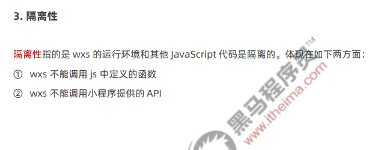

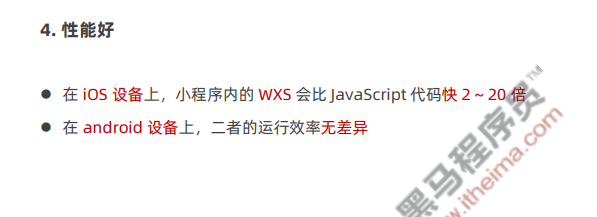

# 11.自定义组件

## 1.创建与使用

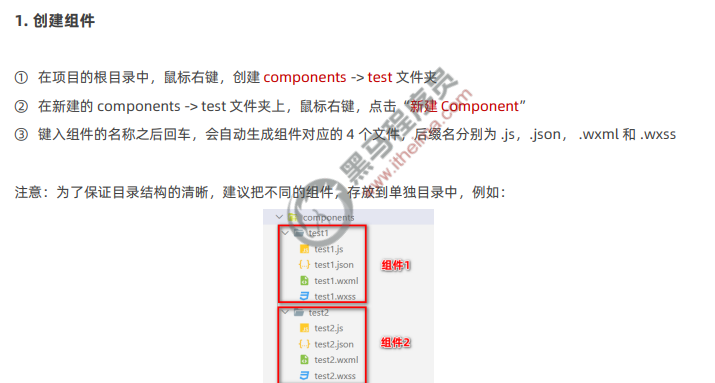

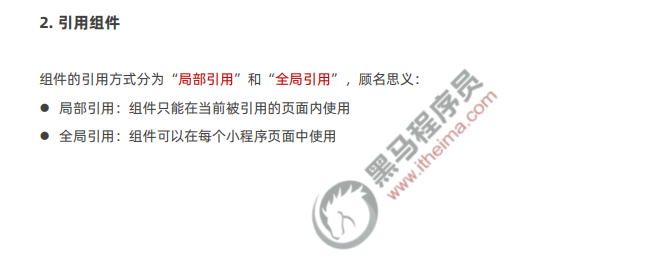

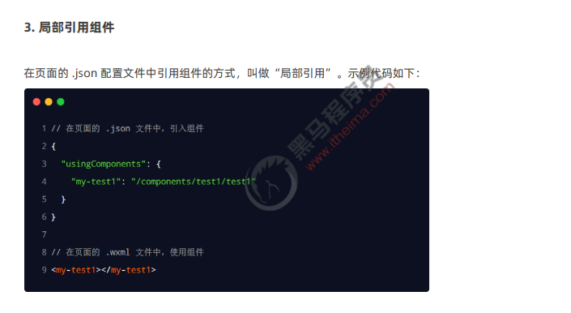

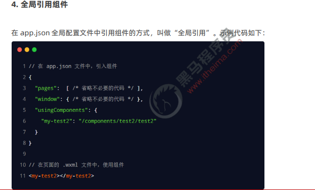

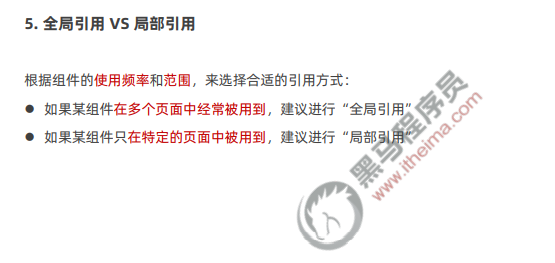

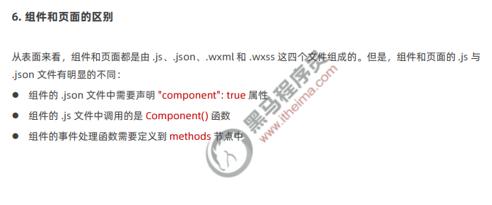

## 2.样式

### 1.组件样式隔离

默认情况下，自定义组件的样式只对当前组件生效，不会影响到组件之外的UI结构

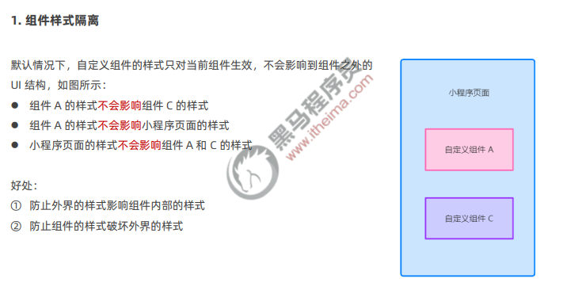

### 2.组件样式隔离的注意点

1. app.wxss中的全局样式对组件无效
2. 只有class选择器，会有样式隔离效果，id选择器、属性选择器、标签选择器不受样式隔离的影响

在组件和引用组件的页面中建议使用class选择器，不使用id、属性、标签选择器

###3.修改组件的样式隔离选项 

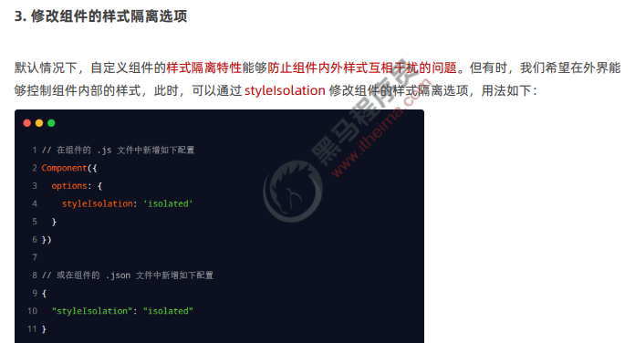

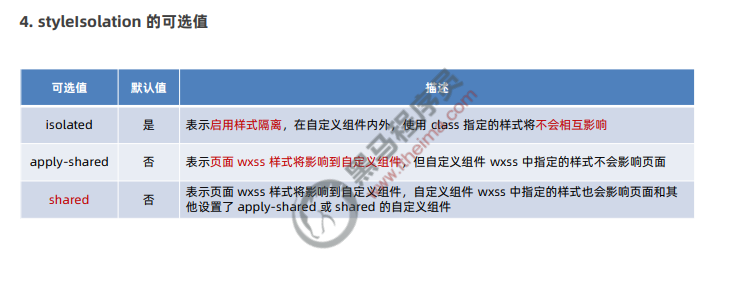

## 3.数据方法和属性

1. data数据

   在小程序组件中，用于组件模板渲染的私有数据，需要定义到 data 节点中，

   ```js
   Component({
       /**
       * 组件的初始数据
       */
       data:{
           count:0
       }
   })
   ```

2. methods方法

   在小程序组件中，事件处理函数和自定义方法需要定义到methods节点中

   ```js
   Component({
       // 组件方法列表，包含事件处理函数和自定义方法
       methods:{
           // 事件处理函数
           addCount(){
               this.setData({count:this.data.count+1})
               // 通过this直接调用自定义方法
               this._showCount()
           }
           // 自定义方法，以_开头
           _showCount(){
       		wx.showToast({
       			title:'count值为:'+this.data.count
       			icon:'none'
   			})
   		}
       }
   })
   ```

3. properties属性

   在小程序中，properties是组件的对外属性，用来接收外界传递到组件中的数据

   ```js
   Component({
       // 属性定义
       properties:{
           // 完整定义属性的方式，当需要指定属性的默认值时，使用此方式
           max:{
               // 属性值的数据类型
          		type:Number
               // 属性默认值
               value:10
           }，
           // 简化定义属性的方式，不需要指定属性默认值时使用
           max:Number
       }
   })
   ```

   ```html
   <my-test1 max="10"></my-test1>
   ```

4. data和properties的区别

   在小程序的组件中，properties 属性和 data 数据的用法相同，它们都是可读可写的，只不过：

   data 更倾向于存储组件的私有数据

   properties 更倾向于存储外界传递到组件中的数据

   ```js
   Component({
       methods:{
           showInfo(){
               consol.og(this.data) // 输出结果：{count:0,max,10}
               console.log(this.properties)// 输出结果：{count:0,max,10}
               console.log(this.data===this.properties)// 输出结果true
           }
       }
   })
   ```

5. 使用setData修改properties的值

   data数据和properties属性本质上没有任何区别，都是可读写的，都可作用于页面渲染，或使用setData为properties中的属性重新赋值

   ```js
   Component({
       properties:{max:Number}, // 定义属性
       methods:{
           addCount(){
               // 使用setData修改属性
              this.setData({max:this.properties.max+1})
           }
       }
   })
   ```

 ## 4.数据监听器

1. 什么是数据监听器

   数据监听器用于监听和响应任何属性和数据字段的变化，从而执行特定的操作。它的作用类似于 vue 中的 watch 侦听器。在小程序组件中，数据监听器的基本语法格式如下

   ```js
   Component({
       observes:{
           '字段A，字段B':function(字段A的新值，字段B的新值)
       }
   })
   ```

2. 数据监听器的基本用法

   ```html
   <!--组件的UI结构-->
   <view>{{n1}}+{{n2}}={{sum}}</view>
   <button size="mini" bindtap="addN1">N1自增</button>
   <button size="mini" bindtap="addN2">N2自增</button>
   ```

   ```js
   // 组件的js文件
   Component({
       data:{n1:,n2:,sum:0},// 数据
       // 方法列表
       method:{
           addN1(){this.setData({n1:this.data.n1+1})},
           addN2(){this.setData({n2:this.data.n2+1})}
       },
       // 数据监听节点
       observe:{
           // 监听n1,n2的变化
           'n1,n2':function(n1,n2){
               // 通过监听器，自动计算n1,n2的变化
               this.setData({sum:n1+n2})
           }
       }
   })
   ```

3. 监听对象属性的变化

   数据监听器支持监听对象中单个或多个属性的变化，示例语法如下

   ```js
   Component({
       observes:{
           '对象.属性A,对象.属性B':function(属性A的值,属性B的值){
               // 触发此监听的三种情况：
               // 为属性A赋值，使用setData设置this.data.对象.属性A时触发
               // 为属性B赋值，使用setData设置this.data.对象.属性B时触发
               // 直接为对象赋值，使用setData设置this.data.对象时触发
           }
       }
   })
   ```

## 5.纯数据字段

纯数据字段指的是那些不用于界面渲染的 data 字段。

应用场景：例如有些情况下，某些 data 中的字段既不会展示在界面上，也不会传递给其他组件，仅仅在当前 组件内部使用。带有这种特性的 data 字段适合被设置为纯数据字段。

好处：纯数据字段有助于提升页面更新的性能

1. 使用规则

   在 Component 构造器的 options 节点中，指定 pureDataPattern 为一个正则表达式，字段名符合这个正则 表达式的字段将成为纯数据字段，示例代码如下：

   ```js
   Component({
       options:{
           // 指定所有_开头的数据字段为纯数据字段
           pureDataPattern:/^_/
       },
       data:{
           // 普通数据字段
           a:true,
           // 纯数据字段
           _b:true
       }
   })
   ```

2. 使用纯数据字段改造监听器案例

   ```js
   Component({
       options:{
           // 指定所有_开头的数据字段为纯数据字段
           pureDataPattern:/^_/
       },
       data:{
           // 将rgb改造为以_开头的纯数据字段
           _rgb:{
               r:0,
               g:0,
               b:0
           },
           fullColor:'0,0,0'
       },
   })
   ```

## 6.组件的生命周期

1. 组件全部的生命周期函数

   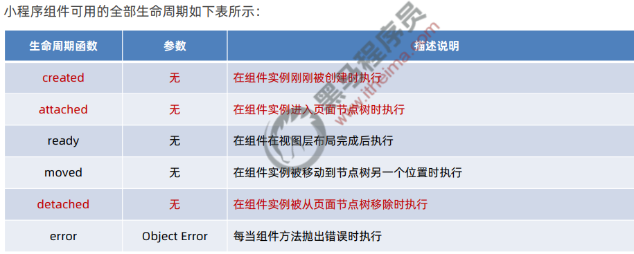

2. 组件主要的生命周期函数

   在小程序组件中，最重要的生命周期函数有三个，分别是create、attached、detached.它们各自的特点如下:

   1. 组件实例被创建好的时候，create生命周期函数会被触发

      此时不能调用setData

      通常在这个生命周期函数中，只应该用于给组件的this添加一些自定义的属性字段

   2. 在组件完全初始化完毕，进入页面节点树中，attached生命周期函数会被触发

      此时，this.data已经被初始化完毕

      这个生命周期很有用，绝大多数初始化的工作可以在这个时机进行（例如发请求获取初始数据）

   3. 在组件离开页面节点树后,detached生命周期函数会被触发

      退出一个页面时，会触发页面内每个自定义组件的 detached 生命周期函数

      此时适合做一些清理性质的工作

3. lifetimes节点

   在小程序组件中，生命周期函数可以直接定义在 Component 构造器的第一级参数中，可以在 lifetimes 字段 内进行声明（这是推荐的方式，其优先级最高）。示例代码如下：

   ```js
   Component({
       // 推荐用法
       lifetimes:{
           // 在组件实例进入页面节点树时执行
           attached(){},
           // 在组件实例被从页面节点树移除时执行
           detached(){}
       },
       // 旧的定义方式
       // 在组件实例进入页面节点树时执行
       attached(){},
       // 在组件实例被从页面节点树移除时执行
       detached(){}
   })
   ```

## 7.组件所在页面的生命周期

1. 什么是组件所在页面的生命周期

   有时，自定义组件的行为依赖于页面状态的变化，此时就需要用到组件所在页面的生命周期。 例如：每当触发页面的 show 生命周期函数的时候，我们希望能够重新生成一个随机的 RGB 颜色值。 在自定义组件中，组件所在页面的生命周期函数有如下 3 个，分别是：

   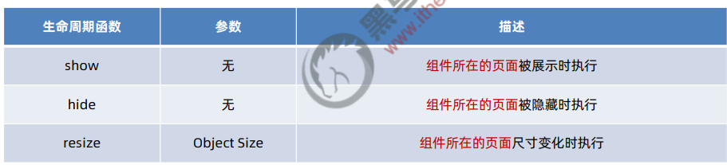

2. pageLifetimes节点

   组件所在页面的生命周期函数，需要定义在pageLifetimes节点中

   ```js
   Component({
       pageLifetimes:{
           // 页面被展示
           show:function(){},
           // 页面被隐藏
           hide:function(){},
           // 页面尺寸变化
           resize:function(size){}
       }
   })
   ```

3. 生成随机的rgb颜色

   ```js
   Component({
       methods:{
           // 生成随机颜色的方法，非事件处理函数以_开头
           _randomColor(){
               // 为data里面的_rgb纯数据字段重新赋值
               this.setData({
                   _rgb:{
                       r:Math.floor(Math.random()*256),
                       g:Math.floor(Math.random()*256),
                       b:Math.floor(Math.random()*256),
                   }
               })
           }
       },
       pageLifttimes:{
           // 组件所在的页面被展示时，立即调用_randomColor生成随机颜色值
           show:function(){
               this._randomColor()
           }
       }
   })
   ```

## 8.插槽

1. 什么是插槽

   在自定义组件的 wxml 结构中，可以提供一个  节点（插槽），用于承载组件使用者提供的 wxml 结构

   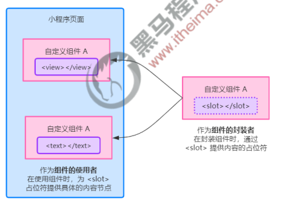

2. 单个插槽

   在小程序中，默认每个自定义组件中只允许使用一个  进行占位，这种个数上的限制叫做单个插槽

   ```html
   <!--组件的封装-->
   <view class="wrapper">
   	<view>组件的内部节点</view>
       <!--对于不确定的内容，可以使用<slot>进行占位，具体的内容由组件的使用者决定-->
       <slot></slot>
   </view>
   ```

   ```html
   <!--组件的使用者-->
   <component-tag-name>
   	<!--这部分内容将替换<slot>-->
       <view>替换到slot中</view>
   </component-tag-name>
   ```

3. 启用多个插槽

   在小程序的自定义组件中，需要使用多  插槽时，可以在组件的 .js 文件中，通过如下方式进行启用。 示例代码如下

   ```js
   Component({
       options:{
           // 在组件定义时的选项中启用多slot支持
           multipleSlots:true
       }，
       properties:{},
             methods:{}
   })
   ```

4. 定义多个插槽

   可以在组件的 .wxml 中使用多个  标签，以不同的 name 来区分不同的插槽。示例代码如下：

   ```html
   <!--组件模板-->
   <view class="wrapper">
       <!--name为before的第一个slot插槽-->
       <slot name="before"></slot>
       <view>文本内容</view>
       <!--name为after的第二个slot插槽-->
       <slot name="after"></slot>
   </view>
   ```

5. 使用多个插槽

   在使用带有多个插槽的自定义组件时，需要用 slot 属性来将节点插入到不同的  中。示例代码如下

   ```html
   <!--引用组件的而页面模板-->
   <component-tag-name>
   	<!--这部分内容放在name="before"的slot组件的位置上-->
       <view slot="before">插到name="before"中的内容</view>
   	<!--这部分内容放在name="after"的slot组件的位置上-->
       <view slot="after">插到name="after"中的内容</view>
   </component-tag-name>
   ```

##9.父子组件之间的通信

###1.父子组件之间通信的三种方式

1. 属性绑定

   用于父组件向子组件所指定属性设置数据，仅能设置JSON兼容的数据

2. 事件绑定

   用于子组件向父组件传递数据，可以传递任意数据

3. 获取组件实例

   父组件还可以通过this.selectComponent()获取子组件实例对象

   这样就可以直接访问子组件的任意属性和方法

###2.属性绑定

属性绑定用于实现父向子传值，而且只能传递普通类型的数据，无法将方法传递给子组件

```js
// 父组件的data节点
data:{
    count:0
}
```

```html
<!--父组件的wxml结构-->
<my-text1 count="{{count}}"></my-text1>
<view>-----</view>
<view>父组件中，count值为:{{count}}</view>
```

子组件在properties节点中声明对应的属性并使用

```js
// 子组件的properties节点
properties:{
    count:Number
}
```

```html
<!--子组件的wxml结构-->
<text>子组件中，count的值为{{count}}</text>
```

###3.事件绑定

事件绑定用于实现子向父传值，可以传递任意类型的数据

1. 在父组件的js文件中，定义一个函数，这和个函数即将通过自定义事件的形式，传递给子组件

   ```js
   // 在父组件中定义syncCount方法
   // 将来，这个方法会被传递给子组件，供子组件进行调用
   syncCount(){
       console.log('父组件中的方法')
   }
   ```

2. 在父组件的wxml中，通过自定义事件的形式，将步骤一中定义的函数引用，传递给子组件

   ```html
   <!--使用bind:自定义事件名称-->
   <test count="{{count}}" bind:sync="syncCount"></test>
   <!--第二种自定义事件方式-->
   <test count="{{count}}" bintsync="syncCount"></test>
   ```

3. 在子组件的js文件中，通过调用this.triggerEvent('自定义事件名称',{/\*参数对象*/}),将数据发送到父组件

   ```html
   <!--子组件的wxml结构-->
   <text>子组件中，count的值为：{{count}}</text>
   <button type="primary" bindtap="addCount">
       +1
   </button>
   ```

   ```js
   // 子组件的js代码
   methods:{
       addCount(){
           this.setData({
               count:this.properties.count+1
           })
           this.triggerEvent('sync',{value:this.properties.count})
       }
   }
   ```

4. 在父组件的js中，通过e.detail获取到子组件传递过来的数据

   ```js
   syncCount(e){
       this.setData({
           count:e.detail.value
       })
   }
   ```

###4.获取组件实例

可在父组件里调用this.selectComponent("id或class选择器")，获取子组件的实例对象，从而直接访问子组件的任意数据和方法。调用时需要传入一个选择器

```html
<!--wxml结构-->
<test count="{{count}}" bind:sync="syncCount" class="customA" id="cA"></test>
<button bindtap="getChild">获取子组件实例</buttn>
```

```js
// tap处理函数
getChild(){
    const child=this.selectComponent('.customA')
    child.serData({count:child.propertier.count+1})
    child.addCount()
}
```

# 12.behaviors

behaviors 是小程序中，用于实现组件间代码共享的特性，类似于 Vue.js 中的 “mixins”

每个behavior可以包含一组属性、数据、生命周期函数和方法。组件引用它时，他的属性、数据和方法会被河滨到组件中

每个组件可以引用多个behavior,behavior也可以引用其他behavior

### 1.创建behavior

调用Behavior(Object object) 方法即可创建一个共享的behavior实例对象，共所有的组件使用

```js
// 调用Behavior()方法，创建实例对象
// 并使用module.exports 将behavior实例对象共享出去
module.export=Behavior({
    // 属性节点
    properties:{},
    // 私有数据节点
    data:{username:'zs'},
    // 事件处理函数和自定义方法节点
    methods:{}
    // 其他节点......
})
```

### 2.导入并使用behavior

在组件中，使用require()方法导入需要的behavior，挂在后即可访问behavior中的数据或方法

```js
// 1.使用require()导入需要的自定义behavior模块
const myBehavior=require("../../behaviors/my-behavior")

Component({
    // 2.将导入的behavior实例对象，挂载到behavior数组节点中，即可生效
    behaviors:[myBehavior],
})
```

### 3.behavior中所有可用的节点

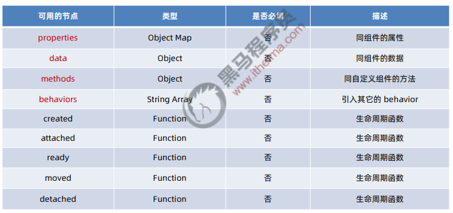

### 4.同名字段的覆盖和组合规则

组件和她引用的behavior中可以包含同名的字段：

1. 同名的数据字段----data
2. 同名的属性----properties,或方法----methods
3. 同名的而生命周期函数

# 13.使用npm包

