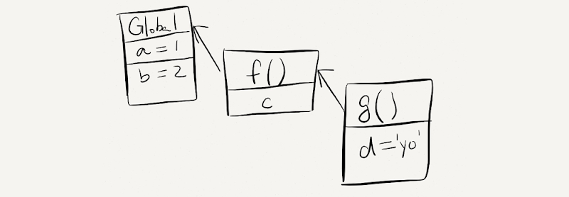
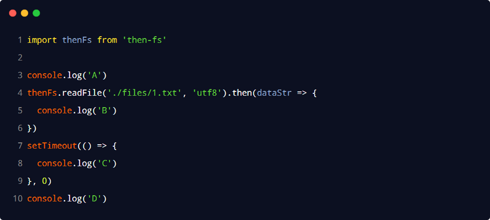

#  Python

## print

* print输出生成文件

  ```python
  # 指定位置生成3.txt文件，文件内容为1111
  fp=open('f:/3.txt','a'+)   #a+  文件不存在就创建，存在就对文件追加后续操作
  print('1111',file=fp)
  fp.close（）
  ```


## 转义字符

```python
# \n 换行
# \t 四字符空格
# \r 光标恢复初始位置
print('hello\rworld')#输出world
# \b 退一格
print('hello\bworld')#输出hellworld
# \\ 反斜杠
# \'单引号
print('说:\'123\'')#输出说：'123'
# \" 双引号
# 原字符 字符串中的转义字符不起作用，在字符串之前加r或R
print(r'hhhh\nwwww')#输出hhh\nwwww
```


## 字符编码

* ASSCII码


## 变量

- 标识	内存地址 	id() 获取
- 类型         数据类型         type()获取
- 值             具体数据         print()输出


## 数据类型

* 二进制0b

* 八进制0o

* 十六进制0x

  ```python
  print(0b1010,0o125,ox123
  #  个别浮点数运算防止出差错
  print(1.1+2.2)  #结果3.3000000000000003
  from decimal import Decimal
  print(Decimal('1.1')+Decimal('2.2'))#结果3.3
  #bool可转换成整型计算   true=1  false=0
  #字符串可用单引号、双引号、三引号定义 单引号双引号只能在同一行定义，三引号数据可以跨行
  str1='sdasda,sadaa'
  str2="""asdadadadw,
  dadadad"""
        
  # complex  复数   5+6j     j是规定，不可更改
  ```


## 数据类型转换

* str()

* int()

* float()

  ```python
  str(12)
  
  int('123')#只有整数字符串能转换，小数串和字符串不能转换
  int(9.8)#转换浮点数时抹零取整
  
  float('9.9')#字符串中数据必须为数字串
  float(9)#整数转换成浮点数末尾加 .0
  
  #coding:utf-8/gbk    中文编码声明注释，指定源码文件的编码格式   
  ```


## 输入函数

* input()

  ```python
  #作用      接收用户输入
  #返回类型   str
  #值的存储   变量赋值
  ```


## 运算符

* 算术运算符

  * 标准算术运算符

    - 加：+	减：-	乘：*	除：/	整除：//（向下取整）

  * 取余运算符

    * 取余：%    一正一负：余数=被除数-除数*商

      ```python
      print(9%-4)# 9-(-4)*(-3)
      print(-9%4)# -9-4*(-3)
      ```

      

  * 幂运算符

    * 幂：**

* 赋值运算符

  * 赋值运算 =  运算从右到左

  * 支持链式赋值

  * 支持参数赋值

  * 支持系列解包赋值

    ```python
    a=b=c=10 #链式赋值
    a+=20 # 参数赋值a=a+20
    a,b,c=10,20,30 #系列解包赋值 a=10 b=20 c=30
    a,b=b,a  #交换a,b的值
    ```

* 比较运算符

  * 结果返回bool类型

  * ==比较变量的值---value

  * is  、is not比较变量的标识----id

    ```python
    a=10
    b=10
    print(a==b)#a=10 b=10  值相等
    print(a is b)# a指向10的内存地址    b指向10的内存地址 id相同 
    ```

* 布尔运算符

  * 与(and)、或(or)、非(not  取反)、in、not in

    ```python
    a=1
    b=2
    print(a==1 and b==2)#true
    
    f=false
    print(not f)#true  单操作数
    
    # in not in判断子串
    str='qwertyu'
    print('w' in str)# true  w是str的一个字串
    print('w' not in str)# false
    
    '''false 0 none 空字符串 空列表 空元组 空字典 空集合 布尔值为false
    	bool()获取对象的bool值
    '''
    print(bool([]))	#空列表
    print(bool(list()))	#空列表
    print(bool(()))	#空元组
    print(bool(tuple()))	#空元组
    print(bool({}))	#空字典
    print(bool(dict()))	#空字典
    print(bool(set()))	#空集合
    ```

* 位运算符

  * & 按位与、|按位或、<<左移（一位*2，高位溢出舍弃低位补零）、>>右移（一位/2，低位溢出舍弃高位补零）

*  运算符优先级

  算术   位  比较  布尔  赋值

  1. **
  2. *、/、//、%
  3. +、-
  4. <<、>>
  5. &
  6. |
  7. <、>、<=、>=、==、！=
  8. and
  9. or
    10. =				


## 多分支结构

```python
'''           if  else if
if 条件：
	执行
elif 条件：
	执行
elif 条件：
	执行
else：
	执行
'''

#条件表达式
'''
x if 判断条件 else y  true 返回x false 返回y'''
a=10
b=20
print(a+'>='+b if a>=b else a+'<'+b)
	
```


## 循环

* range()函数

  ```python
  #	生成一个整数序列
  #	range(stop)	创建一个[0,stop)之间的整数序列，步长为1
  #	range(start,stop)	创建一个[start,stop)之间的整数序列，步长为1  不包括stop
  #	range(start,stop,step)	创建一个[start,stop)之间的整数序列，步长为step
  #	返回值是一个迭代器对象
  range(3)		#[0,1,2]
  range(0,4)		#[0,1,2,3]
  range(0,5,2)	#[0,2,4]
  ```

  

* while循环

* for-in循环

  ```python
  # in 表示从(字符串、序列等)中依次取值，进行遍历
  # for-in 遍历的对象必须是可迭代对象
  # for 自定义的变量 in 可迭代的对象：
  # 循环体
  for str in 'cacac':
      print(str)		#'c' 'a' 'c' 'a' 'c'
  ```

* break、continue、与else语句

  ```python
  # break 结束循环，常与if连用

  # continue 结束当前循环进入下一次循环，常与if一起使用
  for i in range(1,51):
  	if i%5==0
      print(i)
      
  # break、countinue只控制本层循环，嵌套时不影响外层循环
      
  # if···else···  if不成立时执行else

  # while、for与else搭配，没有遇到break，循环结束后执行else
  a=0
  while a<3:
      id=input('输入id：')
      if id=='0001'
      	print('1')
      	break
       else:
          print('0')
  else:
      print('三次错误')
  ```

  

* 嵌套循环

  ```python
  for i in range(1,10):
      for j in range(1,i+1):
              print(i, '*', j, '=', i * j,end='\t')  #end不换行输出 每次输出之间间隔一个\t
      print()
      
  ```

  

## 列表

* 列表的创建与删除----有序

  ```python
  # 列表可以存重复数据，不同类型的数据可以混存

  lst=['zz','xx','cc',20]
  list_1=list(['zz','xx','cc',21])      #指针数组，存元素的内存地址

  #空列表
  lst=[]
  lst=list()
  ```

* 增、删、改、查

  ```python
  # index() 获取指定元素的索引，存在重复元素，返回第一个元素的索引，还可以在指定的 start和stop之间查找
  lst=['zz','xx','cc',20]
  print(list.index('cc'))
  print(list.index('xx',1,3))# 从索引1到3不包括3，进行查找xx,找到返回，找不到报错

  # 正向索引0到N-1
  # 逆向索引-N到-1

  # 获取列表多个元素
  # 列表名[start:stop:step] 范围不包括stop[start，stop)
  # step 不声明时默认1
  # step正数 从start开始往后切片
  # step负数 从start开始往前切片
  # start省略默认0 stop省略默认最后一个位置

  lst.append(30) #列表最后追加一个元素
  lst.extend([40,50,60,70])	#列表末端合并另一个列表
  lst.insert(2,3)	#指定位置添加一个元素
  lst[start:stop]=[]  #lst [start,stop)元素用[]替代

  # remove() 一次删除一个元素，重复元素删除第一个
  # pop() 删除指定索引位置上的元素，索引位置不指定时删除列表最后一个元素
  # clear() 清空列表
  # del 删除列表
  # 切片 截取[start,stop)位置上的元素 产生一个新的列表对象---用空列表替代，删除[start,stop)位置上的元素

  # 一次修改一个元素，对指定索引位置重新赋值
  lst[2]='sss'
  # 一次修改多个元素，使用切片，用列表代替指定位置元素
  ```

* 列表元素排序

  ```python
  # sort() 默认参数在原列表基础上对列表进行升序排序
  # sort(reverse=Trus) 指定reverse  True=降序 False=升序  
  lst.sort()

  #sorted() 对原列表进行排序产生一个新的列表，原列表不发生改变
  lst_1=sorted(lst)
  lst_2=sorted(lst,reverse=True) #True 降序 False升序
  ```

* 列表推导式                                                                                                                                                                                                                                                                  

  ```python
  #  [列表元素表达式 for 自定义变量 in 可迭代对象]
  lst=[i for i in range(1,10)]
  ```


## 字典

* 字典的原理----无序

  字典以键值对存储数据，元素之间用逗号分隔，键值对用冒号分隔，冒号前键，冒号后值

  字典查询根据键值查找value的存储位置

  * 字典的特点

    字典的每个元素都是key-value对

    字典的key唯一，重复时后面覆盖前面

    字典以空间换时间，浪费较大的内存

  ```python
  scores={'lili':59,'zhangsa':59.9,'lisi':60}
  # 字典哈希存储
  ```

* 字典的创建与删除

  ```python
  scores={'lili':59,'zhangsa':59.9,'lisi':60}
  std=dict(name='uv',age=50)

  #创建空字典
  d={} 
  d=dict()
  ```

* 字典的查询操作

  ```python
  # 获取字典元素的值
  # [键]获取元素的值
  # get()方法获取元素的值
  # []键不存在抛出异常，get返回None
  scores['lisi']
  get('zhangsa')

  # in与not in可判断键是否在字典中
  'lili' in scores
  'ssss' not in scores

  # 字典的遍历
  for key in scores:		# 输出字典中的所有key
      print(key)
      
  for key in scores:		# 输出字典中的所有键值对
      print(key，scores[key])
  ```

* 字典的增、删、改操作

  ```python
  # del 删除指定的键值对
  del scores['zhangsa']
  scores.clear()  #清空字典元素

  scores['法外狂徒张三']=33  #元素不存在时新增元素，存在时赋予新的值

  # keys()		获取字典中所有的key
  # values()		获取字典中的所有valua
  # items()		获取字典中所有的key,value对

  keys=scores.keys()   # 字典的key组成的视图转成列表
  values=score.values()
  items=score.items()  # 转换之后的列表元素由元组组成
  ```

* 字典生成式

  ```python
  # zip() 可将两个列表元素对应生成字典
  # zip() 对象可迭代-----可使用for-in循环遍历
  # {key:value for key,value in zip(key,value)}
  items=['zx','sx','sf','aw']
  values=[10,20,1,2]
  dic={items:values for items,values in zip(items,values)} #items做键  value作值
  #dic={items.upper():values for items,values in zip(items,values)} #.upper()键大写
  #dic={items.title():values for items,values in zip(items,values)} #.title() key首字母大写
  for key in dic:
      print(key,dic[key])
  ```


## 元组

* 元组-----有序

  Python内置的数据结构之一，是一个不可变序列

  * 多任务条件下保证程序正确进行，用户不能修改数据，不需要对数据加锁

  元组中存储的是对象的引用

  * 如果元组中对象本身是不可变对象，则不能在引用其他对象

  * 如果元组中的对象是可变对象，则可变对象的引用不允许改变，但数据可以改变

    ```python
    t=(10,[20,30],9)
    # 10和9是元组元素，是不可变对象，不可修改
    # [20,30]是列表，是可变对象，可对列表中元素进行修改
    # t[1]=100 是不允许的
    t[1].append(100) 可以对列表追加元素
    
    #t[索引] #获取指定索引位置的元素
    ```

  不可变序列：字符串、元组-------没有增、删、改操作

  可变序列：    列表、字典----------可以对序列执行增、删、改操作，对象地址不发生更改

* 元组的创建

  ```python
  t=('q','w','a',1,10)
  #t='q','w','a',1,10         #括号可省略
  s=tuple(('s','w','cc',20))

  # 元组中只有一个元素需要使用小括号和逗号,否则会创建字符串
  t1=('ssss',)

  #空元组
  t3=()
  t3=tuple()
  ```

* 元组的遍历

  ```python
  for s in t:
    print(s)
    
  #使用索引也能遍历，需知道元组数据数量
  ```

  

## 集合

- 集合---无序

  * Python内置数据结构
  * 可变类型的序列
  * 集合是没有value的字典
  * 集合元素经hash()存入内存，元素顺序与内存顺序不定

- 集合的创建

  ```python
  s={2,3,4,5,6,7,8}  #集合元素不允许重复，重复的保留一个

  s=set(range(6))
  print(s)

  lst=[10,20,30,40]	#列表转集合
  print(set(lst))

  t=(3,50,70,80,90)	#元组转集合
  print(set(t))

  print(set('ssssrtytr'))	#字符串转集合

  print(set({999,888,777}))	#集合排序

  # 空集合
  s=set()   #s={} 为空字典
  ```

- 集合的增、删、改

  ```python
  # 集合元素判断
  # in not in

  # 集合元素新增
  # add() 一次添加一个元素
  # update() 至少添加一个元素  参数是集合元组列表都可
  s={10,20,30,40,50,60}
  s.add(99)
  s1={'s','w','r'}
  s.update(s1)     #添加后顺序随机

  # 集合元素删除
  # remove() 一次删除一个指定元素，元素不存在抛出异常
  # discard() 一次删除一个指定元素，元素不存在不抛出异常
  # pop() 一次删除一个任意元素   无参，不能添加参数
  # clear() 清空集合
  s.remove(10)
  s.discard(20)
  s.pop()
  ```

- 集合的关系

  ```python
  # 集合是否相等
  # == !=判断
  s={1,2,3,4,10,20,30}
  s1={10,20，999，998}
  print(s==s1)

  # 子集关系
  # 调用issubset方法判断
  print(s1.issubset(s))

  # 超集
  # issuperset
  print(s1.issuperset(s1))

  # 交集
  # isdisjoint
  print(s.isdisjoint(s1))
  ```

- 集合的数学操作

  ```python
  # 交集
  print(s.intersection(s1))
  print(s&s1)

  # 并集
  s3={999,888}
  print(s1.union(s3))
  print(s1|s3)

  # 差集
  print(s.difference(s1))
  print(s-s1)

  # 对称差集
  print(s.symmetric_difference(s1))
  ```

- 集合的生成式

  ```python
  # {集合产生表达式 for 自定义变量 in 可迭代对象}   {}换[]为列表生成
  s={i**3 for i in range(10)}
  ```


## 字符串

* 字符串驻留机制

  仅保留一份相同且不可变字符串的方法，不同的值被放在字符串的驻留池中，Python对相同字符串只保留一份拷贝，创建相同字符串时不开辟新的空间，不同变量指向同一地址

  驻留机制的几种情况(交互模式---cmd)

  - 字符串的长度为0或1时
  - 符合标识符的字符串---字母、数字、下划线
  - 字符串只在编译时进行驻留，而非运行时
  - [-5,256]之间的整数数字

  驻留集的优缺点

  * 需要值相同的字符串时，可以从字符池中拿来取用，避免频繁的创建和销毁，提升效率和节约内存，因此拼接字符串和修改字符串是会比较影响性能的
  * 在需要进行字符串拼接时建议使用str类型的join()，而非+，因为join()是先计算出所有字符中的长度，然后再拷贝，只新建一次对象，效率要比+高

* 字符串常用操作

  * 查询

    ```python
    # index()  查找字串substr第一次出现的位置，字串不存在，抛出异常
    # rindex() 查找字串substr最后一次出现的位置，字串不存在，抛出异常
    # find()   查找字串substr第一次出现的位置，字串不存在，返回-1
    # rfind()  查找字串substr最后一次出现的位置，字串不存在，返回-1
    s='yooluy,wazy'
    print(s.index('y'))
    print(s.rindex('y'))
    print(s.find('y'))
    print(s.rfind('y'))
    ```

  * 大小写转换

    ```python
    # upper()   	 把字符串中所有字符都转成大写字母
    # lower()	 	 把字符串中所有字符都转换成小写字母
    # swapcase()	 把字符串中大小写字母互换：大-->小、小-->大
    # capitalize()	 把第一个字符转换为大写，其余字符转换为小写
    # title() 		 把每个单词的第一个字符转换为大写，单词的剩余字符转换为小写
    #  转换后开劈新地址存结果
    s.upper()
    ```

  * 对齐

    ```python
    # center() 居中对齐，第一个参数指定宽度，第二个指定填充符，第二个参数可选，默认空格，如果设置宽
    #          度小于实际宽度则返回原字符串
    # ljust()  左对齐，第一个参数指定宽度，第二个指定填充符，第二个参数可选，默认空格，如果设置宽度  #          小于实际宽度则返回原字符串
    # rjust()  右对齐，第一个参数指定宽度，第二个指定填充符，第二个参数可选，默认空格，如果设置宽度  #          小于实际宽度则返回原字符串
    # zfill()  右对齐，左边用0填充，该方法只接收一个参数，用于指定字符串的宽度，如果指定的宽度小于等  #          于字符串的长度，则返回字符串本身
    print(s.center(20,'*'))
    print(s.ljust(20,'*'))
    print(s.rjust(20,"*"))
    print(s.zfill(20))
    ```

  * 字符串劈分操作

    ```python
    # split()    从字符串的左边开始劈分，默认的劈分字符是空格字符串，返回的值都是一个列表
    #            可以通过参数sep指定分劈字符串的劈分符
    #            通过参数maxsplit指定最大劈分次数，达到最大时剩余子串单独作为一部分
    # rsplit()   从字符串的右边开始劈分，默认的劈分字符是空格字符串，返回的值都是一个列表
    #            可以通过参数sep指定分劈字符串的劈分符
    #            通过参数maxsplit指定最大劈分次数，达到最大时剩余子串单独作为一部分
    s='pyoaluy,wazy,asdad,fawfc,ajakz'
    print(s.split())
    print(s.split('a,'))
    print(s.split('a',4))
    print(s.rsplit())
    print(s.rsplit('a'))
    print(s.rsplit('a',4))
    ```

  * 判断字符串

    ```python
    # isidentifier()  判断指定的字符串是不是合法的标识符(字母、数字、下划线)
    # issoace()		  判断指定的字符串是否全部由空白字符组成(回车、换行、水平制表符)
    # isalpha()		  判断指定的字符串是否全部由字母组成
    # isdecimal()	  判断指定的字符串是否全部由十进制的数字组成
    # isnumeric()	  判断指定的字符串是否全部由数字组成
    # issalnum()  	  判断指定的字符串是否全部由字母和数字组成
    ```

  * 字符串替换

    ```python
    # replace()   第一个参数指定被替换的子串，第二个参数指定替换子串的字符串，该方法返回替换后得到  #             的字符串，替换前的字符串不发生变化，调用该方法时了一通过第三个参数指定最大替换次  #             数 
    s='am,is,are,who,am,i,who,are,you,am,are,are,am'
    print(s.replace('am','be'),id(s.replace('am','be')))
    print(s,id(s))
    print(s.replace('am','be',3),id(s.replace('am','be')))
    print(s,id(s))
    
    # join()      将列表或元组中的字符串合并成一个字符串
    lst=['nb','sb','zz']
    print("\t".join(lst),'\n')
    t=('q','w','a')
    print('---'.join(t))
    ```

* 字符串的比较

  运算符：>,>=,<,<=,==,!=

  计较规则：逐对比较ASCII码，相等继续下一对，直到不等

  ```python
  print(ord('a'))   #获取指定字符的ordinal value
  print(chr(97))    #获取指定ordinal value对应的字符
  ```

* 字符串的切片操作

  字符串是不可变类型，不能进行增、删、改

  切片产生新的对象

  ```python
  # 切片 [start:end:step]  
  s='hello,world'
  s1=s[:5]          # 不指定起始位置默认从下标0开始
  s2=s[6:]		 # 不指定结束位置默认到最后一个字符
  s3=[1:7:2]		 # 不包含索引为7
  s4=[::-1]        # step=-1,从最后一个字符开始到第一个字符结束
  ```

* 格式化字符串

  按一定的格式输出字符串

  ```python
  # %       占位符
  # %s      字符串
  # %i、%d  整数
  # %f      浮点数
  name='张三'
  age=18
  print('用户名：%s,年龄：%d' % (name,age))

  # {}     占位符
  print('俺是：{0}，年纪：{1}'.format(name,age))

  # f-string
  print(f'我叫：{name},年龄：{age}')

  print('%10d' % 99)               # %10d表示宽度总共10位
  print("%.3f" % 3.1415926)	     # %.3f表示保留三位小数
  print("%10.3f" % 3.1415926)       # %10.3f表示宽度10，保留三位小数
  print('{0:.3}'.format(3.1415926)) # {0:.3}表示保留三位数字----0可省略
  print('{:.3f}'.format(3.1415926)) # {0:.3f}表示保留三位小数----0可省略
  print('{:10.3f}'.format(3.1415926)) # {0:10.3f}表示宽度共10位保留三位小数----0可省略

  # format格式化
  #  标题显示格式
   formate_title = '{:^6}\t{:^12}\t{:^8}\t{:^10}\t{:^10}\t'
     print(formate_title.format('id', '姓名', 'score1', 'score2', 'score3'))
     # 定义内容的显示格式
    form_data='{:^6}\t{:^12}\t{:^8}\t{:^10}\t{:^10}\t{:^8}\t'
        for item in stu:
           print(form_data.format(item.get('id'),
                                          item['name'],
                                          item.get('score1'),
                                          item.get('score2'),
                                           item.get('score3'),))
  ```

* 字符串的编码转换

  不同机器之间字符串的编码格式不同，编码--->byte字节传输---->解码

  编码：字符串转换为二进制数据

  解码：二进制数据转换成字符串类型

  ```python
  s='海内存知己'                       # encode() 编码
  print(s.encode(encoding='gbk'))     # GBK编码一个中文占两个字节
  print(s.encode(encoding='utf-8'))   # UTF-8编码一个中文占三个字节
  
  byte=s.encode(encoding='gbk')       #  编码.decode()解码
  print(byte.decode(encoding='gbk'))
  ```


## 函数

* 函数的创建和调用

  ```python
  def 函数名 （[输入参数]）：
  	函数体
      [retern xxx]
  ```

* 函数的参数传递

  ```python
  def calc(a,b):        #a,b形参   出现在函数定义处
      c=a+b
      return c
  result=calc(10,20)    #10,20实参   出现在调用处-----不声明形参名称--地址实参
  print(result)
  re=calc(b=10,a=20)    # 关键字实参，根据形参名称进行实参传递
  print(re)

  def fun(arg1,arg2):         #函数调用过程中进行参数的传递
      print('arg1=',arg1)     #如果是不可变对象，在函数体的修改不会影响实参的值
      print('arg2=',arg2)     #如果是可变对象，在函数体内的修改会影响到实参的值
      arg1=100
      arg2.append(10)
      print('arg1=',arg1)
      print('arg2=',arg2)

  n1=11
  n2=[22,33,44]
  print(n1)
  print(n2)
  print('---------------')
  fun(n1,n2)
  print(n1)
  print(n2)
  ```

* 函数的返回值

  ----函数是否需要返回值，视情况而定

  - 函数没有返回值(函数执行完毕后，不需要给调用处提供数据) return可以省略不写
  - 函数的返回值，如果是一个，直接返回类型

  * 函数有多个返回值时，返回结果是元组

  ```python
  def fun(num):
      odd=[]
      even=[]
      for i in num:
          if i%2==0:
              even.append(i)
          else:
              odd.append(i)
      return odd,even
  print(fun([10,29,34,23,44,53,55]))
  ```

* 函数的参数定义

  * 函数定义默认参数值

    函数定义时给形参设置默认值，只有与默认值不一致时才需要传递实参

  ```python
  def fun(a,b=10):
      print(a,b)
  fun(100)          # 值传递一个参数，
  fun(1,4)          # 30与10不等，b默认值被30替换
  ```

  * 个数可变的位置参数----个数只能有一个

    定义函数时不确定传递实参的个数时，使用可变的位置参数，用 * 定义可变的位置形参，结果是一个元组

    ```python
    def fun(*args):
        print(args)
    fun(10)
    fun(10,20,30)
    ```

  * 个数可变的关键字形参----个数只能有一个

    定义函数时，不确定传递的关键字实参的个数时，使用可变的关键字形参，使用 **定义，结果是一个字典

    ```python
    def fun(**args):
        print(args)
    fun(a=10)
    fun(a=10,b=20,c=30)
    
    # 在一个函数的定义过程中，既有关键字个数可变的关键字形参也有个数可变的位置形参，要求个数可变的位   置形参放在个数可变的关键字形参之前
    def fun1(*args,**kwargs):
        pass
    ```

    ```python
    def fun(a,b,c):
        print("a=",a)
        print("b", b)
        print("c", c)
    fun(10,20,30)                   # 函数调用时的此参数传递称为位置传参
    lst=[11,22,33]
    fun(*lst)				      # 函数调用时，将列表中的每个元素都转换成位置实参传入
    dic={'a':111,'b':222,"c":333}
    fun(**dic)					  # 函数调用时将字典中的键值对都转换成关键字实参传入
    
    def fun(a,b,c,d):
        print("a=",a)
        print("b", b)
        print("c", c)
        print("d", d)
    fun(10,20,30,40)               # 位置实参传递
    fun(a=10,b=20,c=30,d=40)	   # 关键字实参传递
    fun(10,20,c=30,d=50)           # 前两个参数位置实参传递，c、d采用关键字实参传递
    
    # def fun(a,b,*,c,d):   c、d前加 * ，*之后的参数在函数调用时只能采用关键字传递
    
    def fun(a,b,*,c,d,**args):
        pass
    def fun(*args,**args1):
        pass
    def fun(a,b=10,*args,**args1):
        pass
    
    # 局部变量使用global声明，局部变量就变成全局变量
    def fun1():
        global age
        age=20
        print(age)
    fun1()
    print(age)
    ```

* 递归函数

  ```python
  # 递归函数由递归调用和递归终止条件组成    if  else 
  # 每递归调用一次函数，都会在栈内存分配一个栈帧
  # 每执行完一次函数，都会释放相应的空间
  # 缺点：占用内存多，效率低下
  # 优点：思路和代码简单
  
  def fac(num):
      if num==1:                  # 递归终止条件
          return 1
      else:
          return num*fac(num-1)   # 递归调用
  
  print(fac(6))
  
  def fac(num):
      if num<=2:
          return 1
      else:
          return fac(num-2)+fac(num-1)
  
  print(fac(7))
  
  ```

  

## 异常

* Bug的由来及分类

* 不同异常的处理方式

  ```python
  # try  except
  # try 放可能出现异常的代码
  # except 捕获可能出现的异常
  try:
      a=int(input('请输入被除数：'))
      b=int(input('请输入被除数：'))
      re=a/b
      print('结果为:',re)
  except ZeroDivisionError:           #只能捕获一个指定异常，其余异常仍会出错
      print('除数不能为0')
  print('程序结束')

  # 多个except结构   捕获异常顺序先子类后父类，最后可以增加BaseException
  try:
      a=int(input('请输入被除数：'))
      b=int(input('请输入被除数：'))
      re=a/b
      print('结果为:',re)
  except ZeroDivisionError:
      print('除数不能为0')
  except ValueError:
      print("请输入数字串")
  except BaseException as e:
      print(e)
      
  # try...except...else
  # try块中没有出现异常，执行else块,出现异常，执行except块
  try:
      a=int(input('请输入被除数：'))
      b=int(input('请输入被除数：'))
      re=a/b
  except BaseException as e:
      print('出错了')
      print(e)
  else:
      print('结果为:',re)
      
  # try...except...else...finally
  # finally块无论是否发生异常都会执行，常用来释放try块中申请的资源
  try:
      a=int(input('请输入被除数：'))
      b=int(input('请输入被除数：'))
      re=a/b
  except BaseException as e:
      print('出错了')
      print(e)
  else:
      print('结果为:',re)
  finally:
      print('都会执行')

  ```

* 常见异常

  ```python
  ZeroDivisionError   # 除(或取模)零(所有数据类型)
  IndexError		   # 序列中没有此索引
  KeyError		   # 映射中没有这个键
  NameError		   # 未声明/初始化对象
  SyntaxError         # 语法错误
  ValueError		   # 传入无效的参数
  
  # traceback 打印异常信息
  import traceback
  try:
      print(1/0)
  except:
      traceback.print_exc()
  ```

  

## 类与对象

```python
# 类是多个类似事物组成的群体的统称，能够帮助我们快速理解和判断事务的性质
# 不同的数据类型属于不同的类
#100、99都是Int类下包含的相似的不同个例，称为对象或实例
```

* 类的创建

  ```python
  # 类的组成：类属性、实例方法、静态方法、类方法

  #声明一个类
  class Student:
      native_place='长安'            # 定义在类里的变量，称为类属性    被所有对象共享
      
      def __init__(self,name,age):
          self.name=name            # self.name 称为实例属性，进行了一次赋值操作，将局部变量name的值赋给实体属性
          self.age=age
      
      #实例方法
      def fun(self):                # 定义在类里面称为实例方法----类外面称为函数
          print("cicilani")
      
      #静态方法----使用类名直接访问
      @staticmethod
      def method():                 # 用staticmethod修饰，称为静态方法，静态方法不允许写self
          print('静态方法')
      
      #类方法-----使用类名直接访问
      @classmethod
      def cn(cls):
          print('类方法')            # 用classmethod修饰，称为类方法，要求参数cls
  ```

* 对象

  ```python
  # 创建对象---类的实例化
  # 实例名=类名()

  #创建Student类的实例对象
  stu1=Studeng('zhangsa',10)
  print(stu1)                  # 输出stu1的内存地址
  stu1.fun()				    # 调用方法    对象.方法（）
  Student.fun(stu1)			# 调用方法，传实例   类.方法（对象）

  Student.method()             # 调用静态方法
  Student.cn()    			# 调用类方法
  ```

* 动态绑定属性和方法

  ```python
  class Student:
      def __init__(self,name,age):
          self.name=name
          self.age=age
      def fun(self):
          print('111')
  stu1=Student('张三',99)
  stu2=Student('李四',30)

  stu2.gender='中'         # 为stu2绑定一个新的属性gender---stu1没这个属性
  print(stu2.gender)

  def show():
      print('动态绑定方法')
  stu1.show=show        # 实例绑定函数，成为实例的方法
  stu1.show()
  ```

  

* 面向对象的三大特征

  * 封装----提高程序的安全性

     将属性和方法包装到类中，在方法内部对属性进行操作，在类对象的外部调用方法，无需关心方法内部的具体实现细节，从而隔离了复杂度。

    属性不希望在类对象外部被访问，前面使用两个”__“

    ```python
    class Student:
        def __init__(self,name,age):
            self.name=name
            self.__age=age          #属性私有，类外无法直接访问
        def show(self):
            print(self.name,self.__age)
    stu1=Student('张三',99)
    stu1.show()
    print(stu1.name)
    #print(stu1.__age)         #报错
    print(stu1._Student__age)   #可访问类不希望被访问的属性
    ```

  * 继承----提高代码的复用性

    ```python
    # class 子类类名 （父类1，父类2...）
    # 如果一个类没有继承任何类，则默认继承object
    # Python支持多继承
    # 定义子类时，必须在构造函数中调用父类的构造函数

    class Person:
        def __init__(self,name,age):
            self.name=name
            self.age=age
        def info(self):
            print(self.name,self.age)

    class Student(Person):
        def __init__(self,name,age,score):
            super().__init__(name,age)       # 调用父类的构造函数
            self.score=score                 # Student自己的属性
    stu=Student('张三',12,50)
    stu.info()							  # 继承了弗雷德方法
    ```

  * 多态-----提高程序的可拓展性和可维护性

    多态就是具有多种形态，它指的是：即便不知道一个变量所引用的对象到底是什么类型，仍然可以通过这个变量调用方法，在运行过程中根据变量所引用对象的类型，动态决定调用哪个方法

    ```python
    class Animal:
        def eat(self):
            print('动物吃东西')
    class Dog(Animal):
        def eat(self):
            print('狗吃东西')
    class Cat(Animal):
        def eat(self):
            print('猫吃东西')
    class Person:
        def eat(self):
            print('人吃东西')
    
    def fun(animal):
        animal.eat()
    
    fun(Cat())
    fun(Dog())
    fun(Animal())
    fun(Person())
    ```

    静态语言实现多态的三个必要条件

    1. 继承
    2. 方法重写
    3. 父类引用指向子类对象

* 方法重写

  在子类中对父类的某个属性或方法进行重新编写，重写后的方法中可以通过super().xxx()调用父类中被重写的方法

  ```python
  class Person:
      def __init__(self,name,age):
          self.name=name
          self.age=age
      def info(self):
          print('姓名：{0}，年龄：{1}'.format(self.name,self.age))

  class Student(Person):
      def __init__(self,name,age,score):
          super().__init__(name,age)
          self.score=score
      def info(self):            # 方法重写
          super().info()         # 调用父类方法
          print("学号:{0}".format(self.score))
  stu=Student('张三',12,50)
  stu.info()

  # 结果
  # 姓名：张三，年龄：12
  # 学号:50
  ```

* Object类

  1. object类是所有类 的父类，因此所有类都有object类的属性和方法

  2. 内置函数dir()可以查看指定对象所有的属性

  3. object有一个   __str__()方法，用于返回一个对于对象的描述，对应于内置函数str()经常用于print()方法，帮助查看对象的信息，因此常对 __str__()方法进行重写

     ```python
     class Student:
         def __init__(self,name,age):
             self.name=name
             self.age=age
         def __str__(self):
      
             return "姓名：{0}，年龄:{1}".format(self.name,self.age)
     stu=Student('张三',12)
     print(stu)     # 默认调用__str__()，重写__str__()后返回一个字符串
     ```

     

* 特殊属性和特殊方法

  ```python
  # 特殊属性
  # __dict__   获得类对象或实例对象 所绑定的所有属性和方法的字典
  class A:
      pass
  class B:
      pass
  class C(A,B):
      def __init__(self,name,age):
          self.name=name
          self.age=age

  c=C('JOJO',18)
  print(c.__dict__)        # {'name': 'JOJO', 'age': 18} 实例对象的属性字典
  print(c.__class__)       # <class '__main__.C'> 输出对象所属的类
  print(C.__bases__)       # C类的父类类型的元素
  print(C.__base__)        # 类的基类，C继承的第一个类
  print(C.__mro__)         # 类的层次结构 子类-->父类
  print(A.__subclasss__)   # A子类组成的列表

  # 特殊方法
  # __len__()  通过重写__len__()方法，让内置函数len()的参数可以是自定义类型
  # __add__()  通过重写__add__()方法，可使用自定义对象具有 + 功能
  # __new__()  用于创建对象
  # __init__() 对创建的对象进行初始化

  class Student:
      def __init__(self,name):
          self.name=name
      def __add__(self, other):
          return  self.name+other.name
  stu1=Student('张三')
  stu2=Student('李四')
  s=stu1+stu2    # 实现两个对象的加法运算
  print(s)
  s1=stu1.__add__(stu2)  #调用__add__()，执行stu1+stu2
  print(s1)
  # 结果：
  # 张三李四
  ```

* 类的浅拷贝与深拷贝

  * 变量的赋值

    只是形成两个变量，实际还是指向同一个对象

  * 浅拷贝

    拷贝时，对象包含的子对象内容不拷贝，源对象与考本对象公用子对象----源与拷贝指向同一子对象

  * 深拷贝

    拷贝时子对象也拷贝---关联的全部对象都开辟新的空间复制一遍

    

## 模块

* 模块

  拓展名.py的文件就是一个模块

  使用模块的好处

  1.  方便其他程序和脚本的导入并使用
  2.  避免函数名和变量名冲突
  3.  提高代码的可维护性
  4.  提高代码的可重用性

* 自定义模块

  1. 创建模块

     新建一个.py文件

  2. 导入模块

     ```python
     # import  模块名称 [as 别名]          导入模块中的全部内容
     # from 模块名称 import 函数/变量/类    导入模块中的指定内容

     from math import pi   # 导入math 模块中的pi
     import math           # 导入math模块

     # import 模块名称 引入模块，使用模块的函数时，要用模块名称.函数（）

     # 需将文件夹设置标记为源根

     if __name__=='__main__':    # 只有运行当前模块时才执行，模块被引用时不执行
         print(add(10,20))
         
      # dir() 可查询模块的属性和方法
     ```

  3. ptthon常用内置模块

     ```python
     # sys      与python解释器及其环境操作相关的标准库
     # time     提供与事件相关的各种函数的标准库
     # os       提供了访问操作系统服务功能的标准库
     # clendar  提供了与日期相关的各种函数的标准库
     # urlib    用于读取来自网络（服务器）的数据标准库
     # json     用于使用JSON序列化和反序列化对象
     # re       用于在字符串中执行正则表达式匹配和替换
     # math     提供标准算术运算函数的标准库
     # dacimal  用于进行精确控制运算精度、有效数位和四舍五入造作的十进制运算
     # logging  提供了灵活的记录事件、错误、警告和调试信息的那个日志信息的功能
     ```


## 包

* Python中的包是一个分层次的目录结构，它将一组功能相近的模块组织在一个目录下

* 作用

  1. 代码规范
  2. 避免模块名称冲突

* 包与目录的区别

  ```python
  # 包含__init__.py文件的目录称为包
  # 目录里通常不包含__init__.py文件
  ```

* 包的导入

  ```python
  import 包名.模块名
  
  import paggage1.module_A as ma  # ma 是paggage1.module_A  的别名，可代替使用
  
  print(ma.a)    # print(paggage1.module_A.a)
  
  # 使用import导入时，只能跟包名或模块名
  # 使用 from...import导入时，可以导入包、模块、函数、变量...
  ```

## 文件

* 编码格式

  Python解释器使用的是Unicode(内存)

  .py文件在磁盘上使用UTF-8存储(外存)

  ```python
  #							ASCII    7位表示1个字符，最高位为0，只能表示128个字符
                                   |
                  --------------------------------
                  |                              |
  #			ISO88591   ----- 不兼容 ------ Unicode
  # 	8位表示1个字符，能表示			  定长编码，2个字节表示1个字符
  # 	256个字符，兼容ASCII
  #                                         UTF-8是Unicodde的实现                                     
  #  GB2312    -------   UTF-8  
  #                      变长编码，1-4字节表示1个字符，               
  #	GBK                英文1个字节，汉字3个字节          
  #
  #	GB18030
  # 国标，兼容ISO8859-1
  # 英文1个字节，汉字2个字节

  ```

* 文件的读写操作

   ```python
   # 内置函数 open()创建文件对象

   # 被创建的文件对象 = open(要创建或打开的文件名称[,打开模式,文本文件编码格式]

   file=open(filename [,mode,encoding])

   # r 以只读模式打开文件，文件的指针将会放在文件的开头

   # w 以只写模式打开文件，如果文件不存在则创建，如果文件存在，则覆盖原有内容，文件指针在文件的开头

   # a 以追加模式打开问价，不存在则创建，文件指针在文件开头，文件存在，则在文件末尾追加内容，文件指针在	原文件末尾

   # b 以二进制方式打开文件，不能单独使用，需要与其他模式一起使用，rb或者wb

   # + 以读写方式打开文件，不能单独使用，需要与其他模式一起使用，a+

   # 读取a.txt

     file=open('a.txt','r',encoding='utf-8')

     print(file.readlines())      # 文件中数据生成一个列表

     file.close()

   # 每次执行文件追加一组1123

     file=open('a.txt','a',encoding='utf-8')

     print(file.write('1123'))

     file.close()

   # 图片复制

     src_file=open('login.PNG','rb')         # 二进制方法打开图片，读取

     target_file=open('copylogin.png','wb')  # 写文件，创建新图片

     target_file.write(src_file.read())	    # src_file读出的内容写入target_file

     target_file.close()

     src_file.close()

   ```

* 文件对象的常用操作

   ```python
   # read([size]) 从文件中读取size个字节或字符的内容返回，若省略[size],一次读取文件所有内容         
   # readline() 从文本文件中读取一行内容
   # readlines() 把文本文件中每一行都做为独立的字符串对象，并将这些对象放入列表返回
   # write(str) 将字符串str内容写入文件
   # writelines(s_list) 将字符串列表s_list写入文本文件，不添加换行符
   # seek(offset[,whence]) 把文件指针移动到新的位置，offset表示相对whence的位置：offset：为正往结束     #					    方向移动，为负往开始方向移动
   #					   whemce不同的值表示不同的含义
   #					   0：从文件头开始计算（默认值）
   #					   1：从当前位置开始计算
   #					   2：从文件尾开始计算
   # tell() 返回文件指针当前位置
   # flush() 把缓冲区的内容写入文件，但不关闭文件
   # close() 把缓冲区的内容写入文件，之后关闭文件，释放文件对象相关资源
   ```


* with语句（上下文管理器）

  * with语句可以自动管理上下文资源，不论什么原因跳出with块，都能确保文件正确的关闭，一次来达到释放资源的目的   不必手动关闭

    ```python
    # with open ('a.txt','r') as file
    
    with open('login.PNG','rb') as src_file:
        with open('copylogin.png','wb') as target_file:
            target_file.write(src_file.read())
            
    # 上次阿文管理器--遵守上下文管理协议，有进入有推出--__enter__()方法和__exit__()方法
    ```

* 目录操作

  * 目录模块是Python内置的与操作系统功能和文件系统相关的模块，该模块中的语句的执行结果通常与操作系统有关，在不同的操作系统上运行，得到的结果可能不一样

  * os模块与os.path模块用于对目录或文件进行操作

    ```python
    import os
    os.system('notepad.exe')    # 打开记事本
    os.system('calc.exe')	    # 打开计算器
    
    # 打开指定目录的程序
    import os
    os.startfile('C:\Program Files\Google\Chrome\Application\Chrome.exe')
    
    # os模块操作目录相关函数
    # getcwd()                           获取当前的工作目录
    # listdir(path)					    获取指定路径下的文件和目录信息
    # mkdir(path[,mode])				创建目录
    # makedirs(path1/path2...[,mode])     创建多级目录
    # rmdir(path)						删除目录
    # removedirs(path1/path2...)		 删除多级目录
    # chdir(path)						将path设置当前工作目录
    
    # os.path模块操作目录相关函数
    # abspath(path)      用于获取文件或目录的绝对路径
    # exists(path)		 用于判断文件或目录是否存在，存在返回True，否则返回False
    # join(path,name)     将目录与目录或者文件名拼接起来
    # splitext()		 分离文件名和拓展名
    # basename(path)	  从一个目录中提取文件名
    # dirname(path)		 从一个路径中提取文件路径，不包括文件名
    # isdir(path)		 用于判断是否为路径
    ```

    ```python
    # 获取当前目录下所有指定类型的文件
    import os
    path=os.getcwd()
    lst=os.listdir(path)
    for file_name in lst:
        if file_name.endswith('.py'):     # 获取.py文件
            print(file_name)
    ```


## 实践 

```python
import os
def main():
    while True:
        menue()
        choise=int(input('请选择：'))
        if choise in [0,1,2,3,4,5,6,7,]:
            if choise==0:
                answer=input('是否确定退出？Y/N:')
                if answer=='Y' or answer=='y':
                    exit()
            elif choise==1:
                insert()
            elif choise==2:
                search()
            elif choise==3:
                delete()
            elif choise==4:
                modify()
            elif choise==5:
                sort()
            elif choise==6:
                total()
            elif choise==7:
                show()

# 输出菜单界面
def menue():
    print('================学生信息管理系统=================')
    print('------------------功能菜单----------------------')
    print('               1.录入学生信息')
    print('               2.查找学生信息')
    print('               3.删除学生信息')
    print('               4.修改学生信息')
    print('               5.排序')
    print('               6.统计学生人数')
    print('               7.显示所有学生信息')
    print('               0.退出系统')
    print('----------------------------------------------')

filename='stuinfo.txt'
# 插入函数
def insert():
    student_list=[]
    while True:
        id=input("请输入学生ID:")
        if not id:                       # stu_id为空时，not stu_id为True,退出循环
            break
        name=input('请输入学生姓名:')
        if not name:
            break
        try:
            score1=input('请输入成绩1：')
            score2=input('请输入成绩2：')
            score3=input('请输入成绩3：')
        except ValueError:
            print('输入无效，重新输入')
            continue
        # 录入的学生信息保存到字典
        student={'id':id,'name':name,'score1':score1,'score2':score2,'score3':score3}
        # 将学生信息放入列表中
        student_list.append(student)
        answer=input('是否继续添加信息？Y/N')
        if answer=='y' or answer=='Y':
            continue
        else:
            break
    save(student_list)
    print('学生信息录入完毕')
# 查询函数
def search():
    sear=int(input('ID查找请输入1，姓名查找请输入2：'))
    if os.path.exists(filename):
        with open(filename,'r',encoding='UTF-8') as rfile:
            stu_oid=rfile.readlines()
            if sear == 1:
                stu_id = input('请输入查找的ID:')
                if stu_id != '':
                    for items in stu_oid:
                        d=dict(eval(items))
                        if d['id']==stu_id:
                            print(f'id为{stu_id}的学生信息为：')
                            print('姓名：',d['name'])
                            print('score1：',d['score1'])
                            print('score2：', d['score2'])
                            print('score3：', d['score3'])
                        else:
                            continue
                else:
                    print('id格式有误')
            if sear == 2:
                stu_name = input('请输入查找的姓名:')
                if stu_name != '':
                    for items in stu_oid:
                        d=dict(eval(items))
                        if d['name']==stu_name:
                            print(f'姓名为{stu_name}的学生信息为：')
                            print('ID：',d['id'])
                            print('score1：',d['score1'])
                            print('score2：', d['score2'])
                            print('score3：', d['score3'])
                        else:
                            continue
                else:
                    print('姓名格式有误')

    else:
        print('系统暂无学生信息，请录入学生信息')


def delete():
    while True:
        student_id=input('要删除学生的id:')
        if student_id!='':
            if os.path.exists(filename):    # 判断文件是否存在
                with open(filename,'r',encoding='UTF-8') as file:
                    student_oid=file.readlines()
            else:
                student_oid=[]
            flag=False  # 标记是否删除
            if student_oid:
                with open(filename,'w',encoding='UTF-8') as wfile:
                    d={}
                    for item in student_oid:
                        d=dict(eval(item))  #将字符串转成字典
                        if d['id']!=student_id:
                            wfile.write(str(d)+'\n')
                        else:
                            flag=True
                    if flag:
                        print(f'id为{student_id}的学生信息被删除')
                    else:
                        print(f'id为{student_id}的查无此人')
            else:
                print('信息库中没有学生信息')
                break
            show()     # 删玩后重新显示所有学生信息
            answer=input('是否继续删除？y/n')
        if answer=='y' or answer=='Y':
            continue
        else:
            break
def modify():
    # show()
    if os.path.exists(filename):
        with open(filename,'r',encoding='UTF-8')as rfile:
            student_oid=rfile.readlines()
    else:
        return
    student_id=input('请输入要修改学生的id:')
    with open(filename,'w',encoding='utf-8')as wfile:
        for item in student_oid:
            d=dict(eval(item))
            if d['id']==student_id:
                print('找到学生信息，可以进行修改')
                while True:
                    try:
                        d['name']=input('请输入姓名：')
                        d['score1'] = input('请输入score1：')
                        d['score2'] = input('请输入score2：')
                        d['score3'] = input('请输入score3：')
                    except:
                        print("输入有误请重新输入")
                    else:
                        break
                wfile.write(str(d)+'\n')
                print('修改成功')
            else:
                wfile.write(str(d)+'\n')

    answer=input('是否继续修改？y/n')
    if answer=='y' or answer=='Y':
        modify()

def sort():
    show()
    if os.path.exists(filename):
        with  open(filename,'r',encoding='utf-8')as rfile:
            student_list=rfile.readlines()
            student_new=[]
        for item in student_list:
            d=dict(eval(item))
            student_new.append(d)
    else:
        return
    asc_or_desc=input("0：升序  1：降序")
    if asc_or_desc=='0':
        asc_or_desc_bool=False
    elif asc_or_desc=='1':
        asc_or_desc_bool=True
    else:
        print('输入有误重新输入')
        sort()
    mode=input('排序方式：score:1、2、3')
    if mode=='1':
        student_new.sort(key=lambda student_new:int(student_new['score1']),reverse=asc_or_desc_bool)
    elif mode=='2':
        student_new.sort(key=lambda student_new:int(student_new['score2']),reverse=asc_or_desc_bool)
    elif mode=='3':
        student_new.sort(key=lambda student_new:int(student_new['score3']),reverse=asc_or_desc_bool)
    else:
        print('重新输如')
        sort()
    show_student(student_new)

def total():
    if os.path.exists(filename):
        with open(filename,'r',encoding='utf-8') as rfile:
            stu=rfile.readlines()
            if stu:
                print(f'共有{len(stu)}名学生')
            else:
                print('系统暂无学生信息，请录入学生信息')
    else:
        print('系统暂无学生信息，请录入学生信息')

def show():
    if os.path.exists(filename):
        with open(filename,'r',encoding='utf-8')as rfile:
            stu=rfile.readlines()
            if stu:
                for items in stu:
                    d=dict(eval(items))
                    print('ID：', d['id'])
                    print('姓名',d['name'])
                    print('score1：', d['score1'])
                    print('score2：', d['score2'])
                    print('score3：', d['score3'])
                    print('------------------')
    else:
        print('系统暂无学生信息，请录入学生信息')

def save(lst):
    try:
      stu_txt=open(filename,'a+',encoding='UTF-8')
    except:
        stu_txt=open(filename,'a+',encoding='UTF-8')
    for item in lst:
        stu_txt.write(str(item)+'\n')
    stu_txt.close()

def show_student(lst):
    if len(lst)==0:
        print('没有查到学生信息')
        return
        #  标题显示格式
    formate_title = '{:^6}\t{:^12}\t{:^8}\t{:^10}\t{:^10}\t'
    print(formate_title.format('id', '姓名', 'score1', 'score2', 'score3'))
    # 定义内容的显示格式
    form_data = '{:^6}\t{:^12}\t{:^8}\t{:^10}\t{:^10}\t'
    for item in lst:
        print(form_data.format(item.get('id'),
                               item['name'],
                               item.get('score1'),
                               item.get('score2'),
                               item.get('score3'), ))
main()


# pyinstaller -F  F:\pythonProject\stu\stusystem.py  命令行执行，生成exe文件
```


# 爬虫

## 爬虫在使用场景中的分类

1. 通用爬虫

   抓取系统的重要组成部分，抓取的是一整张页面数据。

   1. 指定URL
   2. 发起请求
   3. 获取响应数据
   4. 持久化存储

2. 聚焦爬虫

   是建立在通用爬虫的基础上，抓取的是页面中的特定的局部内容。

   1. 指定URL
   2. 发起请求
   3. 获取响应数据
   4. 数据解析
   5. 持久化存储

3. 增量式爬虫

   检测网站中数据更新的情况，只会抓取网站中最新更新出来的数据。

   

## 数据解析

### 数据解析分类

* 正则----即可应用在py也可应用在其他语言

* bs4-----只能应用在py语言中

  实现原理：

  1. 实例化一个BeautifulSoup对象，并且将网页源码加载到该对象中
  2. 通过调用BeautifulSoup对象中相关的属性或方法进行标签定位和数据提取

  实例化BeautifulSoup对象:

  1. 将本地的html文档中的数据加载到该对象中

     ```python
     from bs4 import BeautifulSoup
     if __name__=="__main__":
         # 将本地的html文档中的数据加载到该对象中
         fp=open('./page.html','r',encoding='gbk')
         soup=BeautifulSoup(fp,'lxml')
         print(soup)
     ```

  2. 将互联网上获取的页面源码加载到该对象中

     ```python
     page_text=response.text
     soup=BeautifulSoup(page_text,'lxml')
     ```

  提供的用于数据解析的相关的属性和方法:

  ```python
      # soup.tagName 返回第一次出现的标签
      print(soup.div)
      
      # soup.find('tagName') 返回第一次出现的标签=soup.tagName
      print(soup.find('a'))
      # 属性定位 根据具体属性定位标签  标签class_后加下划线  id、attr
      print(soup.find('div',id='main'))
      # 返回符合要求的所有标签，返回结果是一个列表
      print(soup.findAll('a'))
      
      # select('某种选择器(id、class、标签···)')，返回的是一个列表
      print(soup.select('.search'))
      # 层级选择器，>表示一个层级，空格表示多个层级
      print(soup.select('.nav>li>a')[0])
      print(soup.select('.nav a')[0])

      # 获取标签中的文本内容
      # soup.a.text/string/get_text()  获取标签文本内容
      # text、get_text() 获取标签下所有的文本内容，包括子标签的文本内容
      # string 获取标签下直系文本内容，不包括子标签的文本内容
      print(soup.select('.nav a')[3].text)
      print(soup.select('.nav a')[3].string)
      print(soup.select('.nav a')[3].get_text())
      
      # 获取标签中的属性值  ['属性名称']
      print(soup.select('.nav a')[3]['href'])
  ```

* xpath

  解析原理：

  1. 实例化一个etree的对象，且需要将被解析的页面源码数据加载到该对象中
  2. 调用etree对象中的xpath方法结合着xpath表达式实现标签的定位和内容的捕获

  实例化etree对象：

  1. 将本地html文档中的源码数据加载到etree对象中

     ```python
     from lxml import etree
     etree.parse(filePath)
     ```

  2. 将网上获取的源码数据加载到该对象中

     ```python
     etree.HTML('page_text ')
     ```

  3. xpath表达式

     ```python
     # /:表示从根节点开始定位。表示的是一个层级
     # //:表示的是多个层级。可以从任意位置开始定位
     # 属性定位：//div[@class="nav-m clearfix tran"]   定位到指定属性标签                       #          //tag[@attrmane="attrvalue"]
     # 索引定位：//div[@class="nav-m clearfix tran"]/a[1]  索引从1开始
     # 取文本：/text()获取标签中直系的文本内容  //text()获取标签中非直系的文本内容（所有的文本内容）
     # 取属性：/@attrName  ===> img/@src
     
     # html前/表示从根节点开始定位，一个/表示一个层级
     # xpath()返回一个列表  列表保存的是地址
       r=tree.xpath('/html/head/script')
     # //在两个层级之间表示多个层级
       s=tree.xpath('/html//script')
     # //在最前面表示可以从任意位置定位,可定位全部的script标签
       t=tree.xpath('//script')
     # 定位到指定属性的 div  //div[@class="nav-m clearfix tran"]
     # 定位到指定属性标签   //tag[@attrmane="attrvalue"]
       div_head_a=tree.xpath('//div[@class="nav-m clearfix tran"]/a')
     # 取标签文本   /a[1]  下标从1开始    tree.xpath()返回的列表下标从0开始
       div_head_a1 = tree.xpath('//div[@class="nav-m clearfix tran"]/a[1]/text()')[0]
     # 取属性
     div_head_a1 = tree.xpath('//div[@class="nav-m clearfix tran"]/a/@title')
     ```

     

  

### 数据解析原理

解析的局部的文本内容都会在标签之间或者标签对应的属性中进行存储

1. 进行指定标签的定位
2. 标签或者标签对应的属性中存储的数值进行提取

# 爬虫实践

## 解决爬取网页中文乱码问题

---------爬取4k图片

```python
response.encoding=response.apparent_encoding
page_text=response.text

# 手动设定响应数据的编码格式
response.encoding='gbk'
page_text=response.text

# 先将数据编码改为ISO-8859-1再设定为gbk
img_title=img_title.encode('ISO-8859-1').decode('gbk')
```


## 爬取搜狗主页

```python
# 爬取搜狗主页
import  requests
if __name__=='__main__':
    # 指定url
    url='https://www.sogou.com/'
    # 发起请求   get方法返回一个响应对象
    response=requests.get(url=url)
    # 获取响应数据
    page_text=response.text    # text返回一组字符串形式的响应数据
    print(page_text)
    # 持续化存储
    with open('./sogou.html','w',encoding='utf-8') as fp:   # 存储到当前目录下
        fp.write(page_text)
    print('爬取完成')
```

## 简易网页采集器

​    抓取指定关键字搜索结果

```python
# UA 伪装
# UA:User-Agent(请求载体的身份标识)
# UA检测：门户网站的服务器会检测对应请求载体的身份表示，如果检测到请求的载体身份标识为某一款浏览器，说明是该请求是一个正常的请求
#        如果检测到请求的载体身份标识不是基于一款浏览器的，则表示该请求为不正常的请求(爬虫),则服务器很肯会拒绝此次请求。
# UA伪装：让爬虫对应的请求载体身份标识伪装成某一款浏览器
import  requests
if __name__=='__main__':
    # UA伪装：将对应的的User-Agent封装到一个字典中
    headers={
        'User-Agent':'Mozilla/5.0 (Windows NT 10.0; Win64; x64) AppleWebKit/537.36 (KHTML, like Gecko) Chrome/97.0.4692.99 Safari/537.36'}
    # 指定url
    url='https://www.sogou.com/web?'
    # 处理url携带的参数:封装到字典中
    kw=input('要搜索的关键字：')
    param={'query':kw}
    # 对指定url发起的请求对应的url是携带参数的，并且请求过程中处理了参数
    response=requests.get(url=url,params=param,headers=headers)
    page_text=response.text
    # 持久化存储
    fileName=kw+'.html'
    with open(fileName,'w',encoding='utf-8') as  fp:
        fp.write(page_text)
    print(fileName,'保持成功')
```

## 抓取百度翻译

```python
import requests
import  json
if __name__=='__main__':
    post_url='https://fanyi.baidu.com/sug'
    # UA伪装
    headers = {
        'User-Agent': 'Mozilla/5.0 (Windows NT 10.0; Win64; x64) AppleWebKit/537.36 (KHTML, like Gecko) Chrome/97.0.4692.99 Safari/537.36'
    }
    # post请求参数处理(同get请求一致)
    word=input('翻译的对象：')
    data={
        'kw':word
    }
    # 请求发送
    reponse=requests.post(url=post_url,data=data,headers=headers)
    # 获取响应数据 json() 返回的是字典对象（确认响应数据是json类型的才可以用）
    dic_obj=reponse.json()
    print(dic_obj)
    # 持久化存储
    fileName=word+'.json'
    fp=open(fileName,'w',encoding='utf-8')
    json.dump(dic_obj,fp=fp,ensure_ascii=False)
    print('爬取结束')
```

## 爬取豆瓣电影数据

```python
import requests
import  json

if __name__ == '__main__':
    url='https://movie.douban.com/j/chart/top_list'
    param={
        'type': '24',
        'interval_id': '100:90',
        'action':'',
        'start': '1',   # 从第几部电影开始爬取
        'limit': '20',
    }
    headers = {
        'User-Agent': 'Mozilla/5.0 (Windows NT 10.0; Win64; x64) AppleWebKit/537.36 (KHTML, like Gecko) Chrome/97.0.4692.99 Safari/537.36'
    }
    response=requests.get(url=url,params=param,headers=headers)
    list_data=response.json()
    fp=open('./douban.json','w',encoding='utf-8')
    json.dump(list_data,fp=fp,ensure_ascii=False)
    print('111')

```

## 爬取指定城市肯德基门店信息

```python
import requests
if __name__=='__main__':
    url='http://www.kfc.com.cn/kfccda/ashx/GetStoreList.ashx?op=keyword'
    headers={
        'User-Agent':'Mozilla/5.0 (Windows NT 10.0; Win64; x64) AppleWebKit/537.36 (KHTML, like Gecko) Chrome/98.0.4758.80 Safari/537.36 Edg/98.0.1108.43'
    }
    address=input('要查询的城市：')
    # post请求时发送的信息
    data={
    'cname': '',
    'pid':'' ,
    'keyword': address,
    'pageIndex': '1',
    'pageSize': '10',
    }
    response=requests.post(url=url,data=data,headers=headers)
    page_text=response.text
    # 持久化存储
    fileName=address+'.txt'
    with open(fileName,'w',encoding='utf-8') as  fp:
        fp.write(page_text)
    print(fileName,'保持成功')
```

## 爬取药监局化妆品生产许可证信息

```python
import requests
import json
def fun(id):
    id = id
    url = 'http://scxk.nmpa.gov.cn:81/xk/itownet/portalAction.do?method=getXkzsById'
    headers = {
        'User-Agent': 'Mozilla/5.0 (Windows NT 10.0; Win64; x64) AppleWebKit/537.36 (KHTML, like Gecko) Chrome/98.0.4758.80 Safari/537.36 Edg/98.0.1108.43'
    }
    data = {
        'id': id
    }
    response = requests.post(url=url, data=data, headers=headers)
    list_data = response.json()
    with open('./huazhuangpin.json', 'a+', encoding='utf-8')as fp:
        json.dump(list_data, fp=fp, ensure_ascii=False)

if __name__=='__main__':
    url='http://scxk.nmpa.gov.cn:81/xk/itownet/portalAction.do?method=getXkzsList'
    headers={
        'User-Agent':'Mozilla/5.0 (Windows NT 10.0; Win64; x64) AppleWebKit/537.36 (KHTML, like Gecko) Chrome/98.0.4758.80 Safari/537.36 Edg/98.0.1108.43'
    }
    id_list = []
    # 页码循环获取ID---前6页
    for page in range(1,6):
        page=str(page)
        data={
        'on': 'true',
        'page': page,
        'pageSize': '15',
        'productName':'',
        'conditionType': '1',
        'applyname':'',
        'applysn':'',
        }
        response=requests.post(url=url,data=data,headers=headers)
        list_data=response.json()
        # 获取保存信息中 字典中list对应的值的数据---一个列表
        for dic in list_data['list']:
            # 遍历列表将列表中每个元素的’ID‘存到列表id_list中
            id_list.append(dic['ID'])
        with open('./yaojian.json', 'a+', encoding='utf-8') as fp:
            json.dump(list_data, fp=fp, ensure_ascii=False)

    # 遍历id_list 对每一个id调用一次fun函数
    for id in id_list:
        print(id)
        fun(id)

```

## 爬取图片---正则

```python
# 爬取图片
import requests
if __name__=='__main__':
    headers = {
        'User-Agent': 'Mozilla/5.0 (Windows NT 10.0; Win64; x64) AppleWebKit/537.36 (KHTML, like Gecko) Chrome/98.0.4758.80 Safari/537.36 Edg/98.0.1108.43'
    }
    url='http://img.netbian.com/file/2022/0205/002433gJ6lM.jpg'
    # content返回的是二进制形式的图片数据
    # text()返回字符串类型的响应数据
    # content()返回二进制类型的响应数据
    # json()返回对象类型的响应数据
    img_data=requests.get(url=url,headers=headers).content
    with open('./tu.jpg','wb')as fp:
        fp.write(img_data)
```

## 批量爬取图片--正则

```python
import requests
import re
import os
if __name__=='__main__':
    # 创建一个文件夹保存图片
    if not os.path.exists('./tupian/'):
        os.mkdir('./tupian/')
    headers = {
        'User-Agent': 'Mozilla/5.0 (Windows NT 10.0; Win64; x64) AppleWebKit/537.36 (KHTML, like Gecko) Chrome/98.0.4758.80 Safari/537.36 Edg/98.0.1108.43'
    }
    url='https://www.ivsky.com/tupian/dongman_meinv_v58448/'
    # content返回的是二进制形式的图片数据
    # text()返回字符串类型的响应数据
    # content()返回二进制类型的响应数
    # json()返回对象类型的响应数据

    # 使用通用爬虫对整张页面进行爬取
    # with open('./page.txt','w',encoding='utf-8')as fp:
    #     fp.write(page_text)
    
    #  可用get()请求获取网页源码  get().text保存成字符串
    page_text="""<body rel="art" data-id="58448"><div id="header"><div class="box"><div id="logo"><a href="https://www.ivsky.com">天堂图片网</a></div><ul id="menu"><li><a href="/">首页</a></li><li><a href="/tupian/" class="a_now">图片大全</a></li><li><a href="/bizhi/">桌面壁纸</a></li><li><a href="/Photo/" target="_blank">旧版</a></li></ul><div id="search"><div class="inp"><input type="text" id="ser_inp" class="ser_inp" value="找图，要善用搜索"></div><div class="inp-btn"><input type="submit" value="" id="ser_btn" class="ser_btn"></div></div><div id="login" style="display: block;">2022年2月8日<br> 周二 23:49:28</div></div><div class="hbg"></div></div><div class="box"><div id="alltop"><script>dy("alltop");</script></div><div id="tpimgtop1"><script>dy("tpimgtop1");</script></div><div id="tpimgtop2"><script>dy("tpimgtop2");</script></div></div><div class="box"><div class="pos"><a href="https://www.ivsky.com/">首页</a> &gt; <a href="/tupian/">图片大全</a> &gt; <a href="/tupian/katongtupian/">卡通动漫</a> &gt; 可爱的动漫美女图片(9张) </div><div class="sort"><ul class="tpmenu tong"><li class="s1"><a href="/tupian/" title="图片大全 - 唯美图片 - 好看的图片">所有图片</a></li><li class="s2"><a href="/tupian/ziranfengguang/" title="自然风光图片 - 自然风景图片">自然风光</a></li><li class="s3"><a href="/tupian/chengshilvyou/" title="城市旅游图片 - 世界各国城市图片">城市旅游</a></li><li class="s4"><a href="/tupian/dongwutupian/" title="动物图片 - 宠物图片 - 野生动物图片">动物图片</a></li><li class="s5"><a href="/tupian/zhiwuhuahui/" title="植物花卉图片 - 花图片 - 花草图片 - 植物图片">植物花卉</a></li><li class="s6"><a href="/tupian/haiyangshijie/" title="海洋世界 - 海洋风光图片 - 海底世界图片">海洋世界</a></li><li class="s7"><a href="/tupian/renwutupian/" title="人物图片 - 人物图片大全">人物图片</a></li><li class="s8"><a href="/tupian/meishishijie/" title="美食图片 - 国外美食甜点图片 - 中国传统美食小吃图片">美食世界</a></li><li class="s9"><a href="/tupian/wupin/" title="物品物件大全 - 生活用品 - 学习用品图片">物品物件</a></li><li class="s10"><a href="/tupian/yundongtiyu/" title="运动图片 - 体育、休闲、竞赛图片">运动体育</a></li><li class="s11"><a href="/tupian/jiaotongyunshu/" title="公路铁路运输 - 桥梁码头图片 - 车船飞机图片">交通运输</a></li><li class="s12"><a href="/tupian/jianzhuhuanjing/" title="世界著名建筑 - 各国建筑图片 - 建筑环境图片">建筑环境</a></li><li class="s13"><a href="/tupian/jiaju/" title="家居装饰设计图片 - 装修效果图 - 时尚家居图片">装饰装修</a></li><li class="s14"><a href="/tupian/guanggaosheji/" title="品牌广告设计 - 广告设计创意图片">广告设计</a></li><li class="s15"><a href="/tupian/jieritupian/" title="中国传统节日图片 - 国外知名节日图片">节日图片</a></li><li class="s16"><a href="/tupian/shejisucai/" title="设计素材图片 - 背景图片 - 花纹、底纹、边框素材图片">设计素材</a></li><li class="s17"><a href="/tupian/yishu/" title="艺术 - 绘画 - 民族艺术">艺术绘画</a></li><li class="s18on active"><a href="/tupian/katongtupian/" title="卡通插画图片 - 卡通人物形象、动漫、卡通风景图片">卡通动漫</a></li><li class="s19"><a href="/tupian/qita/" title="其他类别图片">其他类别</a></li></ul></div><div class="album"><div class="al_tit"><h1>可爱的动漫美女图片(9张) </h1><div class="al_h3">玉蛮蛮　<span id="arc_pubtime" rel="1583643842">2020年3月8日上传</span> / <span id="arc_click" rel="58448"></span> 本图集共有 9 张图片</div></div><div id="artinfo"><script>dy("artinfo");</script></div><div id="tpimgleft1"><script>dy("tpimgleft1");</script></div><div class="al_info"><div class="al_h4">介绍</div><div class="al_p"><p>&nbsp;可爱的动漫美女图片一组</p></div></div></div><div class="left"><div id="tpimgleft2"><script>dy("tpimgleft2");</script></div><ul class="pli">           <li><div class="il_img"><a href="/tupian/dongman_meinv_v58448/pic_919167.html" title="可爱的动漫美女图片 3840x2160"></a></div><p><a href="/tupian/dongman_meinv_v58448/pic_919167.html" title="可爱的动漫美女图片 3840x2160" "="">可爱的动漫美女图片 </a></p></li><li><div class="il_img"><a href="/tupian/dongman_meinv_v58448/pic_919169.html" title="可爱的动漫美女图片 3840x2160"></a></div><p><a href="/tupian/dongman_meinv_v58448/pic_919169.html" title="可爱的动漫美女图片 3840x2160" "="">可爱的动漫美女图片 </a></p></li><li><div class="il_img"><a href="/tupian/dongman_meinv_v58448/pic_919170.html" title="可爱的动漫美女图片 3840x2160"></a></div><p><a href="/tupian/dongman_meinv_v58448/pic_919170.html" title="可爱的动漫美女图片 3840x2160" "="">可爱的动漫美女图片 </a></p></li><li><div class="il_img"><a href="/tupian/dongman_meinv_v58448/pic_919171.html" title="可爱的动漫美女图片 3840x2160"></a></div><p><a href="/tupian/dongman_meinv_v58448/pic_919171.html" title="可爱的动漫美女图片 3840x2160" "="">可爱的动漫美女图片 </a></p></li><li><div class="il_img"><a href="/tupian/dongman_meinv_v58448/pic_919172.html" title="可爱的动漫美女图片 3840x2160"></a></div><p><a href="/tupian/dongman_meinv_v58448/pic_919172.html" title="可爱的动漫美女图片 3840x2160" "="">可爱的动漫美女图片 </a></p></li><li><div class="il_img"><a href="/tupian/dongman_meinv_v58448/pic_919173.html" title="可爱的动漫美女图片 3840x2160"></a></div><p><a href="/tupian/dongman_meinv_v58448/pic_919173.html" title="可爱的动漫美女图片 3840x2160" "="">可爱的动漫美女图片 </a></p></li><li><div class="il_img"><a href="/tupian/dongman_meinv_v58448/pic_919177.html" title="可爱的动漫美女图片 3203x2212"></a></div><p><a href="/tupian/dongman_meinv_v58448/pic_919177.html" title="可爱的动漫美女图片 3203x2212" "="">可爱的动漫美女图片 </a></p></li><li><div class="il_img"><a href="/tupian/dongman_meinv_v58448/pic_919178.html" title="可爱的动漫美女图片 3203x2212"></a></div><p><a href="/tupian/dongman_meinv_v58448/pic_919178.html" title="可爱的动漫美女图片 3203x2212" "="">可爱的动漫美女图片 </a></p></li><li><div class="il_img"><a href="/tupian/dongman_meinv_v58448/pic_919179.html" title="可爱的动漫美女图片 3203x2212"></a></div><p><a href="/tupian/dongman_meinv_v58448/pic_919179.html" title="可爱的动漫美女图片 3203x2212" "="">可爱的动漫美女图片 </a></p></li>    </ul><div id="tpimgleft3"><script>dy("tpimgleft3");</script></div><div id="tpimgleft4"><script>dy("tpimgleft4");</script></div><div class="page_c"></div><div id="tpimgleft5"><script>dy("tpimgleft5");</script></div><div id="tpimgleft6"><script>dy("tpimgleft6");</script></div><div class="lxg"><div class="lxg_tit">相关的图集...</div><ul class="lxg_ul"><li><div class="xg_img"><a href="/tupian/jiangwenli_v18203/"></a></div><div class="lxg_info"><p><a href="/tupian/jiangwenli_v18203/" title="美女明星蒋雯丽图片(7张)">美女明星蒋雯丽图片(7张)</a></p></div></li><li><div class="xg_img"><a href="/tupian/cosplay_meinv_v54435/"></a></div><div class="lxg_info"><p><a href="/tupian/cosplay_meinv_v54435/" title="动漫展上的cosplay美女图片(11张)">动漫展上的cosplay美女图片(11张)</a></p></div></li><li><div class="xg_img"><a href="/tupian/riben_manhua_dashi_kikivi_nvhai_manhua_v24857/"></a></div><div class="lxg_info"><p><a href="/tupian/riben_manhua_dashi_kikivi_nvhai_manhua_v24857/" title="日本漫画大师KIKIVI女孩漫画作品图片(11张)">日本漫画大师KIKIVI女孩漫画作品图片(11张)</a></p></div></li><li class="lxg_line"></li><li><div class="xg_img"><a href="/tupian/vr_meinv_v55547/"></a></div><div class="lxg_info"><p><a href="/tupian/vr_meinv_v55547/" title="带着VR眼镜的美女图片(10张)">带着VR眼镜的美女图片(10张)</a></p></div></li><li><div class="xg_img"><a href="/tupian/jianshen_de_meinv_v47561/"></a></div><div class="lxg_info"><p><a href="/tupian/jianshen_de_meinv_v47561/" title="健身的美女图片(10张)">健身的美女图片(10张)</a></p></div></li><li><div class="xg_img"><a href="/tupian/thangzhe_de_meinv_v54422/"></a></div><div class="lxg_info"><p><a href="/tupian/thangzhe_de_meinv_v54422/" title="躺在地上的金发美女图片(8张)">躺在地上的金发美女图片(8张)</a></p></div></li><li class="lxg_line"></li><li><div class="xg_img"><a href="/tupian/meinv_v53335/"></a></div><div class="lxg_info"><p><a href="/tupian/meinv_v53335/" title="戴着拳击手套的美女图片(10张)">戴着拳击手套的美女图片(10张)</a></p></div></li><li><div class="xg_img"><a href="/tupian/weixiao_nvhai_v59460/"></a></div><div class="lxg_info"><p><a href="/tupian/weixiao_nvhai_v59460/" title="面带微笑的女孩图片(18张)">面带微笑的女孩图片(18张)</a></p></div></li><li><div class="xg_img"><a href="/tupian/tanqin_shaonv_v21371/"></a></div><div class="lxg_info"><p><a href="/tupian/tanqin_shaonv_v21371/" title="弹钢琴的少女图片(14张)">弹钢琴的少女图片(14张)</a></p></div></li><li class="lxg_line"></li><li><div class="xg_img"><a href="/tupian/daierji_de_meinv_v47023/"></a></div><div class="lxg_info"><p><a href="/tupian/daierji_de_meinv_v47023/" title="戴耳机的美女图片(11张)">戴耳机的美女图片(11张)</a></p></div></li><li><div class="xg_img"><a href="/tupian/sunyunzhu_changxiushan_v65943/"></a></div><div class="lxg_info"><p><a href="/tupian/sunyunzhu_changxiushan_v65943/" title="韩国美女网红模特孙允珠诱惑长袖衫图片(30张)">韩国美女网红模特孙允珠诱惑长袖衫图片(30张)</a></p></div></li><li><div class="xg_img"><a href="/tupian/xiezhen_v53333/"></a></div><div class="lxg_info"><p><a href="/tupian/xiezhen_v53333/" title="美女坐在椅子上的写真图片(13张)">美女坐在椅子上的写真图片(13张)</a></p></div></li></ul></div><div id="tpimgleft7"><script>dy("tpimgleft7");</script></div><div id="tpimgleft8"><script>dy("tpimgleft8");</script></div></div><div class="right"><div id="tpimgr1"><script>dy("tpimgr1");</script></div>        <div class="rb"><div class="rtit">所属小分类</div><ul class="timg_ul"><li><div class="t_img"><a href="/tupian/meinv_t50/"></a></div><div class="t_info"><p><a href="/tupian/meinv_t50/" title="美女图片_美女图片大全">美女图片(8622张)</a></p></div></li><li><div class="t_img"><a href="/tupian/dongman_t53/"></a></div><div class="t_info"><p><a href="/tupian/dongman_t53/" title="动漫图片_动漫图片大全">动漫图片(1038张)</a></p></div></li><li><div class="t_img"><a href="/tupian/dongman_meinv_t38056/"></a></div><div class="t_info"><p><a href="/tupian/dongman_meinv_t38056/" title="动漫美女图片">动漫美女图片(9张)</a></p></div></li></ul></div><div id="tpimgr2"><script>dy("tpimgr2");</script></div></div></div><div class="box"><div class="f_rec"><b>相关推荐：</b><div><b>手机版：</b><a href="https://m.ivsky.com/tupian/dongman_meinv_v58448/">可爱的动漫美女图片(9张)</a> </div></div></div><div class="box"><div id="tpimgbtm"><script>dy("tpimgbtm");</script><script type="text/javascript" src="/link.js"></script><div class="f_rec"><ul><a href="/skysoft/177591.html">连线光球一笔画</a><a href="/skysoft/177592.html">奇幻生活Online</a><a href="/skysoft/177593.html">在地底里寻求宝藏</a><a href="/skysoft/177594.html">[NEOGEO]《拳皇最终完美》</a><a href="/skysoft/177595.html">刀刃跳跃大闯关</a></ul></div>
</div><div id="tpimgbtm2"><script>dy("tpimgbtm2");</script></div><div id="tppagebtm"><script>dy("tppagebtm");</script></div><div id="tppagebtm2"><script>dy("tppagebtm2");</script></div></div><div id="footer"><div class="box"><div id="fl"><dl><dt>关于</dt><dd><a href="/about/about.html" rel="nofollow">关于天堂</a></dd><dd><a href="/about/disclaimer.html" rel="nofollow">免责声明</a></dd>			</dl><dl><dt>帮助</dt><dd><a href="/about/tougao.html" rel="nofollow">用户投稿</a></dd><dd><a href="/about/faq.html" rel="nofollow">常见问题</a></dd></dl><dl><dt>联系</dt><dd><a href="/about/contact.html" rel="nofollow">联系我们</a></dd><dd><a href="/about/guestbook.html" rel="nofollow">留言反馈</a></dd></dl><dl><dt>关注</dt><dd class="sina"><a href="http://weibo.com/ivskycom" target="_blank" rel="nofollow">新浪微博</a></dd></dl></div><div id="fr"><p>© 2005-2021 天堂图片网　<span class="police"><a href="http://www.beian.gov.cn/portal/registerSystemInfo?recordcode=35020302011402" target="_blank">闽公网安备 35020302011402号</a></span>　<a href="https://beian.miit.gov.cn" target="_blank">闽ICP备05021777号-1</a></p><p>本站图片收集自网络，仅供个人学习交流使用，版权归原作者所有，请勿用于任何商业用途</p></div></div></div><script>dy("tbox");</script><div id="tbox">
	<a id="gotop" href="javascript:void(0)" target="_top" rel="nofollow" style="display: block;"></a>
	<a id="jy" href="/about/guestbook.html" rel="nofollow" style="display: block;"></a>
</div>
<div id="tj"><script>dy("tj");</script></div></body>"""
    # 正则表达式匹配src
    ex='<div class="il_img">.*?'
    image_src_list=re.findall(ex,page_text,re.S)
    for src in image_src_list:
        # 拼接完整的url
        src='https:'+src
        img_data=requests.get(src,headers=headers).content
        # 生成图片名称   用 / 分隔src,取切分的最后一个字符串
        img_name=src.split('/')[-1]
        # 图片最终存储的路径
        imgPath='./tupian/'+img_name
        with open(imgPath,'wb') as fp:
            fp.write(img_data)
            print(img_name+'下载成功')
```

## 爬取三国演义章节标题及其内容---bs4

```python
# 爬取三国演义小说的所有章节标题和章节内容
import requests
from bs4 import BeautifulSoup
import os
if __name__=="__main__":
    if not os.path.exists('./sanguo/'):
        os.mkdir('./sanguo/')
    fp=open('./sanguo.txt','w',encoding='utf-8')
    headers={
        'User-Agent': 'Mozilla/5.0 (Windows NT 10.0; Win64; x64) AppleWebKit/537.36 (KHTML, like Gecko) Chrome/98.0.4758.80 Safari/537.36 Edg/98.0.1108.43'
    }
    url='https://www.shicimingju.com/book/sanguoyanyi.html'
    response=requests.get(url=url,headers=headers)

    # 解决中文乱码
    response.encoding=response.apparent_encoding

    title_page_text=response.text
    # with open('./sanguo.html','w',encoding='utf-8')as fp:
    #     fp.write(page_text)

    web_src='https://www.shicimingju.com/'
    soup=BeautifulSoup(title_page_text,'lxml')
    for title in soup.select('.book-mulu a'):
        # 章节内容地址
        detail_src=web_src+title['href']
        # 章节名
        title_name=title.text
        # 章节保存路径
        articalPath='./sanguo/'+title_name
        # 章节内容网站源码
        detail_page=requests.get(url=detail_src,headers=headers)

        # 解决乱码
        # detail_page.encoding='utf-8'
        # html=detail_page.text
        detail_page.encoding=detail_page.apparent_encoding
        soupp=BeautifulSoup(detail_page.text,'lxml')
        # 章节内容
        artical=soupp.find('div',class_='chapter_content').text
        fp.write(title_name+'/n'+artical+'/n/n')
        with open(articalPath+'.txt','w',encoding='utf-8')as fp_1:
            fp_1.write(artical)
            print(title_name+'下载成功')

```

## 58同城二手房标题---xpath

```python
# coding:utf-8
import requests
from lxml.html  import etree
if __name__=='__main__':
    headers = {
        'User-Agent': 'Mozilla/5.0 (Windows NT 10.0; Win64; x64) AppleWebKit/537.36 (KHTML, like Gecko) Chrome/98.0.4758.80 Safari/537.36 Edg/98.0.1108.43'
    }
    url = 'https://fy.58.com/ershoufang/?PGTID=0d100000-0091-5d72-4477-47996cd31d68&ClickID=2'
    # page_text=requests.get(url=url,headers=headers).text
    tree=etree.parse('58.html',etree.HTMLParser(encoding='utf-8'))
    h3_list=tree.xpath('//div[@class="property-content-title"]')
    fp=open('58.txt','w',encoding='utf-8')
    for list in h3_list:
        title=list.xpath('./h3/text()')[0]
        print(title)
        fp.write(title+'\n')
```

## 解析爬取图片---xpath

```python
# coding:utf-8
import requests
from lxml import html
etree=html.etree
import os

if __name__=='__main__':
    headers = {
        'User-Agent': 'Mozilla/5.0 (Windows NT 10.0; Win64; x64) AppleWebKit/537.36 (KHTML, like Gecko) Chrome/98.0.4758.80 Safari/537.36 Edg/98.0.1108.43'
    }
    url='https://pic.netbian.com/4kmeinv/'
    response=requests.get(url=url,headers=headers)
    # 设定响应数据的编码
    # response.encoding='gbk'
    # response.encoding=response.apparent_encoding
    page_text=response.text

    # 数据解析img标签出src的属性值  alt的属性值
    tree=etree.HTML(page_text)
    li_list=tree.xpath('//ul[@class="clearfix"]/li')
    # 创建一个文件夹
    if not os.path.exists('./meinv'):
        os.mkdir('./meinv')
    for li in li_list:
        img_src='https://pic.netbian.com'+li.xpath('./a/img/@src')[0]
        img_title=li.xpath('./a/img/@alt')[0]+'.jpg'

        # 通用处理中文乱码方案
        img_title=img_title.encode('ISO-8859-1').decode('gbk')
        # 请求图片，持久化存储
        image_data=requests.get(img_src,headers).content
        img_path='meinv/'+img_title
        with open(img_path,'wb')as fp:
            fp.write(image_data)
            print(img_title+'下载ok')

```

## 全国城市名称----xpath

```python
import requests
from lxml import html
etree=html.etree
import os

if __name__=='__main__':
    headers = {
        'User-Agent': 'Mozilla/5.0 (Windows NT 10.0; Win64; x64) AppleWebKit/537.36 (KHTML, like Gecko) Chrome/98.0.4758.80 Safari/537.36 Edg/98.0.1108.43'
    }
    url='http://www.aqistudy.cn/historydata/'
    response=requests.get(url=url,headers=headers)
    response.encoding=response.apparent_encoding
    page_text=response.text
    tree=etree.HTML(page_text)
    city_name=[]
    li_list = tree.xpath('//div[@class="bottom"]//li')
    for li in li_list:
        city_name.append(li.xpath('./a/text()')[0])
    print(city_name)
    print('\n')
    print(len(city_name))
```

## 爬取免费简历

```python
# coding:utf-8
import requests
from lxml import html
etree=html.etree
import os

if __name__=='__main__':
    headers = {
        'User-Agent': 'Mozilla/5.0 (Windows NT 10.0; Win64; x64) AppleWebKit/537.36 (KHTML, like Gecko) Chrome/98.0.4758.80 Safari/537.36 Edg/98.0.1108.43'
    }
    for page in range(2,816):
        url=f'https://sc.chinaz.com/jianli/free_{page}.html'
        response=requests.get(url=url,headers=headers)
        response.encoding=response.apparent_encoding
        # 请求总的页面源码
        page_text=response.text
        tree = etree.HTML(page_text)
        div_list=tree.xpath('//div[@id="container"]/div')
        # 创建文件夹保存压缩包
        if not os.path.exists('./jianli'):
            os.mkdir('./jianli')
        for li in div_list:
            try:
                # 详情页地址
                jianli_detail_src='https:'+li.xpath('./a/@href')[0]
                jianli_name=li.xpath('./a/img/@alt')[0]+'.rar'
                # 请求详情页的数据
                response_detail=requests.get(url=jianli_detail_src,headers=headers)
                response_detail.encoding=response_detail.apparent_encoding
                detail_page_text=response_detail.text
                # 实例化详情页etree对象
                tree_dwn=etree.HTML(detail_page_text)
                # 从详情页获取下载页地址
                dwn_src=tree_dwn.xpath('//ul[@class="clearfix"]/li[1]/a/@href')[0]
                # 下载简历
                jianli_data=requests.get(url=dwn_src,headers=headers).content
                # 简历保存路径
                jinli_path='jianli/'+jianli_name
                # 保存简历
                with open(jinli_path,'wb') as fp:
                    fp.write(jianli_data)
                print(jianli_detail_src,jianli_name,dwn_src,'\n')
            except BaseException:
                continue

```

# 前端

## HTML

### 标题标签

```html
<h1></h1>------<h6></h6>
```

### 段落标签

```html
<p>段落内容</p>  段落之间空一行
```

### 换行标签

```html
<br/>   <br/>后面内容换行显示，不是分段
```

### 文本格式化标签

```html
<strong></strong>   <b></b>   加粗
<em></em>           <i></i>	  倾斜
<del></del>         <s></s>   删除线
<ins></ins>         <u></u>   下划线
```

### 盒子标签

```html
<div></div>      一行只能放一个div标签
<span></span>    一行可以放多个span标签
```

### 图片标签

```html
<src=''>    图片路径
<alt>       图片不能显示时的显示文字
<tille>     鼠标放在图片上的提示文字
<width>     图片的宽度
<height>    图片的高度
<border>    图像的边框粗细  
```

+ 相对路径

  ```html
  图片与html文件同级路径       
  图片在html文件下一级路径     
  图片在html文件上一级路径     
  ```

+ 绝对路径

### 超链接

```html
<a href='跳转目标' target='目标窗口的弹出方式'>文本内容</a>  
<a href='跳转目标' target='_self'>文本内容</a>   _self为默认值，打开链接时关闭当前页面
<a href='跳转目标' target='_blank'>文本内容</a>   _blank 用新的窗口打开链接
<a href='#' target='_self'>文本内容</a>   空链接

下载文件  地址链接的是一个文件 :.exe、.zip
<a href='文件名' target='_self'>文本内容</a>   _self为默认值，打开链接时关闭当前页面

锚点链接  跳转到页面指定位置
<a href='#111'>第一</a>
<h4 id='111'>跳到这里</h4>
```

### 注释

```html
<!--注释内容-->
```

### 特殊字符

```html
<!--
&nbsp;    空格
&lt;       小于号 <
&gt;       大于号 >
&amp;       &   
&yen;       ¥   人民币
&copy;      ©   版权
&reg;       ®  注册商标
&deg;       ℃   摄氏度
&plusmn;     ±    正负号
&times;      *     乘
&divide;      /    除
&sup2;        ^2  乘方
&sup3;        ^3   立方
-->    
```

### 表格

+ --<table></table>定义表格

+ <tr></tr>定义表格中的行，嵌套在<table>标签中

+ <td></td>定义表格中的单元格，嵌套在<tr>标签中

+ <th></th> 定义表头单元格，加粗居中表示

  ```html
  <table>
      <tr>
       <th>姓名</th>
       <th>性别</th>
       <th>年龄</th>
      </tr>
      <tr>
       <td></td>
       <td></td>
       <td></td>
      </tr>
          <tr>
       <td></td>
       <td></td>
       <td></td>
      </tr>
          <tr>
       <td></td>
       <td></td>
       <td></td>
      </tr>
  </table>
  ```

+ 表格属性

  + align                  表格对齐方式    left  center  rignt
  + border               表格边框是否显示  1显示 ’‘ ’‘不显示
  + cellpadding       单元边沿与内容之间的空白
  + cellspacing        单元格之间的空白
  + width                  表格的宽度

  ```html
  <table align="center" border="1" cellpadding="0" cellspacing="0" width="500" height="250">
    <tr>
      <th>姓名</th>
      <th>性别</th>
      <th>年龄</th>
    </tr>
    <tr>
      <td>张三</td>
      <td></td>
      <td></td>
    </tr>
    <tr>
      <td>哇</td>
      <td></td>
      <td></td>
    </tr>
    <tr>
      <td>的</td>
      <td></td>
      <td></td>
    </tr>
  </table>
  ```

+ 表格结构标签
  + <thead></thead>标签  表格的头部区域   一般放在第一行
  + <tbody></tbody>标签 表格的主体区域    存放数据本体

+ 合并单元格

  + 合并单元格方式

    + 跨行合并：rowspan="合并单元格的个数"    上下合并   写在合并单元格最上层单元格
    + 跨列合并：colspan="合并单元格的个数"       左右合并   写在合并单元格左侧单元格     合并后删除多余单元格

    

### 列表

+ 无序列表

  --<ul>标签表示HTML项目中的无序列表，列表项用<li>标签表示

  ul标签中只能放<li>标签 

  < ul>
      <li>列表项1</li>
      <li>列表项2</li>
  </ ul>

+ 有序列表 

  ---<ol>标签定义有序列表

  < ol>
      <li>列表项1</li>
      <li>列表项2</li>
  </ ol>

+ 自定义列表

  ---<dl>标签用于定义自定义列表  <dt> 定义项目 <dd> 描述每一个项目名字

  <dl>
      <dt>关注我们</dt>
      <dd>新浪微博</dd>
      <dd>腾讯微博</dd>
      <dd>官方微信</dd>
  </dl>

### 表单

+ 表单域  < form> 定义表单域

  < form action="url地址" method="提交方式" name="表单域名称">
      
  </ form>

+ input表单元素

  + <input type="" name="定义input元素的名称" value="规定input元素的值"    单选按钮和复选框要有相同的name值

    checked="规定此input元素首次加载时应当被选中" maxlength="规定输入字符串的最大长度">

  + < label>标签为< input>标签元素定义标注

    < label>标签用于绑定一个表单元素，当点击< label>标签内的文本时，选择对应的表单元素

    < label for="sex">男</ label>

    < input type="radio" name="sex" id="sex" />    label的for属性与相应元素的id属性相同

+ select表单元素  下拉列表

  <select>
      <option>安徽</option>
      <option>新疆</option>
      <option>西藏</option>
  </select>

  option中定义selected="selected"时默认选中

+ textarea表单元素

  < textarea cols="" rows=""></ textarea>   cols：每行可以显示的最大字符数  rows：行数

## HTML5的新特性

+ HTML5新增的语义化标签

      <header>:头部标签
      <nav>：导航标签
      <article>：内容标签
      <section>：定义文档某个区域
      <aside>：侧边栏标签
      <footer>：尾部标签        IE9中需要将这些标签转换为块级元素

+ HTML5新增的多媒体标签

  + 音频：<audio>       支持MP3、Wav、Ogg三种格式的视频

    语法：<audio src="文件地址" controls="controls"></audio>>

  + 视频：<video>      支持MP4、WebM、Ogg三种格式的视频

    语法：<video src="文件地址"  controls="controls"></video>

    <p style="color:red">chrome浏览器禁用了自动播放，需要设置mute属性来开启自动播放
    </p>

+ HTML5新增的input类型

  可限制用户输入的数据类型，如：邮箱、网址、日期、时间、数字、搜索框等

## JS

### 书写位置

1. 内部JavaScript

   直接写咋html文件里，用scrip标签包住

   规范：script标签写在</body>上面

2. 外部JavaScript

   代码单独写在一个文件中

   语法：通过script标签，引入到html页面中。

   < script src="js文件路径">< /script>

3. 内联JavaScript

   代码写在标签内部

### JS输入输出语法

1. 输出语法
   + 文档输出：document.write('要输出的内容');     向页面body内输出内容，输出内容中含有标签，可解析成网页元素
   + 警示框弹出：alert(”弹出内容“)
   + 控制台输出：console.log("输出内容")

2. 输入语法
   + 提示框输入语句：promote(”要求输入的内容“)

### 变量

+ 声明变量

  语法：let  变量名       

+ 变量命名规则

  1. 变量名不能使用关键字
  2. 只能用下划线、字母、数字和$组成，且数字不能开头
  3. 字母严格区分大小写

+ 变量命名规范

  第一个单词首字母小写，后面每个单词首字母大写

### 数据类型

+ 检测数据类型

  typeof---检测数据类型    typeof "123"

+ 数据类型转换

  + 隐式转换  ---  运算执行时，系统内部自动将数据类型进行转换

    1. +号两边只要有一个是字符串，都会把另一个转换成字符串
    2. 除了+号以外的运算符，如：*  / - 等都会把数据类型转成数字类型

    tips:+号 做为正好解析可以转换成Number

  + 显示转换

    + 转换为数字型
      + Number(数据)       ---数据只能放数字类型的字符，字符中不能含有数字外其他类型的字符，否则会返回NaN
      + parseInt(数据)        ----只保留整数，不进行四舍五入
      + parseFloat(数据)   -----会保留小数
    + 转换为字符型
      + String(数据)
      + 变量.toString(进制)    --不指定参数转换为string型， --参数表示要转换成几进制的数，2：转换成二进制
    + 撒

### 运算符

1. 算术运算符：加 减 乘 除  取余

   优先级：乘=除=取余 > 加=减 。 优先级相同从左往右执行，()可以提升优先级

2. 赋值运算符：=    +=   -=  *=    /=  %=     ------先运算后赋值

3. 一元运算符：正负号    ++ 自增 1    -- 自减 1

    num++和++num单独使用时没有区别

     ++1  + 2=4  自增在前，先自增再使用      1++  + 2=3  自增在后， 先使用，再自增

4. 比较运算符：>; <; <=; >=; ==;---比较左右值是否相等，不管数据类型    

   ​                       ===;-----比较左右数据类型和值是否都相等    !==；-左右两边是否不全等   

   + 字符串的比较是逐位比较字符的ASCII码
   + NaN不等于任何值，包括它本身
   + 尽量不要比较小数，小数有精度问题
   + 不同类型之间比较会发生隐式转换

5. 逻辑运算符：&&--与；||--或；！非

   fals   数字0  "  "   undifined   null    比较时按假来比较

6. 运算符的优先级

   | 优先级 |   运算符   |          顺序          |
   | :----: | :--------: | :--------------------: |
   |   1    |   小括号   |          （）          |
   |   2    | 一元运算符 |      ++   --  ！       |
   |   3    | 算术运算符 |    先 *  / % 后+ -     |
   |   4    | 关系运算符 |  >    >=     <    <=   |
   |   5    | 相等运算符 | ==    !=    ===    !== |
   |   6    | 逻辑运算符 |      先&& 后\|\|       |
   |   7    | 赋值运算符 |           =            |
   |   8    | 逗号运算符 |                        |

### 表达式和语句

+ 表达式：一组代码的集合，解释器将其计算出一个结果
+ 语句：js整句或命令，
+ 区别：表达式计算出一个值，语句用来执行要发生什么事

+ 分支语句：

  + if分支语句-----if() {}  ()里面按布尔型判断    NaN按  fals

    + 单分支---if(){}
    + 双分支---if(){} else{}
    + 多分枝 ---if (){} else if(){} else if(){}  else{}

  + 三元分支语句

    语法：条件？条件为真时执行的代码：条件为假时执行的代码

    ​			3>5?alert('1'):alert('2')

  + switch语句

    switch(数据){

    ​	case 值1:

    ​		break

    ​	default:

    ​		break

    }

    数据与值判断是否全等---值与数据类型，若没有全等则执行default里面的代码

+ 循环语句

  while循环

  + continue：退出本次循环进入下次循环
  + break: 退出循环，执行while下面的代码

### 数组

+ 声明：let  数组名=[ ]

+ 增：arr.push(新增加的内容)     arr.unshift(新增加的内容)

  arr.push()----将新的数组元素添加到原数组的末尾，并返回该数组的新的数组长度

  arr.unshift()----将一个或多个元素添加到数据组的头部，并返回该数组的新的数组长度

+ 删：arr.pop()   arr.shift()   arr.splice(操作数的下标，操作数的个数)

  arr.pop() -----从数组中删除最后一个元素，并返回被删除元素的值

  arr.shift()-----删除数组第一个元素，剩余元素向前补进，并返回被删除元素的值

  arr.splice(start,num)----从arr[start]开始，删除num个元素，并返回一个数组，数组内容为被删除的元素，只有一个参数时，删除arr[start]后面所有元素，

+ 改：数组[下标]=新值

+ 查：数组[下标]  ---for in 也能遍历数组

  ```js
  let arr=[1,2,3,4,5]
  for(let k in arr){
      console.log(arr[k])
  }
  ```

  

### 函数

+ 函数的声明语法

  ```js
  function 函数名{
      函数体
      return
  }
  return只能返回一个数值，但是借助数组可以返回多个数值 没有return返回undefined
  ```

+ 函数作用域

  + 全局作用域：整个script标签内部，或者一个独立的js文件
  + 局部作用域：作用于函数内的代码环境，也称函数作用域
  + 块级作用域：块级作用域由{}包括，if语句和for语句里面的{}等

+ 变量作用域

  + 全局变量：全部区域可访问修改

  + 局部变量：只能在当前函数内部进行访问修改

  + 块级变量：let 定义的变量，只能再块作用域里访问，不能跨块访问，也不能跨函数访问4

    <p style="color:red;">如果函数内部或者块级作用域内部，变量没有声明，直接赋值，也当全局变量看待</p>

+ 变量的访问原则--作用域链

  全局变量和局部变量存在同名变量，访问时采用就近原则，例：局部内部访问这个同名变量时，从最近的声明开始使用，当前-->上一级-->再上级

+ 匿名函数

  语法：function(){}   不定义函数名 ，将函数赋值给一个变量通过变量进行调用

  ```js
  let fun = funcion(){
      函数体；
  }
  fun()
  ```

+ 立即执行函数

  立即执行无需调用，避免全局变量之间的污染   ----------   函数名可写可不写 ---  多个立即执行函数，每个函数末尾必须加分号

  ```js
  （function(形参){
      函数体
  }(实参)）
  （function(形参){
      函数体
  }）(实参)
  （function(x,y){
      console.log(x+y)
  }(1,2)）
  ```

+ 形参和实参个数
  + 实参个数少于形参，返回NaN
  + 实参个数多于形参，多出的部分不传给形参
  + 形参个数0，实参可用伪数组arguments接收,

### 高阶函数

高阶函数可用理解为函数的高级应用，JS中，函数可用被当作值来对待，基于这个特性实现函数的高级应用

+ 函数表达式

+ 回调函数

  如果将函数A当作参数传递给函数B时，称函数A为回调函数      ----事件监听

### 对象

+ 对象：

  + JS中个一种数据类型
  + 可以理解为是一种无序的数据集合
  + 用来描述某个事物
  + 由属性和方法组成

+ 声明语法 ----    let 对象名 = {}

  ```js
  let 对象名={
      属性名：属性值,
      方法名：函数
  }
  //	创建对象
  let obj=new Object
  //	添加属性和方法
  obj.uname='张三'
  obj.f=function(){
      console.log('ss')
  }
  
  let obj=new Object({uname="张三"，age:20})
  
  //	自定义构造函数创建对象
  function Person(uname.age){
      //	设置属性
      this.uname=uname
      this.age=age
      this.f1=function(){
          console.log('11')
      }
  }
  //	实例化对象
  let obj=new Person('张三',20)
  ```

+ 调用属性值

  对象.属性名

  对象['属性名']

+ 对象中的方法 

  对象.方法名()

+ 操作对象

  ```js
  查询对象：
  对象.属性
  对象['属性']
  对象.方法()
  
  改：
  对象.属性=值
  对象.方法=function(){}
  
  增添：
  对象名.新属性名=新值
  
  删除对象中的属性：
  delete 对象名.属性名
  ```

+ 遍历对象

  ```js
  for  in  循环遍历对象
  for(属性名 in  对象){}     for  in  循环获得属性的值只能使用  对象['属性名']来获得属性的对应属性值
  
  let obj={
      uname:'张三'
      age:20
      sex:'男'
      f:function(){
          console.log('111')
      }
  }
  for(let key in obj){
      console.log(obj[key])
  }
  ```

+ 数组对象

  ```js
  let students=[
      {name:""}
  ]
  ```

+ 内置对象

  + 数学内置对象---math

    ```js
    random()     返回[0,1)之间的一个随机数
    ceil()            向上取整
    floor()           向下取整
    max()          找最大值
    abs()           绝对值
    
    生成max---min之间的随机数（整数）
    Math.floor(Math.random()*(max-min+1))+min
    ```

### 环境对象

环境对象指的是函数内部特殊变量this,它代表着当前函数运行时所处的环境

+ 函数的调用方式不同，this指代的对象也不同
+ 谁调用函数，this就指向谁

### WebAPI

+ 作用：使用JS去操作HTML和浏览器

+ 分类DOM---文档对象模型、BOM---浏览器对象模型

+ DOM树：将html文档以树状结构直观的表现出来，称之为DOM树

  ​				描述网页内容关系的名词

  ​				直观的体现了标签与标签之间的关系

+ DOM对象：JS从HTML中获取的标签生成的JS对象称为DOM对象

  <p style="color:red;">DOM的核心思想就是把网页内容当作对象处理
  </p>

+ BOM树

#### DOM

##### 获取DOM对象

1. 根据CSS选择器来获取DOM元素

   1. 选择匹配的第一个元素

      ```js
      document.querySelect('CSS选择器')       
      参数：包含一个或多个有效的CSS选择器字符串 
      返回值：CSS选择器匹配的第一个元素，一个HTMLElement对象，如果没有匹配到，返回null
      
        <ul>
          <li>1</li>
          <li>2</li>
          <li>3</li>
        </ul>
        <script>
          let a = document.querySelector('ul li:nth-child(2)')
          console.log(a)
        </script>
      ```

   2. 选择匹配的多个元素

      ```js
      document.querySelectAll('CSS选择器')    
      参数：包含一个或多个有效的CSS选择器字符串 
      返回值：CSS选择器匹配的NodeList对象集合--是一个伪数组，有长度有索引号，但是没有pop()、push()等数组的方法
      		想要得到里里面的每一个对象，需要遍历获得
      
        <ul>
          <li>1</li>
          <li>2</li>
          <li>3</li>
        </ul>
        <script>
          let a = document.querySelectorAll('ul li:nth-child(2)')
          console.log(a)
        </script>
      ```

2. 其他获取DOM元素方法

   ```js
   // 根据id获取第一个元素
   document.getElementById()
   //根据标签获取一类元素  
   document.getElementsByTagNameNS()
   document.getElementsByTagNameNS('div')        //获取页面中的所有div
   // 根据类名获取元素
   document.getElementsByClassName()
   document.getElementsByClassName('w')       //获取页面中所有类名为w的DOM元素
   ```

#####设置、修改DOM元素内容

```js
document.write()
//	只能将 文本内容追加到</body> 前面的位置
//  文本中包含的标签会被解析

// 元素innerText属性
// 将文本内容添加到、更新到任意标签位置
// 文本中包含的标签不会被解析
  <div style="width: 200px;height: 200px;background-color: blue">
    qqq
  </div>
  <script>
    let div = document.querySelector('div')
    div.innerText = 'aaa'
  </script>

// 元素.innerHTML属性
// 将文本内容添加到、更新到任意标签位置
// 文本中包含的标签不i被解析
div.innerHTML = '<strong>bbb</strong>'
```

#####设置、修改DOM元素属性

1. 修改元素常用属性

   ```js
   //	1 获取元素
   //	2 修改元素属性
   //	对象.属性=属性值
   
     <script>
       let i = Math.floor(Math.random() * 6 + 1)
       let src = "images/" + i + ".webp"
       let pic = document.querySelector('img')
       pic.src = src
     </script>
   ```

2. 修改元素样式属性

   1. 通过style属性操作CSS
   2. 操作类名操作CSS
   3. 通过classList操作控制CSS

   ```js 
   //	1.通过style属性操作CSS      ---新的属性写在标签中
   //	语法：对象.style.样式属性=值
   //	如果属性由-连接符，需要将属性转换为小驼峰命名法
   let div=document.quarySelector('div')
   div.style.backgroundColor='red'
   
   //	2.通过类名操作CSS    
   <style>
   	.a{
           width:100px;
           height:100px;
           background-color:black;
       }    
   </style>
   <div></div>
   <script>
   	let box=document.quarySelector('div')
   	box.className='a'    // 类名赋值时会覆盖原有的类名，可赋值原有类名加新类名，保留原类名
   </script>
   
   //	3.通过classList操作控制CSS
   //	元素.classList.add('类名')   ---追加一个类名
   //	元素.classList.remove('类名')---删除一个类名
   //	元素.classList.toggle('类名')---切换一个类，存在删除，不存在则增加---可用于下拉菜单
   ```

3. 修改表单元素属性

   1. 获取：DOM树对象.属性名
   2. 设置：DOM树对象.属性名=新值

   ```js
   //	表单.属性名='值'
   input.type='text'
   buttom.disabled=true
   ```

#####定时器-间歇函数

+ 开启定时器：调用 setInterval(函数，间隔时间)---间隔时间单位是毫秒---调用函数时函数名称要加引号

+ 关闭定时器：let stop=setInterval();      clearInterval(stop);     

  <p style="color:red;">定时器关闭后重新赋值打开定时器：stop=setInterval(); </p>

#### DOM事件

#####事件监听---程序检测是否由事件发生

事件源：哪个DOM元素被时间触发了，要获取DOM元素

事件：用什么方式触发，

事件调用的函数：要做的事

```js
元素.addEventListener('事件',要执行的函数)    //	函数引用时函数名不带括号
    start.addEventListener('click', function st() {
      time = setInterval(function () {
        i = getRandom(0, arr.length - 1)
        name.innerHTML = arr[i]
      }, 20)
    })
```

#####事件类型

+ 鼠标事件

  click------鼠标点击

  mouseenter----鼠标经过

  mouseeleave-----鼠标离开

+ 焦点事件

  focus----获得焦点

  blur------失去焦点

+ 键盘事件

  keydown----键盘按下触发

  keyup------键盘抬起触发

+ 文本事件

  input---用户输入事件

#####DOM节点 -------  DOM树中的每一个内容都成为节点

节点类型：元素节点、属性节点、文本节点、其他

```js
//		查找结点
查找父节点
子元素.parentNode-----返回最近一级父节点，找不到返回null
查找子节点
父元素.childNodes----获得所有子节点，包括文本节点(空格换行)、注释节点等
父元素.children -----仅获得所有元素节点，返回值时一个伪数组
查找兄弟节点
当前元素.nextELementSibling ------  查找当前节点的下一个兄弟节点
当前元素.previousELementSibling--- 查找当前节点的上一个兄弟节点
//		增加节点
创建标签节点
document.creatElement('标签名')     标签.className=''  给标签添加class属性

追加节点
	将创建的标签插入到父元素的最后一个子元素
		父元素.appendChild(要插入的元素)
	插入到父元素某个子元素的前面
    父元素.insertBefore(要插入的元素，在哪个元素前面)

//		克隆节点 
//		1.复制一个原有的节点
//		2.把复制的节点放入到指定的元素内部
元素.cloneNode(布尔值)  ---默认 false
true:	克隆时会包含后代节点一起克隆
false：	克隆时不包括后代节点
    
//		删除节点
父元素.removeChild(要删除的元素)
如果不存在父子关系则删除不成功，隐藏节点（display；none;)还是存在的，可以删除，删除节点是从html中直接删除
```

#####时间对象

```js
//		获得当前时间
let date=new Date()
//		获得指定时间
let date=new Date('2000-1-02')
let date = new Date('2000-1-1 20:20:00')

//		时间对象方法
getFullYear()-------获得年份 
getMonth()  --------获得月份  取值0-11
getDate()	--------获得月份中的每一天，不同月份取值不同
getDay()	--------获取星期  取值0-6
getHours()	--------获得小时  取值0-23
getMinutes()--------获取分钟  取值0-59
getSeconds()--------获取秒数  取值0-59

getTime()----- 获得时间戳
```

#####时间戳

时间戳是指从1970年01月01日00时00分00秒起到现在的毫秒数，它是一种特殊的计量时间的方式

```js
//		获得时间戳
1. getTime()方法
	实例化事件对象，使用getTime()方法
2. 简写+new Date()
3. 使用Date().now()
	无需实例化，但是只能得到当前时间的时间戳，而前面两种可以返回指定时间的时间戳
```

#####事件对象

事件对象保存事件触发时的相关信息，在事件绑定的回调函数的第一个参数就是事件对象

+ 获取事件对象

  ```
  btn.addEventListener('click', function (e) {}
  ```

+ 事件对象常用属性

  ```
  type    		获取当前的事件类型
  
  clientX/clientY	  获取光标相对浏览器可视区域左上角的位置
  
  offsetX/offsetY    获取光标相对于当前DOM元素左上角的位置
  
  pageX/PpageY     光标相对于文档区域的位置   页面滚动后仍然计算相对初始左上角位置
  
  key			    用户按下的键盘的值
  ```

+ 事件流

  事件流指的是事件完整执行或称中的流动路径

  事件触发时会经历两个阶段，分别是捕获阶段、冒泡阶段---捕获阶段：父元素到子元素---冒泡阶段：子元素到父元素

  + 事件冒泡

    当个一个元素的事件被触发时，同样的事件会在该元素的所有祖先元素中依次被触发，这一过程被称为事件冒泡

    同种类型的事件---子元素出发了点击事件，子元素的点击事件触发时父元素也触发点击事件

  + 事件捕获

    从DOM的根源素开始执行对应的事件

    事件捕获需要写对应的代码才能看到效果	

    DOM.addEventListener(事件类型,事件处理函数,是否使用捕获机制)

    ​	true:表示捕获阶段触发

    ​	false:表示冒泡阶段触发

    ​	若使用的是L0事件监听，则只有冒泡阶段没有捕获阶段

  + 阻止事件流动

    因为默认就有冒泡模式的存在，所以容易影响到父级元素

    若想把事件限制在当前元素内，就需要阻止事件流动

    阻止事件流动需要获取事件对象

    事件对象.stopPropagetion()-------不光在冒泡阶段有效，捕获阶段同样有效

    <p style="color:red;font-weight:700;">鼠标经过事件：<br>mouseover和mouseout有冒泡效果<br>
    mouseenter和mouseleave没有冒泡效果
    </p>

  + 阻止默认行为

    例如：点击链接不跳转，表单域不提交

    e.preventDrfault()

    ```html
    <a href='http://www.baidu.com'>点击不跳转</a>
    <script>
    let a=document.querySelect('a')
    a.addEventListener('click',function(e){
        e.preventDefault()
    })
    </script>
    ```

  + 两种注册事件的区别

    + 传统on注册（L0）

      同一个对象，后面注册的事件会覆盖前面注册（同一个事件）

      直接使用null覆盖偶就可以实现事件的解绑

      ```js
      btn.onclick=function(){}    //	绑定事件
      btn.onclick=null			//	解绑事件
      ```

      都是冒泡阶段执行的

    + 事件监听注册（L2）

      后面注册的事件监听不会覆盖前面注册的事件（同一个事件）

      可以通过第三个参数去确定是在冒泡阶段还是捕获阶段执行

      必须使用removeEventListener(事件类型,事件处理函数,捕获或者冒泡阶段)

      ```js
      btn.addEventListener('click',add)        //	绑定事件
      function add(){}
      btn.removeEventListener('click',add)	//	解绑事件，函数不能是匿名函数
      ```

      匿名函数无法被解绑

  #####事件委托

  事件委托是利用事件流的特征解决一些来发需求的知识技巧

  <p style="color:red;font-weight:700;">优点：给父级元素添加事件（可以提高稳定性）<br>原理：事件委托其实是利用事件冒泡的特点，给父元素添加事件，子元素可以触发<br>实现：e.target 事件对象.target可以获得真正触发事件的元素</p>

```js
// 不要每个小li注册事件了  而是把事件委托给他的爸爸 
// 事件委托是给父级添加事件 而不是孩子添加事件
let ul = document.querySelector('ul')
ul.addEventListener('click', function (e) {
    // alert('我点击了')
    // 得到当前的元素
     console.log(e.target)
    e.target.style.color = 'red'
})
```

#### BOM操作浏览器

+ Window对象

  + BOM:BOM是浏览器对象模型

    + window是浏览器内置中的全局对象，window对象下包含了navigator、location、document、history、screen五个属性即所谓的BOM（浏览器对象模型）
    + document是实现BOM的基础，它其实是依附于window的属性
    + 依附于window对象的所有属性和方法，使用时可省略window

  + 定时器-延时函数

    + setTimeout(回调函数，等待的毫秒数)

    + setTimeout仅执行一次

      let time=setTimeout(回调函数，等待的毫秒数)

      clearTimeout(time)   ------   延迟函数发生前，清除延迟函数		

    + 结合递归函数，setTimeout()可实现setInterval（）相同的功能

  + JS执行机制

    JS是单线程，同一时间只能执行一个任务

    问题：JS执行时间过长，会造成页面的渲染不连贯，导致页面渲染时有加载阻塞感

    <p style="color:red;">JS先执行栈中的同步任务<br>异步任务放入任务队列中<br>一旦执行栈中的同步任务执行完毕，系统按次序读取任务队列中的异步任务执行

    <p style="color:red;font-weight:700">JS的异步任务是通过回调函数实现的，一般的异步任务类型：<br>1.普通事件，如click、resize等<br>2.资源加载，如load、error等<br>3.定时器，包括setTimeout、setInterval等

  + location对象

    + location的数据类型是对象，它拆分并保存了URL地址的各个组成部分
    + 常用属性和方法：
      + href属性获取完整的URL地址,对其赋值时用于地址的跳转
      + search属性获取地址中携带的参数，符号?后面的部分
      + hash属性获取地址中的哈希值，符号#后面部分     vue 不刷新页面显示不同页面
      + reload方法用来刷新当前页面，传入参数true时表示强制刷新----从网络获取页面信息，不加载本地缓存

  + navigator对象

    + navigator的数据类型是对象，该对象下记录了浏览器自身的相关信息

    + 常用属性和方法：

      + 通过userAgent检测浏览器的版本及平台

        ```js
        //	检测userAgent
        !(function(){
            const userAgent=navigator.userAgent
            //	验证是否为Android 或iPhone
            const android=userAgent.match(/(Android);?[\s\/]+([\d.]+)?/)
            const iphone=userAgent.match(/(iPhone\sOS)\s([\d_]+)/)
            //	如果是Android 或iPhone，则跳转至移动站点
            if(android||iphone){
                location.href='http://m.itcast.cn'
            }
        })
        ```

  + history对象

    + history 的数据类型是对象，该对象与浏览器地址栏的操作相对应，如前进、后退、历史记录等
    + 常用属性和方法：
      + back()		----可以后退功能
      + forward（）---前进功能
      + go(参数)    ----   前进后退功能，参数如果是1前进一个页面，如果是-1后退一个页面

+ swiper插件

+ 本地存储

  + 本地存储特性 

    随着互联网的快速发展，基于网页的应用越来越普遍，同时也变的越来越复杂，为了满足各种各样的需求，会经常性在 本地存储大量的数据，HTML5规范提出了相关解决方案。

    1. 数据存储在用户浏览器中
    2. 设置、读取方便、甚至页面刷新不丢失数据
    3. 容量较大，sessionStorage和localStorage约 5M 左右

  + localStorage

    + 生命周期永久有效，除非手动删除，即使关闭页面依然存在

    + 可以多窗口（页面）共享（同一浏览器可以共享）

    + 以键值对的形式存储使用

      ```js
      //	存储数据
      localStorage.setItem('key','value')
      
      //	获取数据
      localStorage.getItem('key')
      
      //	删除数据
      localStorage.removeItem('key')
      ```

      + 存储复杂数据类型

        本地只能存储字符串,无法存储复杂数据类型.需要将复杂数据类型转换成JSON字符串,在存储到本地

        ```js
        //	复杂数据类型转换成JSO字符串，存储时使用
        JSON.stringfy(复杂数据类型)
        // JSON字符串转换成对象，取出时使用
        JSON.parse(JSON字符串)
        
        let obj={
            uname:'ccc',
            age:20
        }
        localStorage.setItem('obj',JSON.stringfy(obj))
        JSON.parse(localStorage.getItem('obj'))
        ```

  + sessionStorage

    1. 生命周期为关闭浏览器窗口 

    2. 在同一个窗口(页面)下数据可以共享 

    3. 以键值对的形式存储使用 
    4.  用法跟localStorage 基本相同

+ 自定义属性

  + 固有属性

    标签自带的属性，如：class id等

  + 自定义属性

    由程序员自己添加的属性，在DOM树中找不到，无法使用语法操作，必须使用专门的API

    ```js
    //	获取自定义属性
    getAttribute('属性名')
    
    //	设置自定义属性
    setAttribute('属性名','属性值')
    
    //	删除自定义属性
    removeAttribute('属性名')
    
    //	传统的自定义属性没有专门的定义规则,开发者随意定值,不够规范,所以在html5中推出来了专门的data-自定义属性 在
    //	标签上一律以data-开头
    //	在DOM对象上一律以dataset对象方式获取
    <div class='box' data-id='10'></div>
    let box=document.querySelector('.box')
    box.dataset.id
    ```

#### 正则表达式

正则表达式（Regular Expression）是用于匹配字符串中字符组合的模式。在 JavaScript中，正则表达式也是对象

通常用来查找、替换那些符合正则表达式的文本，许多语言都支持正则表达式。

+ 语法

  ```js
  //	定义正则表达式语法
  let 变量名=/表达式/      //	是正则表达式的字面量    变量返回的是一个正则对象
  
  //	判断是否右符合规则的字符串
  //	text()方法，判断是否右符合规则的字符串
  let reg=/sb/		//	reg 是一个正则对象
  let str='qwevgsbd'
  let re=reg.text(str)	//	str中是否右匹配的字符串字串
  console.log(re)		//	结果为true
  
  //	检索符合规则的字符串
  //	exec()方法 在一个指定字符串中进行搜索匹配
  let re_1=reg.exec(str)   //	结果返回一个数组，并且有在字符串中的索引下标，找不到返回null
  ```

+ 元字符

  普通字符：大多数的字符仅能够描述它们本身，这些字符称作普通字符，例如所有的字母和数字。 也就是说普通字符只能够匹配字符串中与它们相同的字符。

  元字符：是一些具有特殊含义的字符，可以极大提高了灵活性和强大的匹配功能。

  1. 边界符 （表示位置，开头和结尾，必须用什么开头，用什么结尾）

     ^   表示匹配行首的文本

     $	表示匹配行尾的文本

     如果  ^ 和$在一起，表示必须是精确匹配

     ```js
     console.log(/^q/.test('qfaf'))       //	true   匹配以q开头
     console.log(/^q/.test('fafq')) 		 //	false
     console.log(/^q$/.test('qfaf')) 	 //	false  精确匹配，匹配字符串中于^$之间字符串相同才返回真 
     console.log(/^q$/.test('qq')) 		//	flase
     console.log(/^q/.test('q')) 		//	true
     ```

  2. 量词（表示重复次数）

     ```js
     *			重复零次或更多次
     +			重复一次或更多次
     ？		   重复零次或一次
     {n}			重复n次
     {n,}		重复n次，或更多次
     {n,m}		重复n~m次
     
     console.log(/q*/.test('qfaf')) 	 //	true
     
     console.log(/q+/.test('qfaf')) 	 //	true
     
     console.log(/^q？$/.test('')) 	//	true
     console.log(/^q？$/.test('q'))	//	true 
     console.log(/^q？$/.test('qq'))  //  false   ?出现一次或零次
     
     console.log(/^q{3}$/.test('qq')) //	false 	 {3}  出现三次
     console.log(/^q{3}$/.test('qqq')) // true
     console.log(/^q{3}$/.test('qqqq')) // false
     
     console.log(/^q{3,}$/.test('qq')) //	false 	 {3,}出现三次或更多次
     console.log(/^q{3,}$/.test('qqq')) // 	true
     console.log(/^q{3,}$/.test('qqqq')) // 	true
     
     console.log(/^q{3,5}$/.test('qq')) //	false 	 {3,5}  出现3~5次包括3和5
     console.log(/^q{3,5}$/.test('qqqq')) // true    
     console.log(/^q{3,5}$/.test('qqqqqqq')) // false
     ```

  3. 字符类（比如\d表示0-9）

     ```js
     []     字符串于[]中任何一个元素匹配成功，返回true---一次仅取[]中的一个元素
     console.log(/[ac]/.test('wertt'))		//	false
     console.log(/[ac]/.test('waertt'))		//	true
     console.log(/[ac]/.test('werttc'))		//	true
     console.log(/^[ac]$/.test('ac'))		//	false  a c 仅出现一个  
     
     []中加-连字符  表示一个范围  单独出现表示短横线
     [a-z]			小写字母a-z
     [a-zA-Z]		字母a-z大小写不限
     [0-9]			数字0-9
     nsole.log(/^[a-zA-Z]$/.test('dd'))	// false
     nsole.log(/^[a-zA-Z]$/.test('d'))	// true
     
     []里面加上^取反符号
     [^a-z]  匹配除了小写字母以外的字符
     
     . 匹配除了换行符之外的任何单个字符
     
     ^[\u4e00-\u9fa5]$ 中文字符匹配
       
     预定义
     \d	----匹配0-9之间的任一数字，相当于[0-9]
     \D	----匹配所有0-9以外的字符，相当于[^0-9]
     \w	----匹配任意的字母、数字和下划线，相当于[a-zA-Z0-9_]
     \W	----除所有字母、数字和下划线以外的字符，相当于[^a-zA-Z0-9_]
     \s	----匹配空格（包括换行符、制表符、空格符等），相当于[\t\r\n\v\f]
     \S	----匹配非空格的字符，相当于[^\t\r\n\v\f]
     ```

+ 修饰符

​		修饰符约束正则执行的某些细节行为，如是否区分大小写、是否支持多行匹配等

```js
//	语法：/表达式/修饰符

//	i是单词ignore的缩写，正则匹配时字母不区分大小写
//	g是单词global的缩写，匹配所有满足正则表达式的将结果
console.log(/a/i.test('a'))		//	true
console.log(/a/i.test('A'))		//	true

// replace() 替换 ----全局查找替换，替换匹配到的第一个
//	字符串.replace(/正则表达式/,'替换的文本')
```


#### 网页特效

##### 手风琴效果

##### 页面滚动事件

​	当页面进行滚动时触发事件    给window或document添加scroll监听事件，也可给元素添加scroll事件监听

##### 加载事件

​	加载外部资源（如图片、外联CSS和JS等）加载完毕时触发的事件

​	事件名：load

​	监听页面所有资源加载完毕 ：给window添加load事件

<p style="color:red;font-weight:700;">&nbsp;&nbsp;&nbsp;&nbsp;当初始的HTML文档完全加载和解析完成之后，DOMContentLoaded事件被触发，而无需等待样式表、图像等完全加载<br>&nbsp;&nbsp;&nbsp;&nbsp;事件名：DOMContentLoaded<br>&nbsp;&nbsp;&nbsp;&nbsp;监听页面DOM加载完毕：给document添加DOMContentLoaded事件</p>

##### 元素大小和位置

+ scroll家族----元素内容大小

  + 获取宽和高

    获取元素内容总宽高---内容溢出时，内容总共的宽高（不包含滚动条），返回值不带单位

    scrollWidth   scrollHeight

  + 获取位置

    获取元素内容往左、往上滚出去看不到的距离

    scrollLeft    scrollTop     ---可直接赋值，页面加载时跳到指定位置--不带单位

    页面滚动的距离：document.documentElement获取页面最大的HTML标签

    window.addEventListener('scroll',function(){

    document.documentElement.scrollTop

    })

+ offset家族----元素自身大小

  + 获取宽高

    获取元素的自身宽高，包含元素自身设置的宽高、padding、border

    offsetWidth   offsetHeight

  + 获取位置

    获取元素距离自己带定位的父级元素的左、上距离---如果父级元素都没有定位，则以文档左上角为准对齐

    offsetLeft   offsetTop 是只读数据，不能修改

+ client家族----元素可视区域大小

  + 获取宽高

    获取元素可见部分的宽高，不包含边框、滚动条等

    clientWidtth   clientHeiht

  + 获取位置

    获取左边框和上边框宽度

    clientTOP  clientLeft  只读不写

​				在窗口尺寸改变时触发resize事件

## JavaScript 进阶

> 学习作用域、变量提升、闭包等语言特征，加深对 JavaScript 的理解，掌握变量赋值、函数声明的简洁语法，降低代码的冗余度。

- 理解作用域对程序执行的影响
- 能够分析程序执行的作用域范围
- 理解闭包本质，利用闭包创建隔离作用域
- 了解什么变量提升及函数提升
- 掌握箭头函数、解析剩余参数等简洁语法

### 一、作用域

> 了解作用域对程序执行的影响及作用域链的查找机制，使用闭包函数创建隔离作用域避免全局变量污染。

作用域（scope）规定了变量能够被访问的“范围”，离开了这个“范围”变量便不能被访问，作用域分为全局作用域和局部作用域。

#### 1.1 局部作用域

局部作用域分为函数作用域和块作用域。

##### 函数作用域

在函数内部声明的变量只能在函数内部被访问，外部无法直接访问。

```html
<script>
  // 声明 counter 函数
  function counter(x, y) {
    // 函数内部声明的变量
    let s = x + y;
    console.log(s); // 18
  }

  // 设用 counter 函数
  counter(10, 8);

  // 访问变量 s
  console.log(s); // 报错
</script>
```

总结：

1. 函数内部声明的变量，在函数外部无法被访问
2. 函数的参数也是函数内部的局部变量
3. 不同函数内部声明的变量无法互相访问
4. 函数执行完毕后，函数内部的变量实际被清空了

##### 块作用域

在 JavaScript 中使用 `{}` 包裹的代码称为代码块，代码块内部声明的变量外部将【有可能】无法被访问。

```html
<script>
  {
    // age 只能在该代码块中被访问
    let age = 18;
    console.log(age); // 正常
  }
  
  // 超出了 age 的作用域
  console.log(age); // 报错
  
  let flag = true;
  if(flag) {
    // str 只能在该代码块中被访问
    let str = 'hello world!';
    console.log(str); // 正常
  }
  
  // 超出了 age 的作用域
  console.log(str); // 报错
  
  for(let t = 1; t <= 6; t++) {
    // t 只能在该代码块中被访问
    console.log(t); // 正常
  }
  
  // 超出了 t 的作用域
  console.log(t); // 报错
</script>
```

JavaScript 中除了变量外还有常量，常量与变量本质的区别是【常量必须要有值且不允许被重新赋值】，常量值为对象时其属性和方法允许重新赋值。

```html
<script>
  // 必须要有值
  const version = '1.0.0';

  // 不能重新赋值
  // version = '1.0.1';

  // 常量值为对象类型
  const user = {
    name: '小明',
    age: 18
  }

  // 不能重新赋值
  user = {};

  // 属性和方法允许被修改
  user.name = '小小明';
  user.gender = '男';
</script>

<-
  var申明的变量可以重新定义申明，let不行 
   var n=1;
   var n=3;  是可以的
   
   var申明的变量相当于给windows添加属性，let直接就是变量
  ->
```

总结：

1. `let` 声明的变量会产生块作用域，`var` 不会产生块作用域
2. `const` 声明的常量也会产生块作用域
3. 不同代码块之间的变量无法互相访问
4. 推荐使用 `let` 或 `const`

注：开发中 `let` 和 `const` 经常不加区分的使用，如果担心某个值会不小被修改时，则只能使用 `const` 声明成常量。

- | 关键字 | 块级作用域 | 变量提升 | 初始值 | 更改值 | 通过window调用 |
  | ------ | :--------: | :------: | :----: | :----: | :------------: |
  | let    |     √      |    ×√    |   -    |  Yes   |       No       |
  | const  |     √      |    ×√    |  Yes   |   No   |       No       |
  | var    |     ×      |    √     |   -    |  Yes   |      Yes       |

#### 1.2 全局作用域

`<script>` 标签和 `.js` 文件的【最外层】就是所谓的全局作用域，在此声明的变量在函数内部也可以被访问。

```html
<script>
  // 此处是全局
  
  function sayHi() {
    // 此处为局部
  }

  // 此处为全局
</script>
```

全局作用域中声明的变量，任何其它作用域都可以被访问，如下代码所示：

```html
<script>
    // 全局变量 name
    let name = '小明';
  
  	// 函数作用域中访问全局
    function sayHi() {
      // 此处为局部
      console.log('你好' + name);
    }

    // 全局变量 flag 和 x
    let flag = true;
    let x = 10;
  
  	// 块作用域中访问全局
    if(flag) {
      let y = 5;
      console.log(x + y); // x 是全局的
    }
</script>
```

总结：

1. 为 `window` 对象动态添加的属性默认也是全局的，不推荐！
2. 函数中未使用任何关键字声明的变量为全局变量，不推荐！！！
3. 尽可能少的声明全局变量，防止全局变量被污染

JavaScript 中的作用域是程序被执行时的底层机制，了解这一机制有助于规范代码书写习惯，避免因作用域导致的语法错误。

#### 1.3 作用域链

在解释什么是作用域链前先来看一段代码：

```html
<script>
  // 全局作用域
  let a = 1;
  let b = 2;
	
  // 局部作用域
  function f() {
    let c;
    // 局部作用域
    function g() {
      let d = 'yo';
    }
  }
</script>
```

函数内部允许创建新的函数，`f` 函数内部创建的新函数 `g`，会产生新的函数作用域，由此可知作用域产生了嵌套的关系。

如下图所示，父子关系的作用域关联在一起形成了链状的结构，作用域链的名字也由此而来。



作用域链本质上是底层的变量查找机制，在函数被执行时，会优先查找当前函数作用域中查找变量，如果当前作用域查找不到则会依次逐级查找父级作用域直到全局作用域，如下代码所示：

```html
<script>
  // 全局作用域
  let a = 1;
  let b = 2;

  // 局部作用域
  function f() {
    let c;
    // let a = 10;
    console.log(a); // 1 或 10
    console.log(d); // 报错
    
    // 局部作用域
    function g() {
      let d = 'yo';
      // let b = 20;
      console.log(b); // 2 或 20
    }
    
    // 调用 g 函数
    g()
  }

  console.log(c); // 报错
  console.log(d); // 报错
  
  f();
</script>
```

总结：

1. 嵌套关系的作用域串联起来形成了作用域链
2. 相同作用域链中按着从小到大的规则查找变量
3. 子作用域能够访问父作用域，父级作用域无法访问子级作用域（就近原则）

#### 1.4 闭包

闭包是一种比较特殊和函数，使用闭包能够访问函数作用域中的变量。从代码形式上看闭包是一个做为返回值的函数，如下代码所示：

```html
<script>
  function foo() {
    let i = 0;

    // 函数内部分函数
    function bar() {
			console.log(++i);
    }

    // 将函数做为返回值
    return bar;
  }
  
  // fn 即为闭包函数
  let fn = foo();    
  
  fn(); // 1    变量（），调用函数--调用后函数的局部变量分配的内存不销毁，
</script>
```

总结：

闭包：一个作用域有权访问另外一个作用域的局部变量，

好处：可以把一个变量使用范围延伸

1. 闭包本质仍是函数，只不是从函数内部返回的
2. 闭包能够创建外部可访问的隔离作用域，避免全局变量污染
3. 过度使用闭包可能造成内存泄漏

注：回调函数也能访问函数内部的局部变量。

#### 1.5 变量提升

变量提升是 JavaScript 中比较“奇怪”的现象，它允许在变量声明之前即被访问，

```html
<script>
  // 访问变量 str
  console.log(str + 'world!');

  // 声明变量 str
  var str = 'hello ';
</script>

<-let和var都有提升，但是let定义的变量没有赋值之前是不可以使用、var可以使用是undefined                                 	预解析时，函数与变量同名优先函数
```

总结：

1. 变量在未声明即被访问时会报语法错误
2. 变量在声明之前即被访问，变量的值为 `undefined`
3. `let` 声明的变量不存在变量提升，推荐使用 `let`【也有人认为具有提升但是不赋值不能使用】
4. 变量提升出现在相同作用域当中
5. 实际开发中推荐先声明再访问变量

注：关于变量提升的原理分析会涉及较为复杂的词法分析等知识，而开发中使用 `let` 可以轻松规避变量的提升，因此在此不做过多的探讨，有兴趣可[查阅资料](https://segmentfault.com/a/1190000013915935)。

### 二、函数

> 知道函数参数默认值、动态参数、剩余参数的使用细节，提升函数应用的灵活度，知道箭头函数的语法及与普通函数的差异。

#### 2.1 函数提升

函数提升与变量提升比较类似，是指函数在声明之前即可被调用。

```html
<script>
  // 调用函数
  foo();

  // 声明函数
  function foo() {
    console.log('声明之前即被调用...');
  }

  // 不存在提升现象
  bar();
  var bar = function () {
    console.log('函数表达式不存在提升现象...');
  }
</script>
```

总结：

1. 函数提升能够使函数的声明调用更灵活
2. 函数表达式不存在提升的现象
3. 函数提升出现在相同作用域当中

#### 2.2 参数

函数参数的使用细节，能够提升函数应用的灵活度。

##### 默认值

```html
<script>
  // 设置参数默认值
  function sayHi(name="小明", age=18) {
    document.write(`<p>大家好，我叫${name}，我今年${age}岁了。</p>`);
  }
  // 调用函数
  sayHi();
  sayHi('小红');
  sayHi('小刚', 21);
</script>
```

总结：

1. 声明函数时为形参赋值即为参数的默认值
2. 如果参数未自定义默认值时，参数的默认值为 `undefined`
3. 调用函数时没有传入对应实参时，参数的默认值被当做实参传入

##### 动态参数

`arguments` 是函数内部内置的伪数组变量，它包含了调用函数时传入的所有实参。

```html
<script>
  // 求生函数，计算所有参数的和
  function sum() {
    // console.log(arguments);
    let s = 0;
    for(let i = 0; i < arguments.length; i++) {
      s += arguments[i];
    }
    console.log(s);
  }

  // 调用求和函数
  sum(5, 10); // 两个参数
  sum(1, 2, 4); // 两个参数
</script>
```

总结：

1. `arguments` 是一个伪数组
2. `arguments` 的作用是动态获取函数的实参

##### 剩余参数

```html
<script>
  function config(baseURL, ...other) {
    console.log(baseURL);
    // other 是真数组，动态获取实参
    console.log(other);
  }

  // 调用函数
  config('http://baidu.com', 'get', 'json');
</script>
```

总结：

1. `...` 是语法符号，置于最末函数形参之前，用于获取多余的实参
2. 借助 `...` 获取的剩余实参

#### 2.3 箭头函数

箭头函数是一种声明函数的简洁语法，它与普通函数并无本质的区别，差异性更多体现在语法格式上。

```html
<script>
  // 箭头函数
  let foo = () => {
    console.log('^_^ 长相奇怪的函数...');
  }
  // 调用函数
  foo();
  
  // 更简洁的语法
  let form = document.querySelector('form');
  form.addEventListener('click', ev => ev.preventDefault());
</script>
```

总结：

1. 箭头函数属于表达式函数，因此不存在函数提升
2. 箭头函数只有一个参数时可以省略圆括号 `()`
3. 箭头函数函数体只有一行代码时可以省略花括号 `{}`，并自动做为返回值被返回
4. 箭头函数中没有 `arguments`，只能使用 `...` 动态获取实参
5. 涉及到this的使用，不建议用箭头函数

箭头函数注意点：

1. 箭头函数不存在预解析，必须先定义在调用
2. 箭头函数中，不存在arguments
3. 箭头函数中，认为不存在this，箭头函数中的this指向的是上级作用域的this，箭头函数的this指向箭头函数所在作用域的this

### 三、解构赋值

> 知道解构的语法及分类，使用解构简洁语法快速为变量赋值。

解构赋值是一种快速为变量赋值的简洁语法，本质上仍然是为变量赋值，分为数组解构、对象解构两大类型。

#### 3.1 数组解构

数组解构是将数组的单元值快速批量赋值给一系列变量的简洁语法，如下代码所示：

```html
<script>
  // 普通的数组
  let arr = [1, 2, 3];
  // 批量声明变量 a b c 
  // 同时将数组单元值 1 2 3 依次赋值给变量 a b c
  let [a, b, c] = arr;
  console.log(a); // 1
  console.log(b); // 2
  console.log(c); // 3
    let [a,b,c,[,d,e]]=[2,3,5,[4,8,9]]// a=2 b=3 c=5 d=8 e=9
</script>
```

总结：

1. 赋值运算符 `=` 左侧的 `[]` 用于批量声明变量，右侧数组的单元值将被赋值给左侧的变量
2. 变量的顺序对应数组单元值的位置依次进行赋值操作
3. 变量的数量大于单元值数量时，多余的变量将被赋值为  `undefined`
4. 变量的数量小于单元值数量时，可以通过 `...` 获取剩余单元值，但只能置于最末位
5. 允许初始化变量的默认值，且只有单元值为 `undefined` 时默认值才会生效

注：支持多维解构赋值，比较复杂后续有应用需求时再进一步分析

#### 3.2 对象解构

对象解构是将对象属性和方法快速批量赋值给一系列变量的简洁语法，如下代码所示：

```html
<script>
  // 普通对象
  let user = {
    name: '小明',
    age: 18
  };

  // 批量声明变量 name age
  // 同时将数组单元值 1 2 3 依次赋值给变量 a b c
  let {name, age} = user;

  console.log(name); // 小明
  console.log(age); // 18
</script>
```

总结：

1. 赋值运算符 `=` 左侧的 `{}` 用于批量声明变量，右侧对象的属性值将被赋值给左侧的变量
2. 对象属性的值将被赋值给与属性名相同的变量
3. 对象中找不到与变量名一致的属性时变量值为 `undefined`
4. 允许初始化变量的默认值，属性不存在或单元值为 `undefined` 时默认值才会生效

注：支持多维解构赋值，比较复杂后续有应用需求时再进一步分析


> 了解面向对象编程的基础概念及构造函数的作用，体会 JavaScript 一切皆对象的语言特征，掌握常见的对象属性和方法的使用。

- 了解面向对象编程中的一般概念
- 能够基于构造函数创建对象
- 理解 JavaScript 中一切皆对象的语言特征
- 理解引用对象类型值存储的的特征
- 掌握包装类型对象常见方法的使用

### 一、面向对象

> 了解面向对象的基础概念，能够利用构造函数创建对象。

#### 1.1 构造函数

构造函数是专门用于创建对象的函数，如果一个函数使用 `new` 关键字调用，那么这个函数就是构造函数。

```html
<script>
  // 定义函数
  function foo() {
    console.log('通过 new 也能调用函数...');
  }
  // 调用函数
  new foo;
</script>
```

总结：

2. 使用 `new` 关键字调用函数的行为被称为实例化
3. 实例化构造函数时没有参数时可以省略 `()`
4. 构造函数的返回值即为新创建的对象
5. 构造函数内部的 `return` 返回的值无效！

注：实践中为了从视觉上区分构造函数和普通函数，习惯将构造函数的首字母大写。

#### 1.2 实例成员

通过构造函数创建的对象称为实例对象，实例对象中的属性和方法称为实例成员。

```html
<script>
  // 构造函数
  function Person() {
    // 构造函数内部的 this 就是实例对象

    // 实例对象中动态添加属性
    this.name = '小明';
    // 实例对象动态添加方法
    this.sayHi = function () {
      console.log('大家好~');
    }
  }

  // 实例化，p1 是实例对象
  // p1 实际就是 构造函数内部的 this
  let p1 = new Person();
  let p2=new Person()
  console.log(p1);
  console.log(p1.name); // 访问实例属性
  p1.sayHi(); // 调用实例方法
    
  //	判断p1是不是Person实例化对象
   console.log( p1 instanceof Person)// 返回布尔值
    
   // 返回构造函数
    console.log(p1.constructor)// 返回构造函数Person
</script>
```

总结：

1. 构造函数内部 `this` 实际上就是实例对象，为其动态添加的属性和方法即为实例成员
2. 为构造函数传入参数，动态创建结构相同但值不同的对象
3. 实例对象的 `constructor`  属性指向了构造函数
4. `instanceof` 用于检测实例对象对应的构造函数

注：构造函数创建的实例对象彼此独立互不影响。

#### 1.3 静态成员

在 JavaScript 中底层函数本质上也是对象类型，因此允许直接为函数动态添加属性或方法，构造函数的属性和方法被称为静态成员。

```html
<script>
  // 构造函数
  function Person(name, age) {
    // 省略实例成员
  }

  // 静态属性
  Person.eyes = 2;
  Person.arms = 2;
  // 静态方法
  Person.walk = function () {
    console.log('^_^人都会走路...');
    // this 指向 Person
    console.log(this.eyes);
  }
//	静态成员只能由构造函数访问
//	实例成员只能由实例对象访问
</script>
```

总结：

1. 静态成员指的是添加到构造函数本身的属性和方法
2. 一般公共特征的属性或方法静态成员设置为静态成员
3. 静态成员方法中的 `this` 指向构造函数本身

### 二、一切皆对象

> 体会 JavaScript 一切皆对象的语言特征，掌握各引用类型和包装类型对象属性和方法的使用。

在 JavaScript 中**最主要**的数据类型有 6 种，分别是字符串、数值、布尔、undefined、null 和 对象，常见的对象类型数据包括数组和普通对象。其中字符串、数值、布尔、undefined、null 也被称为简单类型或基础类型，对象也被称为引用类型。

在 JavaScript 内置了一些构造函数，绝大部的数据处理都是基于这些构造函数实现的，JavaScript 基础阶段学习的 `Date` 就是内置的构造函数。

```html
<script>
  // 实例化
	let date = new Date();
  
  // date 即为实例对象
  console.log(date);
</script>
```

甚至字符串、数值、布尔、数组、普通对象也都有专门的构造函数，用于创建对应类型的数据。

<p style="color:red;font-weight:700;">简单数据类型字符串、数值、布尔、undefined、null：值传递--复制一份数据传递<br>复杂数据类型对象（数组）：引用传递--复制一份地址传递，指向相同内存单元
</p>

#### 2.1 引用类型

##### Object

`Object` 是内置的构造函数，用于创建普通对象。

```html
<script>
  // 通过构造函数创建普通对象
  let user = new Object({name: '小明', age: 15});

  // 这种方式声明的变量称为【字面量】
  let student = {name: '杜子腾', age: 21}
  
  // 对象语法简写
  let name = '小红';
  let people = {
    // 相当于 name: name
    name,
    // 相当于 walk: function () {}
    walk () {
      console.log('人都要走路...');
    }
  }

  console.log(student.constructor);
  console.log(user.constructor);
  console.log(student instanceof Object);
</script>
```

下图展示了普通对象在内存中的存储方式：普通对象数据保存在堆内存之中，栈内存中保存了普通对象在堆内存的地址。


普能对象在赋值时只是复制了栈内中的地址，而非堆内存中的数据，如下图所示：


普通对象赋值后，无论修改哪个变量另一个对象的数据值也会相当发生改变。

总结：

1. 推荐使用字面量方式声明对象，而不是 `Object` 构造函数
2. `Object.assign` 静态方法创建新的对象
3. `Object.keys` 静态方法获取对象中所有属性，返回数组
4. `Object.values` 表态方法获取对象中所有属性值，返回数组

面试回答堆与栈的区别：

1. 堆和栈是内存中的数据存储空间
2. 简单类型的数据保存在内存的栈空间中
3. 引用类型的数据保存在内存的堆空间中，栈内存中存取的是引用类型的地址（房间号）

##### Array

`Array` 是内置的构造函数，用于创建数组。

```html
<script>
  // 构造函数创建数组
  let arr = new Array(5, 7, 8);

  // 字面量方式创建数组
  let list = ['html', 'css', 'javascript'];

  console.log(list.constructor);
  console.log(list instanceof Array);
</script>

```

数组在内存中的存储方式与普通对象一样，如下图所示：


数组在赋值时只是复制了栈内中的地址，而非堆内存中的数据，如下图所示：


数组赋值后，无论修改哪个变量另一个对象的数据值也会相当发生改变。

总结：

1. 推荐使用字面量方式声明数组，而不是 `Array` 构造函数

2. 实例方法 `forEach` 用于遍历数组，替代 `for` 循环

   ```js
   let arr=['a','b','c','q','w']
   arr.forEach(function(item,index,o){
       //	item，代表数组的每一个元素
       //	index,代表数组当前元素的索引值
       //	o,代表数组本身
   })
   ```

3. 实例方法 `filter` 过滤数组单元值，生成新数组

4. 实例方法 `map` 迭代原数组，生成新数组

5. 实例方法 `join` 数组单元素拼接成了符串

6. 实例方法 `concat`  合并两个数组，生成新数组

7. 实例方法 `sort` 对原数组单元值排序

   ```js
   let arr=[3,8,4,99,20,54,1]
   //	正序排序
   arr.sort(function(a,b){return a-b})
   //	倒序排序
   arr.sort(function(a,b){return b-a})
   ```

8. 实例方法 `splice` 删除或替换原数组单元

9. 实例方法 `indexOf` 检索数组单元值

10. 实例方法 `reverse` 反转数组

11. 静态方法 `from` 伪数组转成数组

##### RegExp

`RegExp` 内置的构造函数，用于创建正则表达式。

Regular Expression

```html
<script>
  // 构造函数创建正则
  let reg = new RegExp('\d', 'i');

  // 字面量方式创建正则
  // let reg = /(\d)/i;

  reg.exec('123');
</script>
```

总结：

1. 推荐使用字面量定义正则表达式，而不是 `RegExp` 构造函数
2. `RegExp` 静态属性 $1、$2、$3、... 获取正则分组单元

补充：当使用构造函数创建正则时有两种写法：

```html
<script>
  // 使用 // 定义正则
  let reg = new RegExp(/\d/);
  
  // 或者使用 '' 定义正则
  // 如果使用引号定义正则时，\d、\s、\w
    需要多添加一个 \
  let reg1 = new RegExp('\\d');
</script>
```

#### 2.2 包装类型

在 JavaScript 中的字符串、数值、布尔具有对象的使用特征，如具有属性和方法，如下代码举例：

```html
<script>
  // 字符串类型
  let str = 'hello world!';
 	// 统计字符的长度（字符数量）
  console.log(str.length);
  
  // 数值类型
  let price = 12.345;
  // 保留两位小数
  price.toFixed(2);
</script>
<-简单数据类型包装成复杂数据类型调用属性和方法，使用完毕比改变自身的数据类型，仍为简单数据类型
```

之所以具有对象特征的原因是字符串、数值、布尔类型数据是 JavaScript 底层使用 Object 构造函数“包装”来的，被称为包装类型。

##### String

`String` 是内置的构造函数，用于创建字符串。

```html
<script>
  // 使用构造函数创建字符串
  let str = new String('hello world!');

  // 字面量创建字符串
  let str2 = '你好，世界！';

  // 检测是否属于同一个构造函数
  console.log(str.constructor === str2.constructor); // true
  console.log(str instanceof String); // false
</script>
```

总结：

1. 推荐使用字面量方式声明字符串，而不是 `String` 构造函数
2. 实例属性 `length` 用来获取字符串的度长
3. 实例方法 `split` 用来将字符串拆分成数组，分割时舍去分割的字符，’‘分割每一个字符
4. 实例方法 `toUpperCase` 用于将字母转换成大写
5. 实例方法 `toLowerCase` 用于将字母转换成小写
6. 实例方法 `slice` 用于字符串截取，参数（a,b）开始结束索引，[a,b
7. 实例方法 `indexOf`  检测是否包含某字符
8. 实例方法 `startsWith` 检测是否以某字符开头
9. 实例方法 `endsWith` 检测是否以某字符结尾
10. 实例方法 `replace` 用于替换字符串，支持正则匹配
11. 实例方法  `padStart` 固定长度字符开始位置打补丁
12. 实例方法  `padEnd` 固定长度字符结束位置打补丁
13. 实例方法 `match` 用于查找字符串，支持正则匹配

注：String 也可以当做普通函数使用，这时它的作用是强制转换成字符串数据类型。

##### Number

`Number` 是内置的构造函数，用于创建数值。

```html
<script>
  // 使用构造函数创建数值
  let x = new Number('10');
  let y = new Number(5);

  // 字面量创建数值
  let z = 20;

  // 检测是否属于同一个构造函数
  console.log(x.constructor === z.constructor);
</script>
```

总结：

1. 推荐使用字面量方式声明数值，而不是 `Number` 构造函数
2. 实例方法 `toFixed` 用于设置保留小数位的长度

注：Number 也可以当做普通函数使用，这时它的作用是强制转换成数值数据类型。

##### Boolean

`Boolean` 是内置的构造函数，用于创建布尔值。

```html
<script>
  // 使用构造函数创建布尔类型
  let locked = new Boolean('10');

  // 字面量创建布尔类型
  let flag = true;

  // 检测是否属于同一个构造函数
  console.log(locked.constructor === flag.constructor);
</script>
```

总结：

1. 推荐使用字面量方式声明布尔值，而不是 `Boolean` 构造函数

注：Boolean 也可以当做普通函数使用，这时它的作用是强制转换成布尔类型数据，由其它数据类型转换成布尔类型的数据被称为真值（truly）或假值（falsly）。

#### 2.3 写在最后

至此对 JavaScript 有了更深的理解，即 JavaScript 中一切皆为对象，还有以前学习的 window、Math 对象，最后补充一点无论是引用类型或是包装包类型都包含两个公共的方法 `toString` 和 `valueOf`

```html
<script>
  // 对象类型数据
  let user = {name: '小明', age: 18}
  // 数值类型	 
  let num = 12.345;
  // 字符串类型
  let str = 'hello world!';
  
  str.valueOf(); // 原始值
  user.toString(); // 表示该对象的字符串
</script>
```

总计：

1. `valueOf` 方法获取原始值，数据内部运算的基础，很少主动调用该方法

2. `toString` 方法以字符串形式表示对象

   

> 了解构造函数原型对象的语法特征，掌握 JavaScript 中面向对象编程的实现方式，基于面向对象编程思想实现 DOM 操作的封装。

- 了解面向对象编程的一般特征
- 掌握基于构造函数原型对象的逻辑封装
- 掌握基于原型对象实现的继承
- 理解什么原型链及其作用
- 能够处理程序异常提升程序执行的健壮性

### 一、面向对象

> 学习 JavaScript 中基于原型的面向对象编程序的`语法实现，理解面向对象编程的特征。

面向对象编程是一种程序设计思想，它具有 3 个显著的特征：封装、继承、多态。

#### 1.1 封装

封装的本质是将具有关联的代码组合在一起，其优势是能够保证代码复用且易于维护，函数是最典型也是最基础的代码封装形式，面向对象思想中的封装仍以函数为基础，但提供了更高级的封装形式。

##### 命名空间

先来回顾一下以往代码封装的形式：

```html
<script>
  // 普通对象（命名空间）形式的封装
  let beats = {
    name: '狼',
    setName: function (name) {
      this.name = this.name;
    },
    getName() {
      console.log(this.name);
    }
  }

  beats.setName('熊');
  beats.getName();
</script>
```

以往以普通对象（命名空间）形式封装的代码只是单纯把一系列的变量或函数组合到一起，所有的数据变量都被用来共享（使用 this 访问）。

##### 构造函数

对比以下通过面向对象的构造函数实现的封装：

```html
<script>
  function Person() {
    this.name = '佚名';
    // 设置名字
    this.setName = function (name) {
      this.name = name;
    }
    // 读取名字
    this.getName = () => {
      console.log(this.name);
    }
  }

  // 实例对像，获得了构造函数中封装的所有逻辑
  let p1 = new Person();
  p1.setName('小明');
  console.log(p1.--name);// 小明

  // 实例对象
  let p2 = new Person();
  console.log(p2.name); // 佚名
</script>
```

构造函数相当于一个"模子"，能够像字面量那样创建出对象来，所不同的是借助构造函数创建出来的实例对象之间是**彼此不影响**的。

总结：

1. 构造函数体现了面向对象的封装特性
2. 构造函数实例创建的对象彼此独立、互不影响
3. 命名空间式的封装无法保证数据的独立性

注：可以举一些例子，如女娲造人等例子，加深对构造函数的理解。

##### 原型对象

实际上每一个构造函数都有一个名为 `prototype` 的属性，译成中文是原型的意思，`prototype` 的是对象类据类型，称为构造函数的原型对象，每个原型对象都具有 `constructor` 属性代表了该原型对象对应的构造函数。

```html
<script>
  function Person() {
    
  }

  // 每个函数都有 prototype 属性
  console.log(Person.prototype);
</script>
```

如下图所示：


了解了 JavaScript 中构造函数与原型对象的关系后，再来看原型对象具体的作用，如下代码所示：

```html
<script>
  function Person() {
    // 此处未定义任何方法
  }

  // 为构造函数的原型对象添加方法
  Person.prototype.sayHi = function () {
    console.log('Hi~');
  }
	
  // 实例化
  let p1 = new Person();
  p1.sayHi(); // 输出结果为 Hi~
</script>
```

其结构如图所示：


构造函数 `Person` 中未定义任何方法，这时实例对象调用了原型对象中的方法 `sayHi`，接下来改动一下代码：

```html
<script>
  function Person() {
    // 此处定义同名方法 sayHi
    this.sayHi = function () {
      console.log('嗨!');
    }
  }

  // 为构造函数的原型对象添加方法
  Person.prototype.sayHi = function () {
    console.log('Hi~');
  }

  let p1 = new Person();
  p1.sayHi(); // 输出结果为 嗨!
</script>
每个对象都有个_proto_属性指向原型对象，当实例对象找不到属性和 方法时，沿着_proto_前往原型对象寻找属性和方法
```


构造函数 `Person` 中定义与原型对象中相同名称的方法，这时实例对象调用则是构造函中的方法 `sayHi`。

通过以上两个简单示例不难发现 JavaScript 中对象的工作机制：**当访问对象的属性或方法时，先在当前实例对象是查找，然后再去原型对象查找，并且原型对象被所有实例共享。**

```html
<script>
  function Person() {
    // 此处定义同名方法 sayHi
    this.sayHi = function () {
      console.log('嗨!' + this.name);
    }
  }

  // 为构造函数的原型对象添加方法
  Person.prototype.sayHi = function () {
    console.log('Hi~' + this.name);
  }
  // 在构造函数的原型对象上添加属性
  Person.prototype.name = '小明';

  let p1 = new Person();
  p1.sayHi(); // 输出结果为 嗨!
  
  let p2 = new Person();
  p2.sayHi();
</script>
```


 什么是原型对象？？

 答：是构造函数的一个属性，它的数据类型是对象

 原型对象有啥用？？

 答：原型对象对应的构造函数的实例方法或属性不存在时会去查找原型对象

总结：**结合构造函数原型的特征，实际开发重往往会将封装的功能函数添加到原型对象中。**

#### 1.2 继承

继承是面向对象编程的另一个特征，通过继承进一步提升代码封装的程度，JavaScript 中大多是借助原型对象实现继承的特性。

龙生龙、凤生凤、老鼠的儿子会打洞描述的正是继承的含义，分别封装中国人和日本人的行为特征来理解编程中继承的含义，代码如下：

```html
<script>
  // 封装中国人的行为特征
  function Chinese() {
    // 中国人的特征
    this.arms = 2;
    this.legs = 2;
    this.eyes = 2;

    this.skin = 'yellow';
    this.language = '中文';

    // 中国人的行为
    this.walk = function () {}
    this.sing = function () {}
    this.sleep = function () {}
  }

  // 封装日本人的行为特征
  function Japanese() {
    // 日本人的特征
    this.arms = 2;
    this.legs = 2;
    this.eyes = 2;

    this.skin = 'yellow';
    this.language = '日文';

    // 日本人的行为
    this.walk = function () {}
    this.sing = function () {}
    this.sleep = function () {}
  }
</script>
```

其实我们都知道无论是中国人、日本人还是其它民族，人们的大部分特征是一致的，然而体现在代码中时人的相同的行为特征被重复编写了多次，代码显得十分冗余，我们可以将重复的代码抽离出来：

##### 原型继承

基于构造函数原型对象实现面向对象的继承特性。

```html
<script>
  // 所有人
  function Person() {
    // 人的特征
    this.arms = 2;
    this.legs = 2;
    this.eyes = 2;
    
    // 人的行为
    this.walk = function () {}
    this.sing = function () {}
    this.sleep = function () {}
  }
  
  // 中国人
  function Chinese() {
    this.skin = 'yellow';
    this.language = '中文';
  }
  // 日本人
  function Japanese() {
    this.skin = 'yellow';
    this.language = '日文';
  }
</script>
```

上述代码可以理解成将 `Chinese` 和 `Japanese` 共有的属性和方法提取出来了，也就是说 `Chinese` 和 `Japanese` 需要【共享】一些属性和方法，而原型对象的属性和方法恰好是可以被用来共享的，因此我们看如下代码：

```html
<script>
  // 中国人
  function Chinese() {
    this.skin = 'yellow';
    this.language = '中文';
  }
  // 日本人
  function Japanese() {
    this.skin = 'yellow';
    this.language = '日文';
  }
  
  // 人们【共有】的行为特征
  let people = {
    // 人的特征
    arms: 2,
    legs: 2,
    eyes:2,
    // 人的行为
    walk: function () {},
    sleep: function () {},
    sing: function () {}
  }
  
  // 为 prototype 重新赋值
  Chinese.prototype = people;
  Chinese.prototype.constructor = Chinese;
</script>
```

如下图所示：


创建对象 `people` 将公共的的属性和方法独立出来，然后赋值给构造函数的 `prototype` 这样无论有多少个民族都可以共享公共的属性和方法了：

```html
<script>
  // 人们【共有】的行为特征
  let people = {
    // 人的特征
    arms: 2,
    legs: 2,
    eyes:2,
    // 人的行为
    walk: function () {},
    sleep: function () {},
    sing: function () {}
  }
  
  // 中国人
  function Chinese() {
    this.skin = 'yellow';
    this.language = '中文';
  }
  // 日本人
  function Japanese() {
    this.skin = 'yellow';
    this.language = '日文';
  }
  
  function Englist() {
    this.skin = 'white';
    this.language= '英文';
  }
  
  // 中国人
  Chinese.prototype = people;
  Chinese.prototype.constructor = Chinese;
  
  let c1 = new Chinese();
 	
  // 日本人
  Japanese.prototype = people;
  Janpanese.prototype.constructor = Japanese;
  // 英国人
  English.prototype = people;
  English.prototype.constructor = English;
  
  // ...
</script>
```

继承是一种可以“不劳而获”的手段！！！上述代码中 `Chinese`、`Japanese`、`English` 都轻松的获得了 `people` 的公共的方法和属性，我们说 `Chinese`、`Japanese`、`English` 继承了 `people`。

上述代码中是以命名空间的形式实现的继承，事实上 JavaScript 中继承更常见的是借助构造函数来实现：

```html
<script>
  // 所有人
  function Person() {
    // 人的特征
    this.arms = 2;
    this.legs = 2;
    this.eyes = 2;

    // 人的行为
    this.walk = function () {}
    this.sing = function () {}
    this.sleep = function () {}
  }

  // 封装中国人的行为特征
  function Chinese() {
    // 中国人的特征
    this.skin = 'yellow';
    this.language = '中文';
  }

  // 封装日本人的行为特征
  function Japanese() {
    // 日本人的特征
    this.skin = 'yellow';
    this.language = '日文';
  }

  // human 是构造函数 Person 的实例
  let human = new Person();

  // 中国人
  Chinese.prototype = new Person();
  Chinese.prototype.constructor = Chinese;
  // 日本人
  Japanese.prototype = human;
  Japanese.prototype.constructor = Japanese;
</script>
```

如下图所示：


##### 原型链

基于原型对象的继承使得不同构造函数的原型对象关联在一起，并且这种关联的关系是一种链状的结构，我们将原型对象的链状结构关系称为原型链，如下图所示：


```html
作用：用于查找成员提供机制

<script>
  // Person 构造函数
  function Person() {
    this.arms = 2;
    this.walk = function () {}
  }
	
  // Person 原型对象
  Person.prototype.legs = 2;
  Person.prototype.eyes = 2;
  Person.prototype.sing = function () {}
  Person.prototype.sleep = function () {}
	
  // Chinese 构造函数
  function Chinese() {
    this.skin = 'yellow';
    this.language = '中文';
  }
	
  // Chinese 原型对象
  Chinese.prototype = new Person();
  Chinese.prototype.constructor = Chinese;
	
  // 实例化
  let c1 = new Chinese();
  console.log(c1);
</script>
```

在 JavaScript 对象中包括了一个非标准备的属性 `__proto__` 它指向了构造函数的原型对象，通过它可以清楚的查看原型对象的链状结构。

#### 1.3 写在最后

面向对象（OOP）是编程时的一种指导思想，需要通过不断的实践才能体会面向对象编程的优势，在 JavaScript 中面向对象编程的实现是以构造函数和原型对象为核心的，因此掌握构造函数和原型对象的语法是灵活运用面向对象的基础。

面向对象多态的特性在 JavaScript 中应用场景相对较少，本次课中暂不讲解。

### 二、异常处理

> 了解 JavaScript 中程序异常处理的方法，提升代码运行的健壮性。

##### 2.1 throw

异常处理是指预估代码执行过程中可能发生的错误，然后最大程度的避免错误的发生导致整个程序无法继续运行。

```html
<script>
  function counter(x, y) {

    if(!x || !y) {
      // throw '参数不能为空!';
      throw new Error('参数不能为空!');
    }

    return x + y;
  }

  counter();
</script>
```

总结：

1. `throw` 抛出异常信息，程序也会终止执行
2. `throw` 后面跟的是错误提示信息
3. `Error` 对象配合 `throw` 使用，能够设置更详细的错误信息

##### 2.2 try ... catch

```html
<script>
  function foo() {

    try {
      // 查找 DOM 节点
      var p = docunent.querySelector('p');

    } catch(error) {
      // try 代码段中执行有错误时，会执行 catch 代码段

      // 查看错误信息
      console.log(error.message);

      // 终止代码继续执行
      return;
    }

    // 改变文本样式
    p.style.color = 'red';
  }

  foo();
</script>
```

总结：

1. `try...catch` 用于捕获错误信息
2. 将预估可能发生错误的代码写在 `try` 代码段中
3. 如果 `try` 代码段中出现错误后，会执行 `catch` 代码段，并截获到错误信息


 

> 了解函数中 this 在不同场景下的默认值，动态指定函数 this 的值，提升代码封装的灵活度。

- 能够区分不同场景下函数中 `this` 的默认值
- 知道箭头函数的普通函数的区别，掌握箭头函数的使用
- 能够动指定函数中 `this` 的值
- 了解基于类的面向对象的实现语法

### 一、this

> 了解函数中 this 在不同场景下的默认值，知道动态指定函数 this 值的方法。

#### 1.1 默认值

`this` 是 JavaScript 最具“魅惑”的知识点，不同的应用场合 `this` 的取值可能会有意想不到的结果，在此我们对以往学习过的关于【 `this` 默认的取值】情况进行归纳和总结。

##### 普通函数

**普通函数**的调用方式决定了 `this` 的值，即【谁调用 `this` 的值指向谁】，如下代码所示：

```html
<script>
  // 普通函数
  function sayHi() {
    console.log(this);
  }
  // 函数表达式
  let sayHello = function () {
    console.log(this);
  }
	
  // 函数的调用方式决定了 this 的值
  sayHi(); // window
  window.sayHi();
	
 	// 普通对象
  let user = {
    name: '小明',
    walk: function () {
      console.log(this);
    }
  };
  // 动态为 user 添加方法
  user.sayHi = sayHi;
  uesr.sayHello = sayHello;
	
  // 函数调用方式，决定了 this 的值
  user.sayHi();
  user.sayHello();
    
  //	普通函数this指向window
  //	构造函数this指向实例化对象
  //	对象中的方法，this指向该对象
  //	事件处理函数，this指向事件源
  //	定时器函数，this指向window
  //	自调用函数，this指向window
  //	函数中的this指向调用者
</script>
```

注： 普通函数没有明确调用者时 `this` 值为 `window`，严格模式下没有调用者时 `this` 的值为 `undefined`。

##### 箭头函数

**箭头函数**中的 `this` 与普通函数完全不同，也不受调用方式的影响，事实上箭头函数中并不存在 `this` ！箭头函数中访问的 `this` 不过是箭头函数所在作用域的 `this` 变量。

```html
<script>
    // "use strict"  代码使用严格模式
    //	放在全局开头，全局严格模式，放在函数开头，函数使用严格模式，其他地方不变
    //	严格模式，变量必须定义才能使用
    //	严格模式，普通函数this指向undefined
    //	严格模式，函数形参不能重名
    
  console.log(this); // 此处为 window
  // 箭头函数
  let sayHi = function() {
    console.log(this); // 该箭头函数中的 this 为函数声明环境中 this 一致
  }

  // 普通对象
  let user = {
    name: '小明',
    // 该箭头函数中的 this 为函数声明环境中 this 一致
    walk: () => {
      console.log(this);
    },
    
    sleep: function () {
      let str = 'hello';
      console.log(this);
      let fn = () => {
        console.log(str);
        console.log(this); // 该箭头函数中的 this 与 sleep 中的 this 一致
      }
      // 调用箭头函数
      fn();
    }
  }

  // 动态添加方法
  user.sayHi = sayHi;
  
  // 函数调用
  user.sayHi();
  user.sleep();
  user.walk();
</script>
```

在开发中【使用箭头函数前需要考虑函数中 `this` 的值】，**事件回调函数**使用箭头函数时，`this` 为全局的 `window`，因此DOM事件回调函数不推荐使用箭头函数，如下代码所示：

```html
<script>
  // DOM 节点
  let btn = document.querySelector('.btn');

  // 箭头函数 此时 this 指向了 window
  btn.addEventListener('click', () => {
    console.log(this);
  })

  // 普通函数 此时 this 指向了 DOM 对象
  btn.addEventListener('click', function () {
    console.log(this);
  })
</script>
```

同样由于箭头函数 `this` 的原因，**基于原型的面向对象也不推荐采用箭头函数**，如下代码所示：

```html
<script>
  function Person() {

  }

  // 原型对像上添加了箭头函数
  Person.prototype.walk = () => {
    console.log('人都要走路...');
    console.log(this); // widow
  }

  let p1 = new Person();
  p1.walk();
</script>
```

#### 1.2 定义值

以上归纳了普通函数和箭头函数中关于 `this` 默认值的情形，不仅如此 JavaScript 中还允许指定函数中 `this` 的指向，有 3 个方法可以动态指定普通函数中 `this` 的指向：

##### call

使用 `call` 方法调用函数，同时指定函数中 `this` 的值，使用方法如下代码所示：

```html
<script>
  // 普通函数
  function sayHi() {
    console.log(this);
  }

  let user = {
    name: '小明',
    age: 18
  }

  let student = {
    name: '小红',
    age: 16，
  }

  // 调用函数并指定 this 的值
  sayHi.call(user); // this 值为 user
  sayHi.call(student); // this 值为 student

  // 求和函数
  function counter(x, y) {
    return x + y;
  }

  // 调用 counter 函数，并传入参数
  let result = counter.call(null, 5, 10);
  console.log(result);
</script>
```

总结：

1. `call` 方法能够在调用函数的同时指定 `this` 的值
2. 使用 `call` 方法调用函数时，第1个参数为 `this` 指定的值
3. `call` 方法的其余参数会依次自动传入函数做为函数的参数

##### apply

使用 `call` 方法**调用函数**，同时指定函数中 `this` 的值，使用方法如下代码所示：

```html
<script>
  // 普通函数
  function sayHi() {
    console.log(this);
  }

  let user = {
    name: '小明',
    age: 18
  }

  let student = {
    name: '小红',
    age: 16
  }

  // 调用函数并指定 this 的值
  sayHi.apply(user); // this 值为 user
  sayHi.apply(student); // this 值为 student

  // 求和函数
  function counter(x, y) {
    return x + y;
  }

  // 调用 counter 函数，并传入参数
  let result = counter.apply(null, [5, 10]);
  console.log(result);
    
    //	...参数：剩余参数，函数，解构赋值
    //	...拓展运算符：数组，字符串，对象
</script>
```

总结：

1. `apply` 方法能够在调用函数的同时指定 `this` 的值
2. 使用 `apply` 方法调用函数时，第1个参数为 `this` 指定的值
3. `apply` 方法第2个参数为数组，数组的单元值依次自动传入函数做为函数的参数

##### bind

`bind` 方法并**不会调用函数**，而是创建一个指定了 `this` 值的新函数，使用方法如下代码所示：

```html
<script>
  // 普通函数
  function sayHi() {
    console.log(this);
  }

  let user = {
    name: '小明',
    age: 18
  }

  // 调用 bind 指定 this 的值
  let sayHello = sayHi.bind(user);

  // 调用使用 bind 创建的新函数
  sayHello();
</script>
```

注：`bind` 方法创建新的函数，与原函数的唯一的变化是改变了 `this` 的值。

**改变this三个方法总结：**

```
call：fun.call(this，arg1, arg2,......)
apply：fun.apply(this, [arg1, arg2,......])
bind：fun.bind(this, arg1, arg2,......)

相同点：
	都可以用来改变this指向，第一个参数都是this指向的对象
区别：
	call和apply：都会使函数执行，但是参数不同
	bind：不会使函数执行，参数同call
```


### 二、class

> 了解 JavaScript 中基于 class 语法的面向对象编程，为后续课程中的应用做好铺垫。

传统面向对象的编程序语言都是【类】的概念，对象都是由类创建出来，然而早期 JavaScript 中是没有类的，面向对象大多都是基于构造函数和原型实现的，但是 ECMAScript 6  规范开始增加了【类】相关的语法，使得 JavaScript 中的面向对象实现方式更加标准。


#### 2.1 封装

class（类）是 ECMAScript 6 中新增的关键字，专门用于创建类的，类可被用于实现逻辑的封装。

```html
<script>
  // 创建类
  class Person {
	// 此处编写封装逻辑
  }

  // 实例化
  let p1 = new Person();
  console.log(p1);
</script>
```

##### 实例成员

```html
<script>
  // 创建类
  class Person {
    // 实例属性
    name = '小明';

    // 实例方法
    sleep () {
      console.log('sleeping...')
    }
  }

  // 实例化
  let p1 = new Person();
  p1.sayHi();
</script>
```

总结：

- 关键字 `class` 封装了所有的实例属性和方法

- 类中封装的并不是变量和函数，因此不能使用关键字 `let`、`const` 或 `var`

##### 静态成员

```html
<script>
  // 创建类
  class Person {
    // 静态属性
    static version = '1.0.0';

    // 静态方法
    static getVersion = function () {
      console.log(this.version);
    }
    static eat(){}
  }
	
  // 静态方法直接访问
  console.log(Person.version);
  Person.getVersion();
    
    //	加static是静态成员，没有就是实例成员，实例成员可由实例对象访问,不能由类名访问
</script>
```

总结：

- `static` 关键字用于声明静态属性和方法
- 静态属性和方法直接通过类名进行访问，实例对象不能访问

##### 构造函数

创建类时在类的内部有一个特定的方法 `constructor` ，该方法会在类被实例化时自动被调用，常被用于处理一些初始化的操作。

```html
<script>
  class Person {
    // 实例化时 立即执行
    // 构造函数、构造方法、构造器
    constructor (name, age) {
      this.name = name;
      this.age = age;
    }
	// 实例方法
    walk () {
      console.log(this.name + '正在走路...');
    }
  }
	
  // 实例化
  let p1 = new Person('小明', 18);
  p1.walk();
</script>
```

总结：

- `constructor` 是类中固定的方法名
- `constructor` 方法在实例化时立即执行
- `constructor` 方法接收实例化时传入的参数
- `constructor` 并非是类中必须要存在的方法

#### 2.2 继承

##### extends

`extends` 是 ECMAScript 6 中实现继承的简洁语法，代码如下所示：

```html
<script>
  class Person {
    // 父类的属性
    legs = 2;
    arms = 2;
    eyes = 2;
		// 父类的方法
    walk () {
      console.log('人类都会走路...');
    }
		// 父类的方法
    sleep () {
      console.log('人都得要睡觉...');
    }
  }

  // Chinese 继承了 Person 的所有特征
  class Chinese extends Person {}

  // 实例化
  let c1 = new Chinese();
  c1.walk();
</script>
```

如上代码所示 `extends` 是专门用于实现继承的语法关键字，`Person` 称为父类、`Chinese` 称为子类。

##### super

在继承的过程中子类中 `constructor` 中必须调 `super` 函数，否则会有语法错误，如下代码所示：

```html
<script>
  class Person {
    // 构造函数
    constructor (name, age) {
      this.name = name;
      this.age = age;
    }
    
    // 父类的属性
    legs = 2;
  	arms = 2;
  
    walk () {
      console.log('人类都会走路...');
    }
  }

  // 子类 English 继承了父类 Person
  class English extends Person {
    // 子类的构造函数
    constructor (name, age,address) {
      super(name, age);
      this.address=address
    }

    // 子类的属性
    skin = 'white';
  	language = '英文';
    }

  // 实例化
  let e1 = new English('jack', 18,'ss');
  console.log(e1.name);
</script>
```

子类构造函数中的 `super` 函数的作用是可以将子类实例化时获得的参数传入父类的构造函数之中。

#### 2.3 写在最后

ECMAScript 6 中基于类的面向对象相较于构造函数和原型对象的面向对象本质上是一样的，基于类的语法更为简洁，未来的 JavaScript 中也都会是基于类的语法实现，当前阶段先熟悉基于类的语法，后面课程中会加强基于类语法的实践。

## 拷贝

拷贝不是直接赋值

**浅拷贝：**

```js
<script>
	//	含义：只拷贝最外面层的拷贝方式,内层数据是复杂数据类型的话只复制了地址，数据没有拷贝
	let obj = {
			uname : '张三丰',
			age : 22,
			sex : '男',
			color : ['red', 'blue', 'yellow', 'pink'],
			message : {
				index : 1,
				score : 99
			}
		}

		let newObj = {};

		Object.assign(newObj, obj);

		console.log( obj, newObj );   
</script>
```


**深拷贝：**

```js
//	含义：所有层都拷贝的方式

let obj = {
			uname : '张三丰',
			age : 22,
			sex : '男',
			color : ['red', 'blue', 'yellow', 'pink'],
			message : {
				index : 1,
				score : 99
			}
		}

		let newObj = {};

		function kaobei (newObj, obj) {

			for ( let key in obj ) {

				if ( obj[key] instanceof Array ) {// obj[key] 是数组
					 // obj[key]是数组，遍历
					 newObj[key] = [];
					 kaobei(newObj[key], obj[key]);
				} else if ( obj[key] instanceof Object ) { // obj[key]是对象
					// obj[key]是对象，遍历
					newObj[key] = {};
					kaobei(newObj[key], obj[key]);
				} else {
					newObj[key] = obj[key];
				}

			}

		}

		kaobei(newObj, obj);

		obj.message.score = 123;

		console.log( obj, newObj );


```


## 前后交互

### Ajax

#### 封装自己的Ajax函数

+ 参数选项

  itheima() 函数是我们自定义的 Ajax 函数，它接收一个配置对象作为参数，配置对象中可以配置如下属性：

  method  请求的类型

  url      请求的 URL 地址

  data    请求携带的数据

  success  请求成功之后的回调函数

+ 处理data参数

  需要把 data 对象，转化成查询字符串的格式，从而提交给服务器，因此提前定义 resolveData 函数如下：

  ```js
  /**
   * 处理 data 参数
   * @param {data} 需要发送到服务器的数据
   * @returns {string} 返回拼接好的查询字符串 name=zs&age=10
   */
  function resolveData(data) {
    var arr = []
    for (var k in data) {
      arr.push(k + '=' + data[k])
    }
    return arr.join('&')
  }
  ```

+ 定义函数体

  ```js
  function itheima(options) {
    var xhr = new XMLHttpRequest()
    // 拼接查询字符串
    var qs = resolveData(options.data)
  
    // 监听请求状态改变的事件
    xhr.onreadystatechange = function() {
      if (xhr.readyState === 4 && xhr.status === 200) {
        var result = JSON.parse(xhr.responseText)
        options.success(result)
      }
    }
  }
  ```

+ 判断请求类型

  ```js
  //	不同的请求类型，对应 xhr 对象的不同操作，因此需要对请求类型进行 if … else … 的判断：
   if (options.method.toUpperCase() === 'GET') {
      // 发起 GET 请求
      xhr.open(options.method, options.url + '?' + qs)
      xhr.send()
    } else if (options.method.toUpperCase() === 'POST') {
      // 发起 POST 请求
      xhr.open(options.method, options.url)
      xhr.setRequestHeader('Content-Type', 'application/x-www-form-urlencoded')
      xhr.send(qs)
    }
  
  ```

### art-template模板引擎

####使用

```js
<!--1.入模板引擎-->
    <!--新增全局函数template,template(’盒子id‘,数据)-->
    <script src="./js/template-web.js"></script>
    <script src="js/jquery-3.6.0.js"></script>

 // 2.定义需要渲染的数据
    let data={name:'su'}
    
<!--3.定义模板的HTML结构，必须定义到script中-->
<script type="text/html" id="user">
    <!--{{}}占位符,存放带渲染数据-->
    <h1>{{name}}</h1>
</script>

 <!--4.调用template函数-->
    let str=template('user',data)
    console.log(str)
    $('#box').html(str)
```

####标准语法

```js
//	标准语法-输出
{{value}}
{{obj.key}}
{{obj['key']}}
{{a ? b : c}}
{{a || b}}
{{a + b}}
//	在 {{ }} 语法中，可以进行变量的输出、对象属性的输出、三元表达式输出、逻辑或输出、加减乘除等表达式输出。

//	标准语法-原文输出
{{@value}}
 //	如果要输出的 value 值中，包含了 HTML 标签结构，则需要使用原文输出语法，才能保证 HTML 标签被正常渲染。 

//	标准语法-条件输出
//	如果要实现条件输出，则可以在 {{ }} 中使用 if … else if … /if 的方式，进行按需输出
{{if value}} 按需输出的内容 {{/if}}
{{if v1}} 按需输出的内容 {{else if v2}} 按需输出的内容 {{/if}}

//	标准语法-循环输出
//	如果要实现循环输出，则可以在 {{ }} 内，通过 each 语法循环数组，当前循环的索引使用 $index 进行访问，当前的循环项使用 $value 进行访问
{{each arr}}
    {{$index}} {{$value}}
{{/each}}

//	标准语法-过滤器
{{value | filterName}}
//	过滤器语法类似管道操作符，它的上一个输出作为下一个输入。
template.defaults.imports.filterName = function(value){/*return处理的结果*/}
  
  <div>注册时间：{{regTime | dateFormat}}</div>
	 template.defaults.imports.dateFormat = function(date) {
    var y = date.getFullYear()
    var m = date.getMonth() + 1
    var d = date.getDate()

    return y + '-' + m + '-' + d // 注意，过滤器最后一定要 return 一个值
 }


```

#### 模板引擎的实现原理

##### 正则与字符串操作

+ 基本语法

  ```js
  exec()  检索字符串中的正则表达式的匹配  ,匹配成功返回该匹配值，失败返回null
  RegExpObject.exec(string)
  var str = 'hello'
  var pattern = /o/
  // 输出的结果["o", index: 4, input: "hello", groups: undefined]
  console.log(pattern.exec(str)) 
  ```

+ 分组

  ```js
  //	正则表达式中 ( ) 包起来的内容表示一个分组，可以通过分组来提取自己想要的内容，示例代码如下：
   var str = '<div>我是{{name}}</div>'
   var pattern = /{{([a-zA-Z]+)}}/
  
   var patternResult = pattern.exec(str)
   console.log(patternResult)
   // 得到 name 相关的分组信息
   // ["{{name}}", "name", index: 7, input: "<div>我是{{name}}</div>", groups: undefined]
  
  ```

+ 字符串的replace函数

  ```js
  //	replace()函数用于在字符串中,用一些字符替换另外一些字符
  var result = '123456'.replace('123', 'abc') // 得到的 result 的值为字符串 'abc456'
  
  ```

##### 实现简易模板引擎

```js
<body>
    <div id="user-box"></div>
<script type="text/html" id="tpl-user">
  <div>姓名:{{name}}}</div>
  <div>年龄:{{age}}}</div>
  <div>性别:{{ gender}}}</div>
  <div>地址:{{address }}}</div>
</script>

<script>
    let data={
        name:'su',
        age:10,
        gender:'man',
        address:'city'
    }
    //  调用模板引擎
    let htmlstr=template('tpl-user',data)
    
    //  渲染html结构
    document.getElementById('user-box').innerHTML=htmlstr
    
    //  模板引擎函数
    function  template(id,data){
        let str=document.getElementById(id).innerHTML
        let pattern=/{{\s*(a-zA-Z+)\s*}}/
        let patternResult=null
        
        while (patternResult=pattern.exec(str)){
            str=str.replace(patternResult[0],data[patternResult[1]])
        }
        return str
    }
</script>
</body>
```

### xhr

####xhr发起GET请求

```js
//	xhr发起get请求
创建 xhr 对象
调用 xhr.open() 函数
调用 xhr.send() 函数
监听 xhr.onreadystatechange 事件
// 1. 创建 XHR 对象
var xhr = new XMLHttpRequest()
// 2. 调用 open 函数，指定 请求方式 与 URL地址
xhr.open('GET', 'http://www.liulongbin.top:3006/api/getbooks')
// 3. 调用 send 函数，发起 Ajax 请求
xhr.send()
// 4. 监听 onreadystatechange 事件
xhr.onreadystatechange = function() {
    // 4.1 监听 xhr 对象的请求状态 readyState ；与服务器响应的状态 status
    if (xhr.readyState === 4 && xhr.status === 200) {    //	固定写法
        // 4.2 打印服务器响应回来的数据
        console.log(xhr.responseText)
    }
}

//	使用 xhr 对象发起带参数的 GET 请求时，只需在调用 xhr.open 期间，为 URL 地址指定参数即可：
xhr.open('GET', 'http://www.liulongbin.top:3006/api/getbooks?id=1')
//	这种在 URL 地址后面拼接的参数，叫做查询字符串
```

XMLHttpRequest 对象的 readyState 属性，用来表示当前 Ajax 请求所处的状态。每个 Ajax 请求必然处于以下状态中的一个：

| **值** | **状态**         | **描述**                                             |
| ------ | ---------------- | ---------------------------------------------------- |
| 0      | UNSENT           | XMLHttpRequest  对象已被创建，但尚未调用  open方法。 |
| 1      | OPENED           | open() 方法已经被调用。                              |
| 2      | HEADERS_RECEIVED | send() 方法已经被调用，响应头也已经被接收。          |
| 3      | LOADING          | 数据接收中，此时  response  属性中已经包含部分数据。 |
| 4      | DONE             | Ajax  请求完成，这意味着数据传输已经彻底完成或失败。 |

####查询字符串

定义：查询字符串（URL 参数）是指在 URL 的末尾加上用于向服务器发送信息的字符串（变量）。

格式：将英文的 **?** 放在URL 的末尾，然后再加上 **参数＝值** ，想加上多个参数的话，使用 **&** 符号进行分隔。以这个形式，可以将想要发送给服务器的数据添加到 URL 中。

```js
// 不带参数的 URL 地址
http://www.liulongbin.top:3006/api/getbooks
// 带一个参数的 URL 地址
http://www.liulongbin.top:3006/api/getbooks?id=1
// 带两个参数的 URL 地址
http://www.liulongbin.top:3006/api/getbooks?id=1&bookname=西游记

```

+ 无论使用 $.ajax()，还是使用 $.get()，又或者直接使用 xhr 对象发起 GET 请求，当需要携带参数的时候，本质上，都是直接将参数以查询字符串的形式，追加到 URL 地址的后面，发送到服务器的。

  ```js
  $.get('url', {name: 'zs', age: 20}, function() {})
  // 等价于
  $.get('url?name=zs&age=20', function() {})
  
  $.ajax({ method: 'GET', url: 'url', data: {name: 'zs', age: 20}, success: function() {} })
  // 等价于
  $.ajax({ method: 'GET', url: 'url?name=zs&age=20', success: function() {} })
  
  ```

#### URL编码与解码

URL 地址中，只允许出现英文相关的字母、标点符号、数字，因此，在 URL 地址中不允许出现中文字符。

如果 URL 中需要包含中文这样的字符，则必须对中文字符进行**编码**（转义）。

URL编码的原则：使用安全的字符（没有特殊用途或者特殊意义的可打印字符）去表示那些不安全的字符。

URL编码原则的通俗理解：使用英文字符去表示非英文字符。

```js
http://www.liulongbin.top:3006/api/getbooks?id=1&bookname=西游记
// 经过 URL 编码之后，URL地址变成了如下格式：
http://www.liulongbin.top:3006/api/getbooks?id=1&bookname=%E8%A5%BF%E6%B8%B8%E8%AE%B0

```

浏览器提供了 URL 编码与解码的 API，分别是：

encodeURI() 编码的函数

decodeURI() 解码的函数

```js
encodeURI('黑马程序员')
// 输出字符串  %E9%BB%91%E9%A9%AC%E7%A8%8B%E5%BA%8F%E5%91%98
decodeURI('%E9%BB%91%E9%A9%AC')
// 输出字符串  黑马

```

####xhr发起post请求

①创建 xhr 对象

②调用 xhr.open() 函数

③**设置** **Content-Type** **属性**（固定写法）

④调用 xhr.send() 函数，**同时指定要发送的数据**

⑤监听 xhr.onreadystatechange 事件

```js
// 1. 创建 xhr 对象
var xhr = new XMLHttpRequest()
// 2. 调用 open()
xhr.open('POST', 'http://www.liulongbin.top:3006/api/addbook')
// 3. 设置 Content-Type 属性（固定写法）
xhr.setRequestHeader('Content-Type', 'application/x-www-form-urlencoded')
// 4. 调用 send()，同时将数据以查询字符串的形式，提交给服务器
xhr.send('bookname=水浒传&author=施耐庵&publisher=天津图书出版社')
// 5. 监听 onreadystatechange 事件
xhr.onreadystatechange = function() {
    if (xhr.readyState === 4 && xhr.status === 200) {
        console.log(xhr.responseText)
    }
}

```

#### xhrLevel2新特性

+ 旧XMLHttpRequest的缺点：

  ①只支持文本数据的传输，无法用来读取和上传文件

  ②传送和接收数据时，没有进度信息，只能提示有没有完成

+ XMLHttpRequestLevel2的新功能：

  ①可以设置 HTTP 请求的时限

  ②可以使用 FormData 对象管理表单数据

  ③可以上传文件

  ④可以获得数据传输的进度信息

##### 设置HTTP请求时限

有时，Ajax 操作很耗时，而且无法预知要花多少时间。如果网速很慢，用户可能要等很久。新版本的 XMLHttpRequest 对象，增加了 timeout 属性，可以设置 HTTP 请求的时限：

 xhr.timeout = 3000

上面的语句，将最长等待时间设为 3000 毫秒。过了这个时限，就自动停止HTTP请求。与之配套的还有一个 timeout 事件，用来指定回调函数：

 xhr.ontimeout = function(event){

   alert('请求超时！')

 }

##### FromData对象管理表单数据

Ajax 操作往往用来提交表单数据。为了方便表单处理，HTML5 新增了一个 FormData 对象，可以模拟表单操作：

```js
      // 1. 新建 FormData 对象
      var fd = new FormData()
      // 2. 为 FormData 添加表单项
      fd.append('uname', 'zs')
      fd.append('upwd', '123456')
      // 3. 创建 XHR 对象
      var xhr = new XMLHttpRequest()
      // 4. 指定请求类型与URL地址
      xhr.open('POST', 'http://www.liulongbin.top:3006/api/formdata')
      // 5. 直接提交 FormData 对象，这与提交网页表单的效果，完全一样
      xhr.send(fd)

```

##### 上传文件

新版 XMLHttpRequest 对象，不仅可以发送文本信息，还可以上传文件。

实现步骤：

①定义 UI 结构

②验证是否选择了文件

③向 FormData 中追加文件

④使用 xhr 发起上传文件的请求

⑤监听 onreadystatechange 事件

1. 定义ui结构

   ```js
    <!-- 1. 文件选择框 -->
       <input type="file" id="file1" />
       <!-- 2. 上传按钮 -->
       <button id="btnUpload">上传文件</button>
       <br />
       <!-- 3. 显示上传到服务器上的图片 -->
       
   
   ```

2. 验证是否选择了文件

   ```js
    // 1. 获取上传文件的按钮
    var btnUpload = document.querySelector('#btnUpload')
    // 2. 为按钮添加 click 事件监听
    btnUpload.addEventListener('click', function() {
        // 3. 获取到选择的文件列表
        var files = document.querySelector('#file1').files
        if (files.length <= 0) {
            return alert('请选择要上传的文件！')
        }
        // ...后续业务逻辑
    })
   
   ```

3. 向 FormData 中追加文件

   ```js
    // 1. 创建 FormData 对象
    var fd = new FormData()
    // 2. 向 FormData 中追加文件
    fd.append('avatar', files[0])
   ```

4. 使用 xhr 发起上传文件的请求

   ```js
    // 1. 创建 xhr 对象
    var xhr = new XMLHttpRequest()
    // 2. 调用 open 函数，指定请求类型与URL地址。其中，请求类型必须为 POST
    xhr.open('POST', 'http://www.liulongbin.top:3006/api/upload/avatar')
    // 3. 发起请求
    xhr.send(fd)
   ```

5. 监听 onreadystatechange 事件

   ```js
   xhr.onreadystatechange = function() {
     if (xhr.readyState === 4 && xhr.status === 200) {
       var data = JSON.parse(xhr.responseText)
       if (data.status === 200) { // 上传文件成功
         // 将服务器返回的图片地址，设置为  标签的 src 属性
         document.querySelector('#img').src = 'http://www.liulongbin.top:3006' + data.url
       } else { // 上传文件失败
         console.log(data.message)
       }
     }
   }
   ```

   + 显示文件上传进度

     新版本的 XMLHttpRequest 对象中，可以通过监听 xhr.upload.onprogress 事件，来获取到文件的上传进度。语法格式如下

     ```js
      // 创建 XHR 对象
      var xhr = new XMLHttpRequest()
      // 监听 xhr.upload 的 onprogress 事件
      xhr.upload.onprogress = function(e) {
         // e.lengthComputable 是一个布尔值，表示当前上传的资源是否具有可计算的长度
         if (e.lengthComputable) {
             // e.loaded 已传输的字节
             // e.total  需传输的总字节
             var percentComplete = Math.ceil((e.loaded / e.total) * 100)
         }
      }
     
     // 1.导入需要的库
         <link rel="stylesheet" href="./lib/bootstrap.css" />
         <script src="./lib/jquery.js"></script>
     //	2.基于Bootstrap渲染
         <!-- 进度条 -->
         <div class="progress" style="width: 500px; margin: 10px 0;">
           <div class="progress-bar progress-bar-info progress-bar-striped active" id="percent" style="width: 0%">
             0%
           </div>
         </div>
     //	3.监听上传进度的事件
      xhr.upload.onprogress = function(e) {
         if (e.lengthComputable) {
         // 1. 计算出当前上传进度的百分比
         var percentComplete = Math.ceil((e.loaded / e.total) * 100)
         $('#percent')
             // 2. 设置进度条的宽度
             .attr('style', 'width:' + percentComplete + '%')
             // 3. 显示当前的上传进度百分比
             .html(percentComplete + '%')
         }
      }
     //	4.监听上传完成事件
      xhr.upload.onload = function() {
          $('#percent')
              // 移除上传中的类样式
              .removeClass()
              // 添加上传完成的类样式
              .addClass('progress-bar progress-bar-success')
      }
     ```

##### jquery上传文件

```js
//	1.定义UI结构
    <!-- 导入 jQuery -->
    <script src="./lib/jquery.js"></script>

    <!-- 文件选择框 -->
    <input type="file" id="file1" />
    <!-- 上传文件按钮 -->
    <button id="btnUpload">上传</button>
//	2.验证是否选择了文件
 $('#btnUpload').on('click', function() {
     // 1. 将 jQuery 对象转化为 DOM 对象，并获取选中的文件列表
     var files = $('#file1')[0].files
     // 2. 判断是否选择了文件
     if (files.length <= 0) {
         return alert('请选择图片后再上传！‘)
     }
 })

//	3.向 FormData 中追加文件
// 向 FormData 中追加文件
 var fd = new FormData()
 fd.append('avatar', files[0])

//	4.使用jQuery发起上传文件请求
 $.ajax({
     method: 'POST',
     url: 'http://www.liulongbin.top:3006/api/upload/avatar',
     data: fd,
     // 不修改 Content-Type 属性，使用 FormData 默认的 Content-Type 值
     contentType: false,
     // 不对 FormData 中的数据进行 url 编码，而是将 FormData 数据原样发送到服务器
     processData: false,
     success: function(res) {
         console.log(res)
     }
 })

//	Jquery实现loading效果
//	Ajax 请求开始时，执行 ajaxStart 函数。可以在 ajaxStart 的 callback 中显示 loading 效果，
//	自 jQuery 版本 1.8 起，该方法只能被附加到文档
 $(document).ajaxStart(function() {
     $('#loading').show()
 })
//	注意： $(document).ajaxStart() 函数会监听当前文档内所有的 Ajax 请求。

//	Ajax 请求结束时，执行 ajaxStop 函数。可以在 ajaxStop 的 callback 中隐藏 loading 效果，示例代码如下：
 // 自 jQuery 版本 1.8 起，该方法只能被附加到文档
 $(document).ajaxStop(function() {
     $('#loading').hide()
 })

```

#### AXIOS

Axios 是专注于**网络数据请求**的库。

相比于原生的 XMLHttpRequest 对象，axios **简单易用**。

相比于 jQuery，axios 更加**轻量化**，只专注于网络数据请求。

##### axios发起get请求

```js
 axios.get('url', { params: { /*参数*/ } }).then(callback)
 // 请求的 URL 地址
 var url = 'http://www.liulongbin.top:3006/api/get'
 // 请求的参数对象
 var paramsObj = { name: 'zs', age: 20 }
 // 调用 axios.get() 发起 GET 请求
 axios.get(url, { params: paramsObj }).then(function(res) {
     // res.data 是服务器返回的数据
     var result = res.data
     console.log(res)
 })

```

##### axios发起POST请求

```js
 axios.post('url', { /*参数*/ }).then(callback)
 // 请求的 URL 地址
 var url = 'http://www.liulongbin.top:3006/api/post'
 // 要提交到服务器的数据
 var dataObj = { location: '北京', address: '顺义' }
 // 调用 axios.post() 发起 POST 请求
 axios.post(url, dataObj).then(function(res) {
     // res.data 是服务器返回的数据
     var result = res.data
     console.log(result)
 })

```

##### 直接使用axios发起请求

```js
//	axios 也提供了类似于 jQuery 中 $.ajax() 的函数，语法如下：
 axios({
     method: '请求类型',
     url: '请求的URL地址',
     data: { /* POST数据 */ },
     params: { /* GET参数 */ }
 }) .then(callback)

//	直接使用axios发起get请求
 axios({
     method: 'GET',
     url: 'http://www.liulongbin.top:3006/api/get',
     params: { // GET 参数要通过 params 属性提供
         name: 'zs',
         age: 20
     }
 }).then(function(res) {
     console.log(res.data)
 })

//	直接使用axios发起post请求
 axios({
     method: 'POST',
     url: 'http://www.liulongbin.top:3006/api/post',
     data: { // POST 数据要通过 data 属性提供
         bookname: '程序员的自我修养',
         price: 666
     }
 }).then(function(res) {
     console.log(res.data)
 })

```

### 数据交换格式

数据交换格式，就是服务器端与客户端之间进行数据传输与交换的格式。

前端领域，经常提及的两种数据交换格式分别是 XML 和 JSON。其中 XML 用的非常少

#### XML

XML 的英文全称是 E**X**tensible **M**arkup **L**anguage，即**可扩展标记语言**。因此，XML 和 HTML 类似，也是一种标记语言。

XML 和 HTML 虽然都是标记语言，但是，它们两者之间没有任何的关系。

HTML 被设计用来描述网页上的**内容**，是网页内容的载体

XML 被设计用来**传输和存储数据**，是数据的载体

XML缺点

①XML 格式臃肿，和数据无关的代码多，体积大，传输效率低

②在 Javascript 中解析 XML 比较麻烦

#### JSON

概念：JSON 的英文全称是 JavaScript Object Notation，即“JavaScript 对象表示法”。简单来讲，JSON 就是 Javascript 对象和数组的字符串表示法，它使用文本表示一个 JS 对象或数组的信息，因此，**JSON** **的本质是字符串**。

作用：JSON 是一种轻量级的文本数据交换格式，在作用上类似于 XML，专门用于存储和传输数据，但是 JSON 比 XML 更小、更快、更易解析。

##### JSON的两种数据结构

JSON 就是用字符串来表示 Javascript 的对象和数组。所以，JSON 中包含**对象**和**数组**两种结构，通过这两种结构的相互嵌套，可以表示各种复杂的数据结构。

+ 对象结构

  **对象结构**：对象结构在 JSON 中表示为 { } 括起来的内容。数据结构为 { key: value, key: value, … } 的键值对结构。其中，key 必须是使用英文的双引号包裹的字符串，value 的数据类型可以是数字、字符串、布尔值、null、数组、对象6种类型。

  ```json
  {
      "name": "zs",
      "age": 20,
      "gender": "男",
      "address": null,
      "hobby": ["吃饭", "睡觉", "打豆豆"]
  }
  ```

+ 数组结构

  **数组结构**：数组结构在 JSON 中表示为 [ ] 括起来的内容。数据结构为 [ "java", "javascript", 30, true … ] 。数组中数据的类型可以是数字、字符串、布尔值、null、数组、对象6种类型。

  ```json
  [ "java", "python", "php" ]
  [ 100, 200, 300.5 ]
  [ true, false, null ]
  [ { "name": "zs", "age": 20}, { "name": "ls", "age": 30} ]
  [ [ "苹果", "榴莲", "椰子" ], [ 4, 50, 5 ] ]
  
  ```

##### JSON语法注意事项

①属性名必须使用双引号包裹

②字符串类型的值必须使用双引号包裹

③JSON 中不允许使用单引号表示字符串

④JSON 中不能写注释

⑤JSON 的最外层必须是对象或数组格式

⑥不能使用 undefined 或函数作为 JSON 的值

JSON 的作用：在计算机与网络之间存储和传输数据。

JSON 的本质：用字符串来表示 Javascript 对象数据或数组数据


JSON 是 JS 对象的字符串表示法，它使用文本表示一个 JS 对象的信息，本质是一个字符串。例如：

```js
//这是一个对象
var obj = {a: 'Hello', b: 'World'}

//这是一个 JSON 字符串，本质是一个字符串
var json = '{"a": "Hello", "b": "World"}' 

```

##### JSON和JS对象之间的转换

要实现从 JSON 字符串转换为 JS 对象，使用 JSON.parse() 方法：

要实现从 JS 对象转换为 JSON 字符串，使用 JSON.stringify() 方法：

```js
var obj = JSON.parse('{"a": "Hello", "b": "World"}')
//结果是 {a: 'Hello', b: 'World'}
var json = JSON.stringify({a: 'Hello', b: 'World'})
//结果是 '{"a": "Hello", "b": "World"}'

```

##### 序列化和反序列化

把数据对象转换为字符串的过程，叫做**序列化**，例如：调用 JSON.stringify() 函数的操作，叫做 JSON 序列化。

把字符串转换为数据对象的过程，叫做**反序列化**，例如：调用 JSON.parse() 函数的操作，叫做 JSON 反序列化。

### 同源和跨域

同源：两个页面的协议，域名和端口都相同，则两个页面具有**相同的源**。

跨域：**同源**指的是两个 URL 的协议、域名、端口一致，反之，则是**跨域**。

出现跨域的根本原因：**浏览器的同源策略**不允许非同源的 URL 之间进行资源的交互。

浏览器允许发起跨域请求，但是，跨域请求回来的数据，会被浏览器拦截，无法被页面获取到

#### JSONP

JSONP (JSON with Padding) 是 JSON 的一种“使用模式”，可用于解决主流浏览器的跨域数据访问的问题

只支持 GET 请求，不支持 POST 请求

+ 实现原理

  通过 <script> 标签的 src 属性，请求跨域的数据接口，并通过**函数调用**的形式，接收跨域接口响应回来的数据。

  ```js
  //	简单JSONP
  
  //	定义success函数
   <script>
     function success(data) {
       console.log('获取到了data数据：')
       console.log(data)
     }
   </script>
  //	通过script实现接口调用
  <script src="http://ajax.frontend.itheima.net:3006/api/jsonp?callback=success&name=zs&age=20"></script>
  //	callback  调用函数名
  ```

+ JSONP缺点

  由于 JSONP 是通过 <script> 标签的 src 属性，来实现跨域数据获取的，所以，JSONP 只支持 GET 数据请求，不支持 POST 请求。

  注意：**JSONP** **和** **Ajax** **之间没有任何关系**，不能把 JSONP 请求数据的方式叫做 Ajax，因为 JSONP 没有用到 XMLHttpRequest 这个对象。

#### jQuery中的JSONP

jQuery 提供的 $.ajax() 函数，除了可以发起真正的 Ajax 数据请求之外，还能够发起 JSONP 数据请求，例如：

```js
 $.ajax({
    url: 'http://ajax.frontend.itheima.net:3006/api/jsonp?name=zs&age=20',
    // 如果要使用 $.ajax() 发起 JSONP 请求，必须指定 datatype 为 jsonp
    dataType: 'jsonp',
    success: function(res) {
       console.log(res)
    }
 })
//	默认情况下，使用 jQuery 发起 JSONP 请求，会自动携带一个 callback=jQueryxxx 的参数，jQueryxxx 是随机生成的一个回调函数名称。

```

+ 自定义参数和回调函数名称

  ```js
  //	在使用 jQuery 发起 JSONP 请求时，如果想要自定义 JSONP 的参数以及回调函数名称，可以通过如下两个参数来指定：
   $.ajax({
      url: 'http://ajax.frontend.itheima.net:3006/api/jsonp?name=zs&age=20',
      dataType: 'jsonp',
      // 发送到服务端的参数名称，默认值为 callback
      jsonp: 'callback',
      // 自定义的回调函数名称，默认值为 jQueryxxx 格式
      jsonpCallback: 'abc',
      success: function(res) {
         console.log(res)
      }
   })
  
  ```

+ jQuery中JSONP的实现过程

  jQuery 中的 JSONP，也是通过 <script> 标签的 src 属性实现跨域数据访问的，只不过，jQuery 采用的是**动态创建和移除** **<script>** **标签**的方式，来发起 JSONP 数据请求。

  在发起 JSONP 请求的时候，动态向 <header> 中 append 一个 <script> 标签；

  在 JSONP 请求成功以后，动态从 <header> 中移除刚才 append 进去的 <script> 标签；

#### CORS解决跨域问题

cors 是 Express 的一个第三方中间件。通过安装和配置 cors 中间件，可以很方便地解决跨域问题。

使用步骤分为如下 3 步：

①运行 npm install cors 安装中间件

②使用 const cors = require('cors') 导入中间件

③在路由之前调用 app.use(cors()) 配置中间件


CORS （Cross-Origin Resource Sharing，跨域资源共享）由一系列 HTTP 响应头组成，**这些** **HTTP** **响应头决定浏览器是否阻止前端** **JS** **代码跨域获取资源**。

浏览器的同源安全策略默认会阻止网页“跨域”获取资源。但如果接口服务器配置了 CORS 相关的 HTTP 响应头，就可以解除浏览器端的跨域访问限制。

<center >
    
    
</center>
**注意事项：**

①CORS 主要在服务器端进行配置。客户端浏览器**无须做任何额外的配置**，即可请求开启了 CORS 的接口。

②CORS 在浏览器中有兼容性。只有支持 XMLHttpRequest Level2 的浏览器，才能正常访问开启了 CORS 的服务端接口（例如：IE10+、Chrome4+、FireFox3.5+）。

+ CORS响应头**Access-Control-Allow-Origin** 

  响应头部中可以携带一个 **Access-Control-Allow-Origin** 字段，其语法如下:

  ```js
  Access-Control-Allow-Origin:<origin>|*
  //	其中origin参数的值指定了允许访问该资源的外域url
  res.setHeader('Access-Control-Allow-Origin','http://www.baidu.com')
  //	只允许来自http://www.baidu.com的请求
  
  //	如果指定了 Access-Control-Allow-Origin 字段的值为通配符 *，表示允许来自任何域的请求，示例代码如下：
  res.setHeader('Access-Control-Allow-Origin','*')
  ```

+ **CORS** **响应头部** **- Access-Control-Allow-Headers**

  默认情况下，CORS 仅支持客户端向服务器发送如下的 9 个请求头：

  Accept、Accept-Language、Content-Language、DPR、Downlink、Save-Data、Viewport-Width、Width 、Content-Type （值仅限于 text/plain、multipart/form-data、application/x-www-form-urlencoded 三者之一）

  如果客户端向服务器发送了额外的请求头信息，则需要在服务器端，通过 Access-Control-Allow-Headers 对额外的请求头进行声明，否则这次请求会失败！

  ```js
  //	允许客户端向服务器发送content-type请求头和X-Custom-Header 请求头
  //	多个请求头之间使用英文逗号分隔
  res.setHeader('Access-Control-allow-Headers','Content-Type,X-Custom-Header')
  ```

+ **CORS** **响应头部** **- Access-Control-Allow-Methods**

  默认情况下，CORS 仅支持客户端发起 GET、POST、HEAD 请求。

  如果客户端希望通过 PUT、DELETE 等方式请求服务器的资源，则需要在服务器端，通过 Access-Control-Alow-Methods来指明实际请求所允许使用的 HTTP 方法。

  示例代码如下：

  ```js
  //	只允许 post get delete head请求方法
  res.setHeader('Access-Control-allow-Methods','POST,GET DELETE,HEAD')
  //	允许所有的请求方法发
  res.setHeader('Access-Control-allow-Methods','*')
  ```

+ **CORS请求的分类**

  客户端在请求 CORS 接口时，根据请求方式和请求头的不同，可以将 CORS 的请求分为两大类，分别是：

  ①简单请求

  ​    同时满足以下两大条件的请求，就属于简单请求：

  ​    ① 请求方式：GET、POST、HEAD 三者之一

  ​    ② HTTP 头部信息不超过以下几种字段：无自定义头部字段、Accept、Accept-Language、Content-Language、DPR、     Downlink、Save-Data、Viewport-Width、Width 、Content-Type（只有三个值application/x-www-form-urlencoded、multipart/form-data、text/plain）

  ②预检请求

  只要符合以下任何一个条件的请求，都需要进行预检请求：

  ① 请求方式为 GET、POST、HEAD 之外的请求 Method 类型

  ② 请求头中包含自定义头部字段

  ③ 向服务器发送了 application/json 格式的数据

  在浏览器与服务器正式通信之前，浏览器会先发送 OPTION 请求进行预检，以获知服务器是否允许该实际请求，所以这一次的 OPTION 请求称为“预检请求”。服务器成功响应预检请求后，才会发送真正的请求，并且携带真实数据。

+ 简单请求和预检请求的区别

  **简单请求的特点**：客户端与服务器之间只会发生一次请求。

  **预检请求的特点**：客户端与服务器之间会发生两次请求，OPTION 预检请求成功之后，才会发起真正的请求。

### 防抖和节流

#### 防抖

**防抖策略**（debounce）是当事件被触发后，延迟 n 秒后再执行回调，如果在这 n 秒内事件又被触发，则重新计时。

应用场景：用户在输入框中连续输入一串字符时，可以通过防抖策略，只在输入完后，才执行查询的请求，这样可以有效减少请求次数，					节约请求资源；

```js
//	输入框防抖
 var timer = null                    // 1. 防抖动的 timer

 function debounceSearch(keywords) { // 2. 定义防抖的函数
    timer = setTimeout(function() {
    // 发起 JSONP 请求
    getSuggestList(keywords)
    }, 500)
 }

 $('#ipt').on('keyup', function() {  // 3. 在触发 keyup 事件时，立即清空 timer
    clearTimeout(timer)
    // ...省略其他代码
    debounceSearch(keywords)
 })

```

#### 节流

**节流策略**（throttle），顾名思义，可以减少一段时间内事件的触发频率。

应用场景:①鼠标连续不断地触发某事件（如点击），只在单位时间内只触发一次；

​				②懒加载时要监听计算滚动条的位置，但不必每次滑动都触发，可以降低计算的频率，而不必去浪费 CPU 资源；

```js
// 节流阀判断是否能执行
$(function() {
  var angel = $('#angel')
  var timer = null // 1.预定义一个 timer 节流阀
  $(document).on('mousemove', function(e) {
    if (timer) { return } // 3.判断节流阀是否为空，如果不为空，则证明距离上次执行间隔不足16毫秒
    timer = setTimeout(function() {
      $(angel).css('left', e.pageX + 'px').css('top', e.pageY + 'px')
      timer = null // 2.当设置了鼠标跟随效果后，清空 timer 节流阀，方便下次开启延时器
    }, 16)
  })
})

```


## ES6模块化

ES6 模块化规范中定义：

1. 每个 js 文件都是一个独立的模块

2. 导入其它模块成员使用 import 关键字

3. 向外共享模块成员使用 export 关键字

node.js 中默认仅支持 CommonJS 模块化规范，若想基于 node.js 体验与学习 ES6 的模块化语法，可以按照如下两个步骤进行配置：

①确保安装了 v14.15.1 或更高版本的 node.js

②在 package.json 的根节点中添加 "type": "module" 节点

+ ES6模块化基本语法

  默认导出:

  默认导出的语法： export default 默认导出的成员

  ```js
  let n1=1 //	定义模块私有成员n1
  let n2=2 //	定义模块私有成员n2，外界访问不到n2，因为它没有共享出去
  function show(){} //	定义模块私有方法show
  
  export default{ //	向外共享n1和show两个成员
      n1,
      show
  }
  //	文件名01.js
  //	每个模块中，只允许使用唯一的一次 export default，否则会报错！
  
  ```

  默认导入:

  默认导入的语法： import 接收名称 from '模块标识符'

  ```js
  //	从01.js模块中导入export default向外共享的成员,并使用m1接收
  import m1 from './01.js'
  console.log(m1)	//	输出一个对象,n1,show
  //	默认导入时的接收名称可以任意名称，只要是合法的成员名称即可：
  ```

  按需导出:

  按需导出的语法： export 按需导出的成员

  ```js
  //	当前文件名03.js
  
  //	向外按需导出
  export let s1='wqw'
  export let s2='ttt'
  export function big(){}
  
  //	每个模块中可以使用多次按需导出
  //	按需导入的成员名称必须和按需导出的名称保持一致
  //	按需导入时，可以使用 as 关键字进行重命名
  import {s2 as str,big} from './03.js'
  //	str与s2输出结果相同
  
  //	按需导入可以和默认导入一起使用
  import m2,{s1} from './03.js'
  //	m2默认导入对象，内容为export default共享的成员,没有声明默认导出，m2内容为空对象
  ```

  按需导入:

  按需导入的语法： import { s1 } from '模块标识符'

  ```js
  //	导入模块
  import {s1} from './03.js'
  import {s2,big} from './03.js'
  ```

  直接导入并执行模块中的代码:

  如果只想单纯地执行某个模块中的代码，并不需要得到模块中向外共享的成员。此时，可以直接导入并执行模块代码，示例代码如下：

  ```js
  //	04.js内容
  //	定义一个for循环
  for(let i=0;i<4;i++){
      console.log(i)
  }
  //	---------一下05.js-----------------
  //	直接导入并执行，不需要得到模块向外导出的成员
  import './05.js'
  ```

## Promise

+ 回调地狱

  多层回调函数的相互嵌套，就形成了回调地狱。示例代码如下：

  ```js
  setTimeout(()=>{	//	第一层回调函数
      console.log('延迟1s后输出')
      setTimeout(()=>{	//	第二层回调函数
          console.log('再延迟2s后输出')
          setTimeout(()=>{	//	第三层回调函数
              console.log('再延迟3s后输出')
          },3000)
      },2000)
  },1000)
  ```

  回调地狱的缺点：

  代码耦合性太强，牵一发而动全身，难以维护

  大量冗余的代码相互嵌套，代码的可读性变差

  <p style="color:red;font-weight:700">Promise解决回调地狱</p>

+ Promise基本概念

  1. Promise是一个构造函数

     我们可以创建 Promise 的实例 const p = new Promise()

     new 出来的 Promise 实例对象，代表一个异步操作

  2. Promise.prototype上包含了一个 .then()方法

     每一次 new Promise() 构造函数得到的实例对象，

     都可以通过原型链的方式访问到 .then() 方法，例如 p.then()

  3.  .then()方法用来预先指定成功和失败的回调函数

     p.then(成功的回调函数，失败的回调函数)

     p.then(result => { }, error => { })

     调用 .then() 方法时，成功的回调函数是必选的、失败的回调函数是可选的

+ 基于回调函数按顺序读取文件内容

  

+ 基于then-fs读取文件内容

  npm install then-fs

  调用 then-fs 提供的 readFile() 方法，可以异步地读取文件的内容，它的返回值是 Promise 的实例对象。因此可以调用 .then() 方法为每个 Promise 异步操作指定成功和失败之后的回调函数。示例代码如下：

  

  注意：上述的代码无法保证文件的读取顺序，需要做进一步的改进！

+ 基于Promise顺序读取文件

  Promise 支持链式调用，从而来解决回调地狱的问题。示例代码如下：

  ```js
  import thenFs from 'then-fs'
  
  thenFs.readFile('./files/1.txt', 'utf-8').then((r1) => {
      console.log(r1);
      return thenFs.readFile('./files/2.txt', 'utf-8')  //    返回一个Promise实例对象,可以继续调用then方法
  }).then((r1) => {   //  调用then(),指定成功之后的回调函数
      console.log(r1);
      return thenFs.readFile('./files/3.txt', 'utf-8')
  }).then((r1) => {   //  调用then(),指定成功之后的回调函数
      console.log(r1);
  })
  ```

+ 通过.catch捕获错误

  在 Promise 的链式操作中如果发生了错误，可以使用 Promise.prototype.catch 方法进行捕获和处理：

  ```js
  import thenFs from 'then-fs'
  
  thenFs.readFile('./files/不存在的文件.txt', 'utf-8').then((r1) => { //发送错误，后续then不执行，跳转catch，
      console.log(r1);
      return thenFs.readFile('./files/2.txt', 'utf-8')  //    返回一个Promise实例对象,可以继续调用then方法
  }).then((r1) => {   //  调用then(),指定成功之后的回调函数
      console.log(r1);
      return thenFs.readFile('./files/3.txt', 'utf-8')
  }).then((r1) => {   //  调用then(),指定成功之后的回调函数
      console.log(r1);
  }).catch(err=>{
      console.log(err.message) //	输出错误信息
  })
  ```

  如果不希望前面的错误导致后续的 .then 无法正常执行，则可以将 .catch 的调用提前，示例代码如下：

  ```js
  import thenFs from 'then-fs'
  
  thenFs.readFile('./files/不存在的文件.txt', 'utf-8')
      .catch(err=>{
      console.log(err.message) //	输出错误信息
  }).then((r1) => { //发送错误，后续then不执行，跳转catch，
      console.log(r1);
      return thenFs.readFile('./files/2.txt', 'utf-8')  //    返回一个Promise实例对象,可以继续调用then方法
  }).then((r1) => {   //  调用then(),指定成功之后的回调函数
      console.log(r1);
      return thenFs.readFile('./files/3.txt', 'utf-8')
  }).then((r1) => {   //  调用then(),指定成功之后的回调函数
      console.log(r1);
  }).catch(err=>{
      console.log(err.message) //	输出错误信息
  })
  ```

+ Promise.all()方法

  Promise.all() 方法会发起并行的 Promise 异步操作，等所有的异步操作全部结束后才会执行下一步的 .then 操作（等待机制）。示例代码如下：

  ```js
  import thenFs from 'then-fs'
  //  定义一个数组，存放三个读文件的异步操作
  const promiseArr = [
      thenFs.readFile('./files/1.txt', 'utf-8'),
      thenFs.readFile('./files/2.txt', 'utf-8'),
      thenFs.readFile('./files/3.txt', 'utf-8')
  ]
  //  将PromiseArr数组作为Promise.all()的参数
  Promise.all(promiseArr)
      .then(([r1, r2, r3]) => {
          //  输出字符串,以空格隔开
          console.log(r1, r2, r3);
      })
      .catch((err) => {
          console.log(err.message);
      })
  ```

  注意：数组中 Promise 实例的顺序，就是最终结果的顺序！

+ Promise.race()方法

  Promise.race() 方法会发起并行的 Promise 异步操作，只要任何一个异步操作完成，就立即执行下一步的 .then 操作（赛跑机制）。示例代码如下：

  ```js
  import thenFs from 'then-fs'
  //  定义一个数组，存放三个读文件的异步操作
  const promiseArr = [
      thenFs.readFile('./files/1.txt', 'utf-8'),
      thenFs.readFile('./files/2.txt', 'utf-8'),
      thenFs.readFile('./files/3.txt', 'utf-8')
  ]
  //  将PromiseArr数组作为Promise.all()的参数
  Promise.race(promiseArr)
      .then((result) => {
          //  输出读取文件速度最快的读取结果,
          console.log(result);
      })
      .catch((err) => {
          console.log(err.message);
      })
  ```

+ 基于Promise封装读文件的方法

  方法的封装要求：

  ①方法的名称要定义为 getFile

  ②方法接收一个形参 fpath，表示要读取的文件的路径

  ③方法的返回值为 Promise 实例对象

  1. 定义getFile方法

     ```js
     import thenFs from "then-fs";
     //  1.创建getFile方法
     //  2.方法接收fpath，表示要读取文件的路径
     function getFile(fpath){
         //  3.方法的返回值为一个Promise的实例对象
         return new Promise()
     }
     ```

  2. 创建具体的异步操作

     如果想要创建具体的异步操作，则需要在 new Promise() 构造函数期间，传递一个 function 函数，将具体的异步操作定义到 function 函数内部。示例代码如下：

     ```js
     import fs from 'fs'
     import thenFs from "then-fs";
     //  1.创建getFile方法
     //  2.方法接收fpath，表示要读取文件的路径
     function getFile (fpath) {
         //  3.方法的返回值为一个Promise对象
         return new Promise(function () {
             fs.readFile(fpath,'utf-8',(err,dataStr)=>{
                 
             })
         })
     }
     ```

  3. 获取.then()的两个参数

     ```js
     import fs from 'fs'
     //  1.创建getFile方法
     //  2.方法接收fpath，表示要读取文件的路径
     function getFile (fpath) {
         //  3.方法的返回值为一个Promise对象
         //  resolve形参:接收getFile()方法时，通过.then()指定的成功的回调函数
         //  reject形参:接收getFile()方法时，通过.then()指定的失败的回调函数
         return new Promise(function (resolve, reject) {
             fs.readFile(fpath, 'utf-8', (err, dataStr) => {
                 //  读文件失败调用reject
                 if (err) {
                     return reject(err)
                 }
                 //  成功调用resolve
                 resolve(dataStr)
             })
         })
     }
     
     //  调用getFie
     getFile('./files/11.txt', 'utf-8').then((r1) => {
             console.log(r1);
         }
         //  失败的回调函数,可省略不写
         // ,(err)=>{
         // console.log(err.message);
         // }
     )
         .catch(err => {
             console.log(err.message);
         })
     ```

## async/await

async/await 是 ES8（ECMAScript 2017）引入的新语法，用来简化 Promise 异步操作。在 async/await 出现之前，开发者只能通过链式 .then() 的方式处理 Promise 异步操作。

.then 链式调用的优点：解决了回调地狱的问题

.then 链式调用的缺点：代码冗余、阅读性差、不易理解

+ async/await的基本使用

  使用 async/await 简化 Promise 异步操作的示例代码如下：

  ```js
  import thenFs from "then-fs";
  
  async function getFiles () {
      let r1 = await thenFs.readFile('./files/1.txt', 'utf-8')
      console.log(r1);
      let r2 = await thenFs.readFile('./files/2.txt', 'utf-8')
      console.log(r2);
      let r3 = await thenFs.readFile('./files/3.txt', 'utf-8')
      console.log(r3);
  }
  
  getFiles()
  ```

  ①如果在 function 中使用了 await，则 function 必须被 async 修饰

  ①在 async 方法中，第一个 await 之前的代码会同步执行，await 之后的代码会异步执行

  ```js
  import thenFs from "then-fs";
  console.log('a');
  async function getFiles () {
      console.log('b');
      let r1 = await thenFs.readFile('./files/1.txt', 'utf-8')
      let r2 = await thenFs.readFile('./files/2.txt', 'utf-8')
      let r3 = await thenFs.readFile('./files/3.txt', 'utf-8')
      console.log(r1, r2, r3);
      console.log('d');  
  }
  getFiles()
  console.log('c');
  //	输出结果：
  //	a
  //	b
  //	c
  //	11111 2222 333333
  //	d
  
  //	先输出a，调用函数getFiles,输出b,r1有await修饰，异步执行，跳出函数输出c，同步任务全部完成，执行异步任务,输出r1,r2,r3,d
  ```

  JS中的任务分为同步任务和异步任务
  1.同步任务：当前主线程将要消化执行的任务，这些任务一起形成执行栈
  2.异步任务：不进入主线程，而是进入任务队列，即不会马上进行的任务
  当同步任务全部被消化，主线程空闲时，即上面提到的执行栈空时，系统将会执行任务队列中的任务，即异步任务
  这样的机制保证了：虽然JS是单线程的，但是对于一些耗时的任务，我们可以将其丢入任务队列中，这样就不会阻碍其他同步代码的执行，等到异步任务完成后，便会进行相关逻辑的操作。

## EventLoop

1. Js是单线程的语言

   JavaScript 是一门单线程执行的编程语言。也就是说，同一时间只能做一件事情。

   

   单线程执行任务队列的问题：

   如果前一个任务非常耗时，则后续的任务就不得不一直等待，从而导致程序假死的问题。

2. 同步任务和异步任务

   为了防止某个耗时任务导致程序假死的问题，JavaScript 把待执行的任务分为了两类：

   1. 同步任务（synchronous）

      又叫做非耗时任务，指的是在主线程上排队执行的那些任务

      只有前一个任务执行完毕，才能执行后一个任务

   2. 异步任务（asynchronous）

      又叫做耗时任务，异步任务由 JavaScript 委托给宿主环境(运行环境,浏览器,node等)进行执行

      当异步任务执行完成后，会通知 JavaScript 主线程执行异步任务的回调函数

3. 同步任务和异步任务执行过程

   <p style="color:red;font-weight:700">同步任务由 JavaScript 主线程次序执行<br>异步任务委托给宿主环境执行<br>
       已完成的异步任务对应的回调函数，会被加入到任务队列中等待执行<br>
   JavaScript 主线程的执行栈被清空后，会读取任务队列中的回调函数，次序执行<br>
       JavaScript 主线程不断重复上面的第 4 步<br>JavaScript 主线程不断重复上面的第 4 步
   </p>

   

4. EventLoop基本概念

   JavaScript 主线程从“任务队列”中读取异步任务的回调函数，放到执行栈中依次执行。这个过程是循环不断的，所以整个的这种运行机制又称为 EventLoop（事件循环）。

5. 结合EventLoop分析输出顺序

   

   输出结果：A	D	C	B

   A 和 D 属于同步任务。会根据代码的先后顺序依次被执行

   C 和 B 属于异步任务。它们的回调函数会被加入到任务队列中，等待主线程空闲时再执行

   C延时0s,执行完成时间早于D,C的回调函数先放入任务队列

## 宏任务和微任务

1. 什么是宏任务和微任务

   JavaScript 把异步任务又做了进一步的划分，异步任务又分为两类，分别是

   + 宏任务（macrotask）

     <p style="color:red;font-weight:700">异步Ajax请求<br>setTimeout、setInterval<br>文件操作<br>其他宏任务</p>

   + 微任务（microtask）

     <p style="color:red;font-weight:700">Promise.then、.catch和.finally<br>process.nextTick<br>其他微任务</p>

   

2. 宏任务和微任务的执行顺序

   每一个宏任务执行完之后，都会检查是否存在待执行的微任务，如果有，则执行完所有微任务之后，再继续执行下一个宏任务。

   <p style="color:red;font-weight:700">相当于微任务优先级高于宏任务,所有微任务执行完后才接着执行宏任务</p>

   

   ```js
   setTimeout(function(){
       console.log('1')
   })
   new Promise(function(resolve){
       console.log('2')
       resolve()
   }).then(()=>{
       console.log('3')
   })
   console.log('4')
   //	输出顺序：2	4	3	1
   
   //	先执行所有的同步任务
   //	再执行微任务
   //	再执行下一个宏任务
   //	setTimeout 异步任务
   //	new Promise是同步任务
   //	.then 微任务
   //	new Promise同步任务,参数function立即执行输出2,接着执行下一个同步任务输出4，同步任务执行完，存在微任务.then,输出3
   //	微任务执行完，执行宏任务,输出1
   ```

# 事项

input标签  outline: none; 取消聚焦时的边框

display : none  隐藏标签

```
visibility = 'hidden'
```

字符串.trim()   可去除字符串首尾的空格

```
textarea.value.trim() === ''   //字符串去除首位空格后是否为空
```

实例化本地时间

```
new Date().toLocaleString()
```

next  添加click监听

next.click()  自动调用next点击事件


#例子

<a href='微博发布案例.html'>微博发布案列</a>
